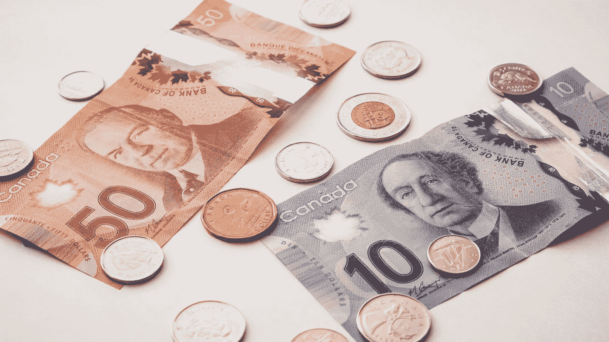

# 世界八大奇迹:复合的力量

> 原文：<https://medium.com/coinmonks/eight-wonder-of-the-world-power-of-compounding-abb78bcbdbcf?source=collection_archive---------6----------------------->

## 坚持不懈的努力创造神奇的结果！！！

Photo by [PiggyBank](https://unsplash.com/@piggybank?utm_source=medium&utm_medium=referral) on [Unsplash](https://unsplash.com?utm_source=medium&utm_medium=referral)

***“复利是世界第八大奇迹。理解它的人，赢得它；***

**——阿尔伯特·爱因斯坦**

复利是在利息上加利息的行为。这是一个将你的收入再投资于你的本金以赚取指数回报的过程，因为下一次增长是在一个更大的本金上，并增加了利息，然后按照这个过程将收入增加到本金上。随着时间的推移，本金呈指数增长，产生不寻常的回报。

我们经常错误地认为利息只能通过一笔钱来获得。对你投入的时间来说也是如此。让我们通过一个故事，用通俗的语言来理解复利。

从前，有两个叫杰克和哈里的朋友，国王给了他们两个选择。他们只能从两个选项中各选择一个。

**选项 1:他们可以从第一天开始获得 1 paise，在接下来的 30 天内，每天都会翻倍。**

运筹学

**选项 2:他们可以开始每天获得 100，000 英镑(1 lac)，直到接下来的 30 天。**

杰克选择了选项 2 作为 Rs。30 天内 30 份 lac 是一笔可观的收入。哈利是一个博学的学者，非常清楚复利选择 1 的力量。无论如何，我们的故事开始“复合”。

第一天:哈利得了 1 分，杰克得了 5 分。1 拉丁美洲和加勒比

**现在开始为哈利计算未来的日子**

第二天:第二次

第三天:第四天

第 4 天:8 秒

第 5 天:16 秒

第 6 天:32 秒

第 7 天:64 秒

第八天:1.28 卢比

第九天:2.56 卢比

第 10 天:哈利得了 5.12 卢比，杰克得了 5.12 卢比。10 个 lac

第 11 天:10.24 卢比

第 12 天:20.48 卢比

第 13 天:40.96 卢比

第 14 天:81.92 卢比

第 15 天:163.84 卢比

第 16 天:327.68 卢比

第 17 天:655.36 卢比

第 18 天:1310.72 卢比

第 19 天:2621.44 卢比

第 20 天:哈里有 5242.88 卢比，杰克有 5242.88 卢比。20 个 lac

直到第 20 天，杰克对他所拥有的一切都非常满意。

第 21 天:10485.76 卢比

第 22 天:20971.52 卢比

第 23 天:41943.04 卢比

第 24 天:83886.08 卢比

第 25 天:哈利有 167772.16 卢比，杰克有。25 个拉美加勒比国家

第 25 天后，复利的魔力变得明显，杰克开始意识到他所犯的错误。让我们看看会发生什么。

第 26 天:335，544.32 卢比

第 27 天:671，088.64 卢比

第 28 天:1342177.28 卢比

第 29 天:2684354.56 卢比

第 30 天:5368709.12 卢比

现在看到复利的魔力了，一笔在第一天出现的一便士的钱在第 30 天结束时变成了一个巨大的数字。复利法则适用于生活的每个领域，可能是金钱、时间、生意或努力。成功的唯一秘诀是坚持做你正在做的事情，复利的力量会给你回报。

**给你复利带来真正好处的关键规则**

1.**起步早**:种植芒果树的最佳时间是 20 年前，第二好的时间是现在。无论你在哪里，无论你有什么，无论你有什么知识，现在就开始你的企业家之旅。允许你的努力复合，看到神奇。

**2。纪律:**遵守纪律，坚持不懈地努力。向你的目标迈出很小的一步，但是要始终如一。一旦你处于心流状态，它就不应该中断，因为一旦心流中断，它就会产生干扰。牛顿第三定律指出“一个运动的物体将保持运动状态，直到有外力作用于它”。因此，一旦你进入心流，不要让任何外力阻止你，否则惯性就会再次启动。

3.**要有耐心**:我们很多人都希望每一次努力都能迅速获得回报，却没有意识到复利概念真正强大的收获是长期的重要性。人们开始他们的 YouTube 频道，上传 5-6 个视频后，他们发现什么都没发生，然后他们就放弃了。如果你种下了一棵树，它需要时间来茁壮成长，然后为你结出果实。你将不得不允许你的努力按照它自己的速度成长，而不是不时地干扰它。

**最后的话:**

复利简单来说就是从付出的努力中赚取利息。最重要的是尽早开始你的努力，让它不受任何干扰地成长。你可能是一名优秀的运动员、歌手、艺术家或任何人，坚持不懈地努力吧。遵循 10000 小时掌握规则，看看复合的奇迹。

> 交易新手？尝试[加密交易机器人](/coinmonks/crypto-trading-bot-c2ffce8acb2a)或[复制交易](/coinmonks/top-10-crypto-copy-trading-platforms-for-beginners-d0c37c7d698c)