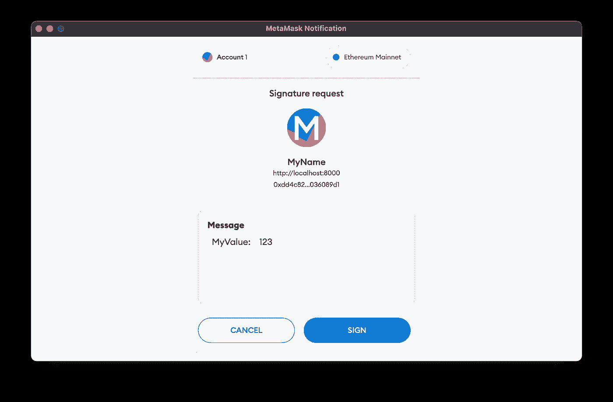
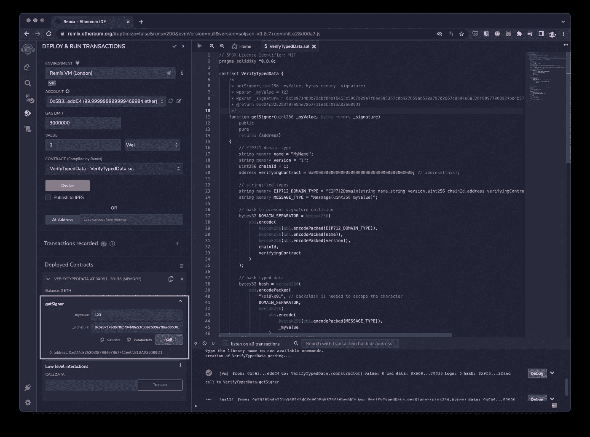

# EIP-712:如何验证链上的类型化数据

> 原文：<https://medium.com/coinmonks/eip-712-how-to-verify-typed-data-on-chain-4ea16548a45f?source=collection_archive---------6----------------------->

实现 EIP-712:类型化结构化数据散列和签名

# 概观

EIP-712 的想法是标准化类型化结构化数据的散列和签名，而不仅仅是字节串。以下是不同的签名方式

*   签署交易
*   [签署消息](https://blog.chainsafe.io/how-to-verify-a-signed-message-in-solidity-6b3100277424)(十六进制字符串)。
*   签署类型化数据

对类型化数据进行签名允许用户在确认之前查看人类可读的数据，而不是任意的十六进制字符串。

> 从顶级交易者那里复制交易机器人。免费试用。

# 演示

[https://leon-do.github.io/eip712-generator/](https://leon-do.github.io/eip712-generator/)

 [## GitHub -莱昂-多/EIP 712-发电机

### 此时您不能执行该操作。您已使用另一个标签页或窗口登录。您已在另一个选项卡中注销，或者…

github.com](https://github.com/leon-do/eip712-generator) 

# 签署

消息参数分为:

**域**:下面的值被散列以防止其他 dapp 使用相同的签名。

*   `name`:dapp 的名称
*   `version`:dapp 的版本
*   `chainId`:防止[重放攻击](https://eips.ethereum.org/EIPS/eip-155)
*   `verifyingContract`:验证签名的合同地址

**消息**:要签名的键入数据(JSON)。在上面的例子中，数据是`{ "myValue": 123 }`

**主类型**:表示对象的顶层类型

**类型**:定义所有的类型

# 核查

智能合同功能分为:

**定义类型**以匹配签名(javascript)代码。

**散列**域分隔符和值。

**将**的签名拆分为`r`、`s`、`v`

**ECRecover** 验证签名

> *加入 Coinmonks* [*电报频道*](https://t.me/coincodecap) *和* [*Youtube 频道*](https://www.youtube.com/c/coinmonks/videos) *了解加密交易和投资*

# 另外，阅读

*   [3 商业评论](/coinmonks/3commas-review-an-excellent-crypto-trading-bot-2020-1313a58bec92) | [Pionex 评论](https://coincodecap.com/pionex-review-exchange-with-crypto-trading-bot) | [Coinrule 评论](/coinmonks/coinrule-review-2021-a-beginner-friendly-crypto-trading-bot-daf0504848ba)
*   [莱杰 vs n rave](/coinmonks/ledger-vs-ngrave-zero-7e40f0c1d694)|[莱杰 nano s vs x](/coinmonks/ledger-nano-s-vs-x-battery-hardware-price-storage-59a6663fe3b0) | [币安评论](/coinmonks/binance-review-ee10d3bf3b6e)
*   [加密交易机器人](/coinmonks/crypto-trading-bot-c2ffce8acb2a) | [Bingbon 评论](https://coincodecap.com/bingbon-review)
*   [Bybit Exchange 审查](/coinmonks/bybit-exchange-review-dbd570019b71) | [Bityard 审查](https://coincodecap.com/bityard-reivew) | [Jet-Bot 审查](https://coincodecap.com/jet-bot-review)