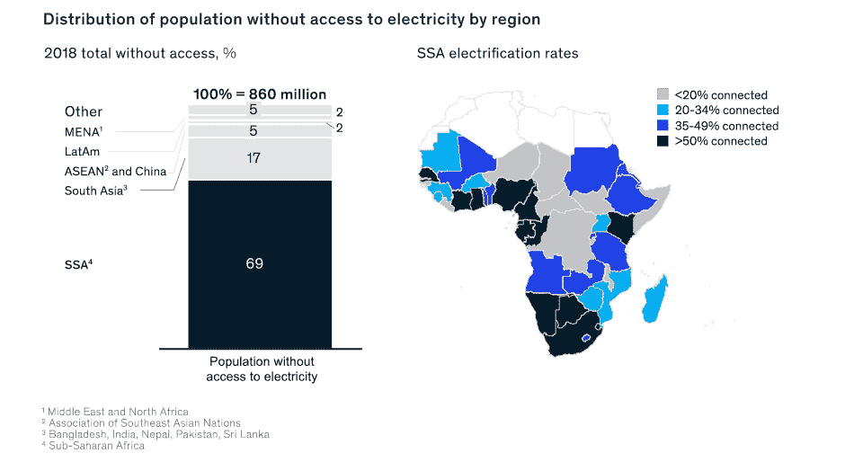

# 用比特币采矿给非洲通电

> 原文：<https://medium.com/coinmonks/electrifying-africa-with-bitcoin-mining-4f6d10f1d38f?source=collection_archive---------37----------------------->

***能源是唯一的通用货币*** *—瓦茨拉夫·斯米尔*

能源是人类生存的命脉。一个能源丰富的社会是一个繁荣的社会，在当今世界的大部分地区，对能源的需求持续增长。更少的能源生产放大了现有的问题，同时产生了新的问题。它导致经济机会减少、粮食产量减少、贫困和生活成本上升，从而导致内乱并最终导致社会崩溃。更多而不是更少的能源生产才是解决之道。今天，撒哈拉以南非洲面临着严重的电力短缺，至少有 6 亿人用不上基本的电力。也就是说，至少 43%的非洲人口或者说全球三分之二以上的人口没有电力供应。

无论是从能源获取、装机容量还是总消费量来看，撒哈拉以南非洲的能源部门都严重不发达。鉴于电力供应与经济增长之间存在直接关联，电气化率低于 80%的国家人均 GDP 持续下降。根据国际能源机构关于非洲的最新报告，至少 80%的缺电人口生活在农村地区，这意味着为了满足他们的需求，必须扩建现有的电力基础设施或建设新的基础设施。

许多非洲国家拥有丰富的太阳能、风能、地热、天然气和水力资源，尽管这些资源通常由于财政资源不足而不发达。[根据](https://www.mckinsey.com/~/media/McKinsey/Industries/Electric%20Power%20and%20Natural%20Gas/Our%20Insights/Powering%20Africa/Powering_Africa.pdf)麦肯锡的说法，“有 1.2 太瓦的产能；包括太阳能在内，潜在发电能力高达 10 太瓦，甚至更多。有大约 400 千兆瓦的天然气发电潜力，仅莫桑比克、尼日尼亚和坦尚尼亚就占总容量的 60 %;约 350 千兆瓦的水力发电，其中刚果民主共和国占 50 %;大约 300 千兆瓦的煤容量，博茨瓦那、莫桑比克和南非占其中的 95%；和 109 千兆瓦的风力发电能力，尽管与其他能源相比相对昂贵。已探明的地热资源潜力只有 15 千兆瓦，但这对拥有 80%地热资源的埃塞俄比亚和肯尼亚来说是一项重要技术。”

国际能源机构(IEA)进一步指出，微电网是最可行的解决方案，但政府通常缺乏用于此类资本密集型基础设施项目的资源。[估计每年需要 280 亿美元的投资来弥补撒哈拉以南非洲地区的能源缺口。在](https://www.imf.org/Publications/fandd/issues/2021/09/fighting-climate-change-in-Africa-ireri)[为比特币杂志](https://bitcoinmagazine.com/culture/bitcoin-is-humanitarian-and-environmental)撰写的一篇文章中，人权基金会的首席战略官 Alex Gladstein 这样陈述这个问题:

*“发展中国家有数十亿人面临着电力短缺的问题。为了实现经济增长，它们必须扩大电力基础设施，这是一项资本密集型的复杂任务。但是，当他们……建造发电厂，试图在偏远地区获取可再生能源时，这些能源往往无处可去。”*

考虑到这一点，十亿美元的问题是，所有这些将如何融资？比特币挖矿是弥合这一资金缺口的潜在解决方案，不仅能让新电厂在任何客户接入之前立即开始创收，无论电厂位于多远的地方；而且还为电厂本身的建设提供资金。请允许我解释。

非洲政府可以效仿萨尔瓦多，发行比特币支持的债券，筹集的资金用于建设新的发电厂，以及购买比特币采矿设备。一旦工厂建成并运行，比特币开采的收益将被用于建设输电和配电基础设施，以及偿还债券持有人。建立输电和配电基础设施以及连接客户是能源公司面临的两大财务障碍。

[以前，发电在相对靠近消费地点的地区(即人类居住区)具有经济意义，但比特币采矿现在已经能够在偏远但能源丰富的地区开发电厂，并通过将能源导向比特币网络来实现能源货币化。把比特币采矿想象成一个没有许可的“能源漩涡”，允许任何获得廉价电力的人随时插入他们的采矿机器并开始产生收入。](https://bitcoinmagazine.com/culture/bitcoin-mining-and-the-case-for-more-energy)

[例如](https://www.nytimes.com/2017/08/30/business/congo-power-plants-poaching.html)，刚果民主共和国(DRC)的维龙加国家公园是仅次于亚马逊的世界第二大雨林，其中有一座 13 兆瓦的水电站，由 Howard Buffet 出资建造。最初的投资仅够建造发电厂，因此，由于资金限制，尚未安装输电基础设施，发电厂 13 兆瓦的发电量中只有 2.5 兆瓦得到利用。在缺乏替代能源的情况下，居住在公园周围的 500 万人主要依赖木炭和木材，这意味着维龙加的持续砍伐。正如国际能源机构的报告所指出的，向维龙加附近的居民提供电力的最经济可行的选择是建立新的小型分散式网络(即微型电网)。这些网络可以通过比特币采矿得到补贴，从而产生维持工厂运营和资助输电基础设施建设所需的收入。正是因为这个原因，在 2020 年，公园的管理层开始用剩余的能量开采比特币。

另一个例子是埃塞俄比亚，它有潜力从“可再生”资源中产生超过 60 000 兆瓦的电力，但是目前只有 4 500 兆瓦的装机容量。 [90%的电力来自水力发电，地热发电、太阳能发电和风能发电构成了差额；然而，严重的能源短缺仍在继续，该国 1.1 亿人口中只有 44%的人用上了电。随着埃塞俄比亚文艺复兴大坝(GERD)等项目的建设，预计将产生额外的 5 150 兆瓦，政府预计在未来 10 年总装机容量将达到 17 000 兆瓦。](https://www.trade.gov/knowledge-product/ethiopia-energy)

尽管国内[能源短缺](https://www.forbes.com/sites/martinrivers/2021/07/13/renewed-hope-how-bitcoin-and-green-energy-can-save-ethiopias-economy/?sh=79dc76784fc9&utm_source=TWITTER&utm_medium=social&utm_content=5157014885&utm_campaign=sprinklrForbesCrypto)，埃塞俄比亚政府[在 2019 年向苏丹和吉布提出口了](https://apanews.net/en/news/ethiopia-power-exports-to-sudan-djibouti-fetch-over-66m)价值 6600 万美元的电力。相比之下，根据区块链分析公司 Elliptic 的数据，在同一时期，伊朗仅从比特币采矿中就获得了约 10 亿美元的收入，估计发电量为 600 兆瓦。如果埃塞俄比亚政府采取了类似的方法，比特币开采产生的收入将极大地增加外汇储备，并为这些电力基础设施项目提供资金。埃塞俄比亚的比特币游说团体[马诺项目也持有同样的观点。](https://projectmano.com/#intro)

我坚信，通过比特币网络或其生态系统的一部分解决当前发展需求的举措，可以加速发展中国家对比特币民族国家的采用；加速电气化就是一个很好的例子，比特币挖矿就是如此。比特币采矿是一种不受地点限制的活动，它从经济上激励人们发现利用能源的经济有效的方法，不受消费者需求或其他历史能源生产障碍的影响。撒哈拉以南非洲国家可以利用比特币采矿更快地“弥合能源获取缺口”，并从采矿收入中为可再生能源电网融资，而不需要依赖捐助者的利他主义或来自国际货币基金组织和世界银行等机构的贷款；从而使其公民摆脱贫困。

> 交易新手？试试[加密交易机器人](/coinmonks/crypto-trading-bot-c2ffce8acb2a)或者[复制交易](/coinmonks/top-10-crypto-copy-trading-platforms-for-beginners-d0c37c7d698c)