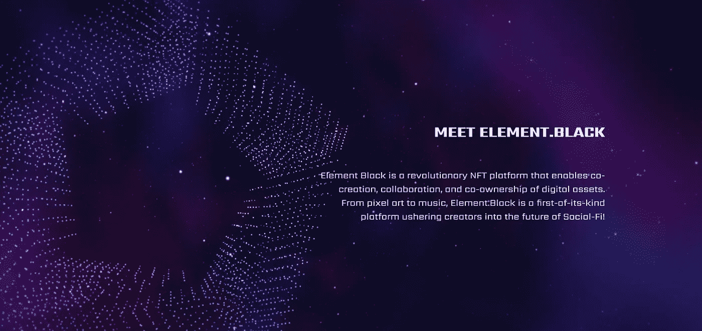

# 元素黑:新的数字资产和泛娱乐平台将彻底改变金融

> 原文：<https://medium.com/coinmonks/element-black-the-new-digital-asset-and-pan-entertainment-platform-set-to-revolutionize-finance-a1142f89edbe?source=collection_archive---------20----------------------->

这是后大流行时代，大量智能基础设施创新正在探索元宇宙、虚拟资产和区块链技术的多功能性，以改善人类体验。**我们的现在就是未来**在未来，我们可以通过金融、娱乐和社会影响力的方式赚取或执行更多的东西。

正如在[他们的白皮书](https://www.element.black/About)、 **Element Black** 中所捕捉到的，他们自诩为引领新的超宇宙浪潮的平台，包括革命性的 NFT 项目，这些项目将符号化和金融化对用户利益的社会影响。因此，Element Black 是 Web 3.0 视觉生态系统开发者寻求共同创作(无论是大规模还是小规模)、合作以及共同获取有价值的数字资产的最佳 NFT 平台。

也许向世界展示一个新的、可靠的去中心化的通往未来社会的路线是再好不过的了。Element Black 对区块链科技在价值分配中的动态、鲜为人知的潜力有着坚定而务实的信念。他们坚持一个信条:真正的、值得信赖的经济在未来三年内会发展得很好，在即将到来的对人类体验的重新定义中，商业不会抛弃人类的社会行为。

**元素黑**抓住了以下行业:音乐和娱乐、游戏、公共链、NFT 和 DEFI。新浪潮坚持模糊普通人的现实和创新者或理想主义者的幻想之间的界限。它还通过为双方提供创建数字资产(和虚拟形象)、视觉元素和定制独特身份所需的高效可靠的工具，在双方之间占据前沿。

也就是说，一个巨大的元宇宙问题没有得到足够的解决:在众多元宇宙之间无缝交易的道路上存在巨大的障碍。此外， **Element Black** 带着一个独特的提议介入救援:一个突破性的环境，使数字资产和虚拟形象能够在各种元宇宙生态系统之间转移。

# **音乐无限(麻省理工学院):元素黑通过她的音乐 NFT 版税生态系统重塑音乐产业**

[Element Black](https://www.element.black/) 宣扬社会影响力的金融化和符号化只有一个目的:通过将经济交给普通人，包括数字资产的创造者、所有者、合作者和用户，最大限度地实现当今区块链生态系统的极度去中心化。她通过为个人、社区和公司创意人员创建安全的基础设施来创造独特的 NFT 和艺术品，从而推动娱乐行业的创新。

这种以利润为导向的方法通过为数字财产产生真实的、可跟踪的价值，使所有者和用户、名人和粉丝等受益。 **Element Black** 创造了一个会呼吸的社交网络平台，通过大量的娱乐明星和他们的观众来设计高质量的名人粉丝互动。他们很清楚疫情对娱乐业的影响，因此寻求通过 web 3.0 基础设施内的分散元世界的财富来帮助艺人及其粉丝群绕过任何此类不利影响。

[因此，Element Black 的泛娱乐音乐 NFT 版税生态系统](https://www.music-infinity.net)通过原创内容和数字资产在一个灵活的平台上链接艺术家和粉丝。该系统有两种激励机制:“创造赚”和“倾听赚”。第一个奖项奖励有才华的艺人和创意人员，同时让富有的观众也能欣赏他们的作品。后者回报听众的时间，帮助他们发现更多的好音乐。

更重要的是，Music Infinity 用户可以下载音轨、混音、乐器或两者兼有，上传新音乐到平台，然后支付一定的费用(麻省理工学院代币)来生成特殊的音乐 NFT，并在 Music Place 上招募它们。然后他们开始从赌注和音乐版税中获利。真正的社会协作因此成为音乐无限的现实。全世界的互联网用户现在可以共同创作和混音原创歌曲，甚至可以使用定制的 NFT 工作室在 **Element Black** 上播放主要艺术家的作品。

此外，音乐无限功能的 NFT 音乐盒的挖掘能力代表了 NFT 价值。元素黑**的 NFT 音乐盒是一个音乐播放器，代币矿工，和 NFT 收藏品。你可以通过用麻省理工学院的代币升级你的音乐盒并进行链上交易来赚取主要的加密货币，如盒子上的以太。盒子越稀有，它的挖掘力越高。你的采矿能力越高，作为不可替代的代币的价值就越高。**

## **音乐无限季节锦标赛**

**Element Black** 寻求通过有目的的参与和显著的用户利益来丰富其生态系统。为了吸引更多的参与者加入这个平台，他们推出了一项新的竞赛:[音乐无限季节锦标赛](https://www.element-support.freshdesk.com/en/support/solutions/articles/15100001-share-130-million-elt-q4-seasonal-tournament-event)。参赛者有机会获得**元素。黑色代币(ELT)** 作为购买音乐盒、迷你盒、维修的奖励。这一季的锦标赛将会送出多达 1 . 3 亿名幸运参与者。

在平台上消费 MIT (Music Infinity)也有助于参赛者获得锦标赛个人奖励池的 ELT 采矿配额。当一个人的音乐盒达到 SR 等级时，他们就可以开始从他们的奖励池中挖掘——同时挖掘麻省理工学院。

对于音乐盒拥有者来说，还有其他的东西:音乐盒电池充电，供希望快速升级以参加锦标赛的新手使用。更重要的是，用户可以在一天内多次购买电池电源充电包。之后，相应的音乐盒电力将恢复，业主可以恢复开采。

## **关于团队和公司**

[Element Black 背后的头脑](https://www.element.black/Team)作为一个单位已经收获了很多成果:音乐无限道、3000 万音乐扶持基金、音乐人 Launchpad、洛杉矶、香港、柏林、东京等地的音乐活动。

他们近期的目标包括:启动 DApp 孵化计划，建立全球音乐品牌和出版网络，创建全球音乐艺术家代理机构和名人合作伙伴关系，以及建立元素黑色游戏中心等。

您可以在该公司的网站上了解更多信息:

[官方元素黑网站](https://www.element.black/)

[音乐无限官方网站](https://www.music-infinity.net)

或者，在社交媒体上与**元素黑**联系:

[推特上的元素黑](https://twitter.com/ELTblack/)

[元素黑上电报](https://t.me/ElementBlackOfficial)

[元素不和谐上的黑色](https://discord.com/invite/TmvnZPzJ2P)

> 交易新手？试试[加密交易机器人](/coinmonks/crypto-trading-bot-c2ffce8acb2a)或者[复制交易](/coinmonks/top-10-crypto-copy-trading-platforms-for-beginners-d0c37c7d698c)