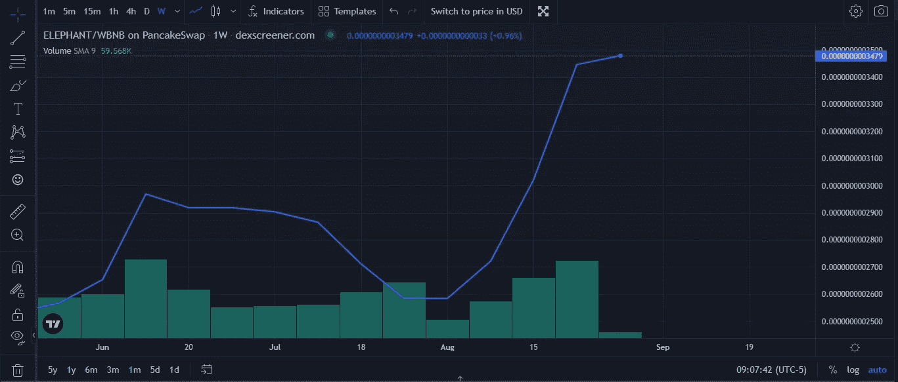
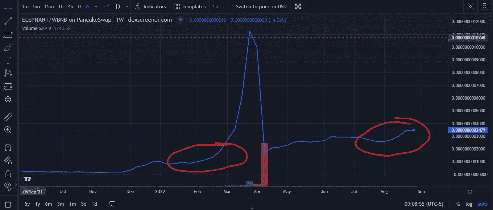
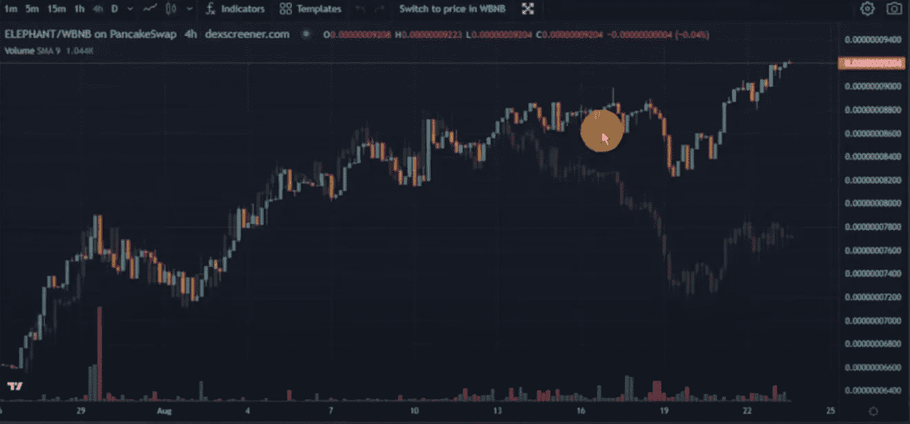

# 大象货币供应冲击来了。DeFi 的每一项协议都将被搁置。

> 原文：<https://medium.com/coinmonks/elephant-money-supply-shock-is-here-every-protocol-in-defi-is-about-to-get-left-behind-cb55ca30807a?source=collection_archive---------3----------------------->

我写了几篇关于大象金钱对人们进行协议教育的文章，以及为什么我在漏洞利用后仍然乐观。

这一次有所不同——供应冲击来了，两个月后你会参考这篇文章，问自己“为什么我不买更多的大象？”。

让我们保持这篇文章简洁明了——让我们看看最近的图表:

你看到了什么？绿色。BwB + Peanuts 通过不断为财政部提供资金，创造了一些严重的 FOMO。

对于那些在利用漏洞之前就在 EM 中的人来说，下面的图表看起来应该非常相似:

这正是上次供应冲击之前发生的情况——图表上的大幅上涨。如果你错过了这个时间，你就不能以这个价格买到大象了。专家们告诉我们开采后要尝试获得 100 磅的大象——这将很快变成 50B，25b，10b 等等。

最后一张参考图表:

这张图表摘自 SK Crypto 最近的 YouTube 视频，点击这里。

你可以看到大象被调换并覆盖在 BNB 的顶部。当你最喜欢的硬币在市场上被谋杀的时候，大象变得越来越强大，流动性越来越强。大象正在拉开距离，没有回头路可走——图表不会说谎。

决定权在你，你是否随大流？

# 逐步指南

1.  前往 [Elephant.money](https://elephant.money/trunk.html) ，通过币安智能链连接您的钱包
2.  去铸币区铸造所需数量的 BUSD。你必须首先启用 BUSD。或者，您可以使用中继令牌地址:
    0x DD 325 c38 b 12903 b 727d 16961 e 61333 f 4871 a 70 e 0 到 PancakeSwap 进行中继交易
3.  向下滚动到“群体:合作伙伴网络”
4.  命中:合作伙伴
5.  如果你想用我作为推荐人，在债券和卷(化合物)上获得 0.5%的空投，请复制并粘贴我的钱包地址(如果你这样做，谢谢！):
    0x cf 95 a 7d 2 b 19746 b 3782d 36 ef 5d 32433 b8e 3232 a 8
6.  点击:更新
7.  向上滚动以抢购永久债券
8.  击中:邦德
9.  输入需要焊接的干线数量，然后点击焊接

# 与滴滴不同的转诊系统

像你们大多数人一样，我在很多地方推托过我的点滴推荐。这个转诊制度是不同的。

你和你的搭档会得到奖励。你们两个都将获得任何主干债券或滚动 0.5%的空投。没有更多的滴灌 maxis 兜售他们的推荐链接，并获得庞氏丰富。

如果您有兴趣将我作为合作伙伴—您可以使用我的推荐代码—0x cf 95 a 7 D2 b 19746 b 3782d 36 ef 5d 32433 b 8 e 3232 a 8

作为感谢——在我的[不和谐](https://discord.gg/CZjT6FAQ)上给我发消息，并获得免费的行李箱奖励！

> 交易新手？试试[加密交易机器人](/coinmonks/crypto-trading-bot-c2ffce8acb2a)或者[复制交易](/coinmonks/top-10-crypto-copy-trading-platforms-for-beginners-d0c37c7d698c)