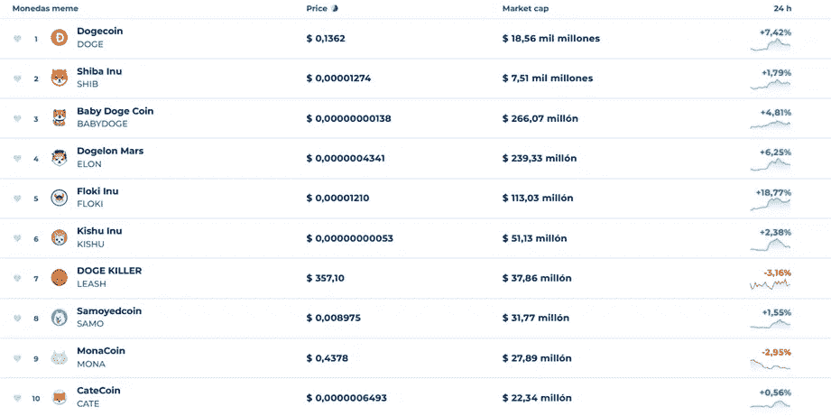

# 埃隆和迷因币。

> 原文：<https://medium.com/coinmonks/elon-and-the-memecoins-455631db69c4?source=collection_archive---------41----------------------->

市场波动是指在一定时期内与金融资产相关的趋势变化或价格波动。这样的概念在经济领域并不新鲜，更不用说在加密货币市场了。

在加密货币的世界中，波动性非常高，这就是为什么它会对投资者产生很多不信任，然而，这是一个双面硬币，可以产生积极或消极的影响。由于这个原因，许多交易者必须注意不同的因素，以在短期或中期内增加投资的利润。

有几种方法可以对市场运动和研究保持警惕，如技术和基本面分析，但是，我试图评论说，也有波动因素，这就是为什么你应该始终了解新闻和重要事件，在这个市场上最有影响力的工具之一是 twitter 应用程序。
最近几天，DOGE 和 Shiba Inu 等加密货币的流动性很大，原因之一是企业家 elon 收购了 twitter，也是因为它作为市场影响者的影响力。

几个小时前，特斯拉首席执行官(Elon Musk)发布了一张简单的图片，图片上是一只穿着 t 恤的狗，旁边是一个南瓜，上面也有这个标志，尽管他没有发表任何评论，但却以一种神奇的方式开始推动市场。

与模因的购买量和销售量有关。虽然很难保证这是移动性的主要原因，但我们意识到，无论是作为一个项目还是图像关系，数量的增加和最佳 memecoin 的顶部都是相关的，都与过去 24 小时的增加有关。

## 影响加密货币波动的因素

## 1.影响者评论和新闻。

在社交网络或其他传播渠道中脱颖而出，并就某一特定话题发表意见，对许多认识他/她的人产生巨大影响的人。
这些评论可能是真实的，也可能不是，但毫无疑问，在大多数事件中，这些评论会直接影响市场，并最终产生大量 fomos。

## 2.重要新闻和事件。

如果金融市场有重要消息，价格会有很大变化，在加密货币领域更是如此，因为这是一种新的投资选择。

因此，任何事件、声明甚至谣言都可能影响加密货币的波动性，导致购买或销售的大幅波动，进而导致其价值的巨大波动。

## 3.供应和需求:

供求也是影响虚拟货币波动的另一个因素。购买需求越大，加密资产的价格就越会上涨。相反，它们卖得越多，价值下降越大。

## 4.趋势和情绪

加密货币没有内在价值，不受任何官方机构的监管，也没有中介，因此，买卖决定尤其是基于趋势或情绪。例如，如果关于虚拟货币的消息非常积极，其需求就会增长，价格也会上涨。反之亦然:坏名声会在几分钟内导致其价值暴跌。

## 5.羊群效应

对加密货币的投资汇集了所有类型的交易者，然而，大多数运动来自年轻人。从这个意义上说，当面对虚拟货币价格的突然变化时，那些经验较少的人会决定卖出以避免损失。这反过来会引起其他投资者的恐慌，产生“羊群效应”和市场价格的加速下跌。

## 6.比特币的统治地位

比特币仍然是卓越的王者货币。因此，它的趋势和演变可以在总体水平上影响市场。

## 最终建议

我希望这篇关于加密货币波动性的文章能帮助你更好地理解它们是如何工作的，并记住，虚拟货币是一个很好的投资选择，但它们应该始终得到明智的管理，拥有知识、分析和精度。

最重要的是知道如何顺应潮流，不仅技术和基本面分析会给我们在广阔的海洋中继续游泳和成功的钥匙，所以我们必须注意鲸鱼，除了上面提到的不稳定因素之外还有其他影响。

> **交易新手？试试** [**密码交易机器人**](/coinmonks/crypto-trading-bot-c2ffce8acb2a) **或** [**复制交易**](/coinmonks/top-10-crypto-copy-trading-platforms-for-beginners-d0c37c7d698c)