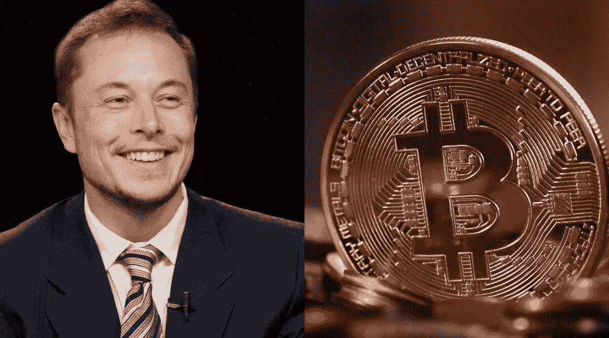

# 埃隆·马斯克(Elon Musk)问自己是否应该退出推特，比特币制造者提出了他们的候选人

> 原文：<https://medium.com/coinmonks/elon-musk-asks-if-he-should-quit-twitter-and-bitcoiners-put-forward-their-candidates-e03fbef293c0?source=collection_archive---------49----------------------->

埃隆·马斯克(Elon Musk)问自己是否应该退出推特，比特币制造者提出了他们的候选人。

埃隆在一项民意调查中落败，该调查旨在了解社会是否希望他继续担任推特的首席执行官，而比特币制造者则在评估候选人。

超过 1700 万人参加了一项民意调查，在这项调查中，埃隆·马斯克询问用户对他是否应该辞去推特首席执行官的意见，包括许多比特币制造者在内的近 60%的人回答说，“是的，走开。”

马斯克在公布调查结果之前曾表示“我会遵守调查结果”，所以，在一种可能的情况下，埃隆将会再担任推特的首席执行官一段时间，至少在他得到继任者之前。

这位亿万富翁在去年 4 月成为微博网络的大股东后，目前拥有微博网络，自投票结束后，他一直没有发表评论。然而，一些比特币制造者已经提出了替代他的候选人。

有人提出爱德华·斯诺登，他在 2013 年向世界揭示了美国国家安全局“收集”数据的真相。

其他人更希望推特回到杰克·多西手中，但最终许多比特币社区的人**呼吁选举一位了解密码货币生态系统**的首席执行官。

在过去的十年里，推特一直被比特币者用作他们分享或讨论想法的首选社交网络，在许多情况下，推特还会报道重要的故事。

事实上，开发者和生态系统成员共有的一些想法被认为具有很高的历史价值。

# 比特币社区呼吁让一位比特币制造者成为推特的负责人

已故 T4·哈尔·芬尼的推特账户是该社区认为有价值的账户。该账户在休眠了十多年后被“复活”。

哈尔的妻子弗兰·芬尼(Fran Finney)不希望第一个操作比特币网络节点的人分享的想法永远消失，因为他直接从中本聪获得了该软件。

无论如何，当马斯克收购推特时，他说他想“T8”试着帮助人类“T9”，并且*“文明会有一个数字广场”*，但是他的计划并不顺利，只有 42.5%的人反对他的辞职。

自马斯克收购社交网站以来，推特上出现了一些有争议的变化。起初，他解雇了大约一半的员工，随后，他因在微博网络上如何调节内容的方式而受到批评。

# 人权团体又来了..

最近，人权组织的支持者将他挑出来，称之为“独裁行为”。

在其他行动中，他们批评他关闭了一些报道社交媒体相关新闻的记者的 Twitter 账户，以及一些分享来自乳齿象的新闻的用户的 Twitter 账户，乳齿象是 Twitter 的竞争对手。

在这方面，联合国在推特上表示，新闻自由“不是玩具”，而欧盟则以制裁威胁推特。

> 值得一提的是，两个实体(联合国和欧盟)在关闭反对 covid 授权的人和任何在网上发表反对言论的人的数千个推特账户时都没有问题。

# 又一个分散的社交网络

与此同时，Twitter 前首席执行官杰克·多西向去中心化社交网络 Nostr 捐赠了 14 个比特币。

该项目被开发者威廉·卡萨林视为与比特币经济相匹配的通信层，也是一项有助于互联网发展的举措。

Nostr 本身是一个协议，由 Fiat Jaf 开发，它不依赖于中央可信服务器。

相反，所有用户都运行一个客户端，用它发布他们用私钥签名的内容，然后将其发送到传输该内容的其他服务器。它的主要功能是接受帖子并将其发送给中继参与者。

*原载于 2022 年 12 月 20 日*[*【https://bitnewsbot.com】*](https://bitnewsbot.com/elon-musk-asks-if-he-should-quit-twitter-and-bitcoiners-put-forward-their-candidates/)*。*

> *加入 Coinmonks* [*电报频道*](https://t.me/coincodecap) *和* [*Youtube 频道*](https://www.youtube.com/c/coinmonks/videos) *了解加密交易和投资*

# 另外，阅读

*   [Bookmap 评论](https://coincodecap.com/bookmap-review-2021-best-trading-software) | [美国 5 大最佳加密交易所](https://coincodecap.com/crypto-exchange-usa)
*   [加密交易机器人](/coinmonks/crypto-trading-bot-c2ffce8acb2a) | [造币评论](https://coincodecap.com/coingate-review)
*   最佳加密[硬件钱包](/coinmonks/hardware-wallets-dfa1211730c6) | [Bitbns 评论](/coinmonks/bitbns-review-38256a07e161)
*   [新加坡十大最佳加密交易所](https://coincodecap.com/crypto-exchange-in-singapore) | [收购 AXS](https://coincodecap.com/buy-axs-token)
*   [红狗赌场评论](https://coincodecap.com/red-dog-casino-review) | [Swyftx 评论](https://coincodecap.com/swyftx-review)