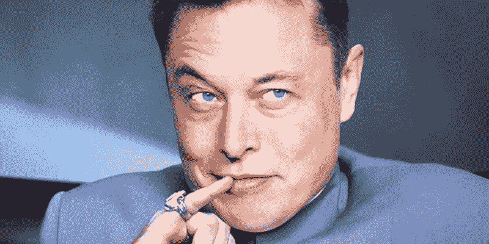

# 埃隆·马斯克强迫推特董事会在法庭上分享机器人信息

> 原文：<https://medium.com/coinmonks/elon-musk-forces-twitter-board-to-share-bot-information-in-court-bc2f3d48c5a2?source=collection_archive---------7----------------------->

Twitter 本周早些时候宣布，它希望通过法庭迫使埃隆·马斯克仍然以商定的 440 亿美元收购该公司。

他们在 Twitter 上没有想到的是，诉讼正是埃隆·马斯克一直以来所希望的。

# 将死

在马斯克周一发布的上述推文中，他用四个简单的图像总结了这个故事。“首先他们说我不能买 Twitter。然后他们不想分享假账号数量的信息。现在他们想通过法庭强迫我买推特。通过这样做，他们正在强迫自己在法庭上披露机器人信息，”一位忍不住大笑的马斯克说。

Pranay Pathole 立即对 Musk 的消息做出了回应，他表示 95%的 Twitter 账户都是真人，这是不可能的。“我的通知中充满了虚假的、垃圾邮件和推广加密的 bot 帐户。Twitter 需要开源其数据，并对用户透明。作为对马斯克的回应，[path ole](https://twitter.com/PPathole/status/1546347382987960322)说:“透明度增加信任”。

在他的第一篇帖子发布后不久，马斯克发布了一张演员查克·诺里斯坐在棋盘后面的照片，标题是“查克·马特”。马斯克的意思是，他已经让 Twitter 进入了他期待已久的位置。看起来 Twitter-Musk 的传奇将会有另一个有趣的尾巴。

> 交易新手？试试[密码交易机器人](/coinmonks/crypto-trading-bot-c2ffce8acb2a)或者[复制交易](/coinmonks/top-10-crypto-copy-trading-platforms-for-beginners-d0c37c7d698c)

# 加密推特让人们感受到它的存在

马斯克早些时候取消交易的决定主要被视为加密社区的负面发展。毕竟，马斯克对 Dogecoin 情有独钟，并在他的公司特斯拉和 SpaceX 以及个人手中拥有相当数量的比特币。随着马斯克执掌 Twitter，这个社交媒体巨头也有可能在 crypto 方面有所作为。

马斯克公开考虑的一个想法是，让人们用自己选择的货币验证自己的账户，支付小额款项。对于货币的选择，他的字面意思是人们可以决定(在很大程度上)他们想要使用哪种法定货币或加密货币。尽管选择可能在某种程度上局限于一定数量的硬币。

在马斯克的最新推文之后，交易的可能性再次增加，这对 crypto 来说是一个积极的发展。Twitter 是一个巨大的平台，无疑在数字社会中扮演着重要角色。Twitter 上支付选项的整合也为该平台瞄准金融市场打开了大门。

# Twitter 是新银行吗？

像 Twitter 这样的平台有趣的一点是，它已经拥有数百万用户。根据该公司的最新数据，它拥有大约 4 . 5 亿月活跃用户。

这些数字是一般银行想都不敢想的。理论上，Twitter 可以很容易地将庞大的用户网络转变成一个金融网络。

在这个网络中，人们可以相互支付、持有储蓄、获得贷款、买卖股票和其他金融资产，等等。

埃隆·马斯克是一位行动迅速、胸怀大志的企业家。因此，似乎可以肯定的是，这样的计划至少在他的脑海深处。尤其是考虑到他曾是 PayPal 的联合创始人。

这说明他一直对支付平台很感兴趣，也很了解。

*原载于 2022 年 7 月 12 日*[*【https://bitnewsbot.com】*](https://bitnewsbot.com/elon-musk-forces-twitter-board-to-share-bot-information-in-court/)*。*