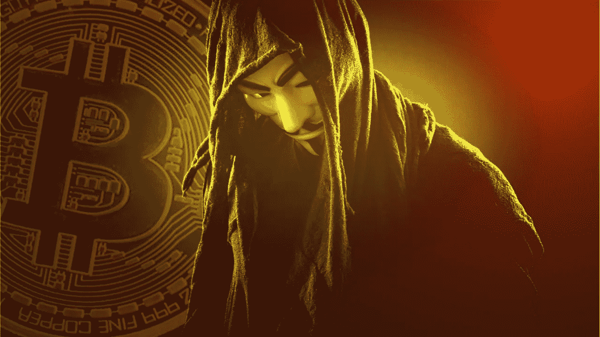

# 埃隆·马斯克为比特币的神秘创造者中本聪找到了答案

> 原文：<https://medium.com/coinmonks/elon-musk-has-the-answer-for-the-mysterious-creator-of-bitcoin-satoshi-nakamoto-b65efd0430e7?source=collection_archive---------3----------------------->

## 大多数人已经投资并将投资比特币。但是谁才是比特币的神秘创造者呢？

[**Who is Satoshi Nakamoto?**](https://www.google.com/search?q=misterios+of+bitcoin&tbm=isch&ved=2ahUKEwjAp56eyo75AhU7wgIHHZeSBmkQ2-cCegQIABAA&oq=misterios+of+bitcoin&gs_lcp=CgNpbWcQAzoECCMQJzoFCAAQgAQ6BAgAEEM6BwgjEOoCECc6CAgAELEDEIMBOgsIABCABBCxAxCDAToICAAQgAQQsQM6BwgAELEDEEM6BAgAEB46BAgAEBM6BwgAEMcDEBM6BggAEB4QEzoJCAAQHhDHAxATOggIABAeEAgQE1CMIVjWTmD_UWgDcAB4AIAB0gGIAd8akgEGMC4xNy40mAEAoAEBqgELZ3dzLXdpei1pbWewAQrAAQE&sclient=img&ei=kq_bYsCWKLuEi-gPl6WayAY&bih=714&biw=1536#imgrc=KLWtpM1VhMzNiM&imgdii=73Fgv1YRBCrc9M)

我们都知道埃隆·马斯克是特斯拉、SpaceX、Neuralink 等公司的首席执行官，他说别名背后的人…