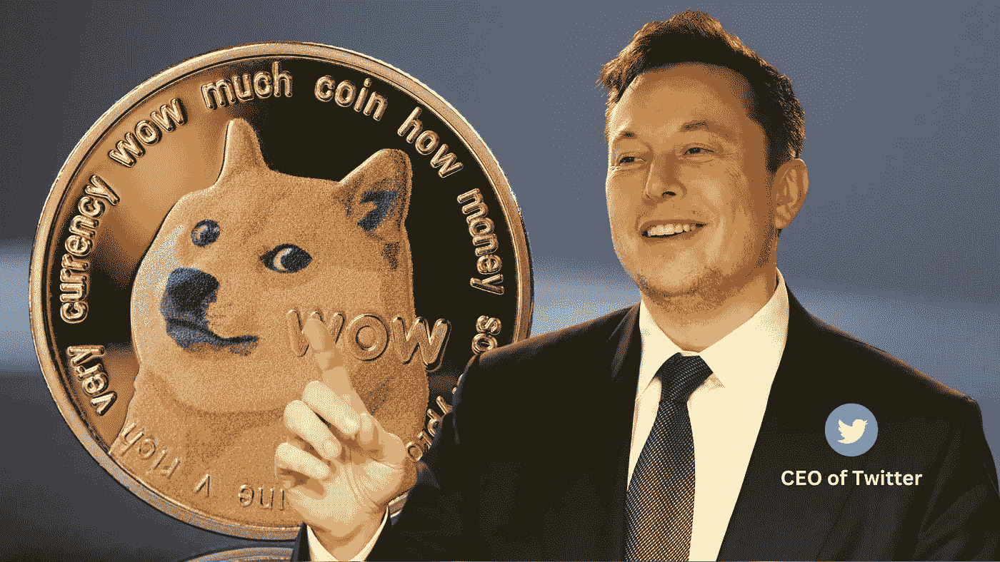

# Elon Musk 刚刚证实 Dogecoin 将成为 Twitter 的货币！

> 原文：<https://medium.com/coinmonks/elon-musk-just-confirmed-that-dogecoin-will-become-twitters-currency-88178d2dbea4?source=collection_archive---------4----------------------->

Twitter CEO Elon Musk just said “DOGECOIN TO THE MOON” in a Twitter space. What does this mean?

今天在一个 Twitter 空间， **Twitter CEO 埃隆马斯克**在被问及完全不同的事情时，突然说了一句“**”的话。这促使 **Dogecoin** 的价格上涨**+20%**,并让加密爱好者怀疑这是否可能是 **Dogecoin** 成为 Twitter 的**加密货币的开始。****

**让我们来看看为什么会出现这种情况的**原因**:**

**FF**首先是**，Dogecoin 是**易得**和**易得**。与其他加密货币不同，后者通常需要经历建立一个分散钱包并在 DeFi 交易所购买的过程，Dogecoin 可以在比特币基地和币安等流行的加密货币交易所轻松买卖。**

**S**second**，Dogecoin 有**非常低的交易费用**。这很重要，因为这意味着用户可以发送和接收 Dogecoin，而不必担心高额费用会侵蚀他们的利润。**

****举个例子**，上周我给一个朋友寄了价值 5 美元的比特币，交易费是 0.21 美元——超过总额的 4%！有了 Dogecoin，同样的交易只需花费我 0.0001 美元，仅为 0.0002%。**

**F **最后**，最重要的是，Dogecoin 背后有一个**庞大的社区**。 **Dogecoin 社区**是**最活跃的**之一，活跃于所有加密货币领域。日日夜夜，总有人在社交媒体上谈论 Dogecoin，发布模因，并致力于帮助发展生态系统的项目。这个充满激情的社区是我相信 Dogecoin 有能力成为 Twitter 的**加密货币的主要原因之一。****

**只有时间才能证明 Dogecoin 能否成为 Twitter 的加密货币。然而，考虑到它的低费用，高访问性和充满激情的社区，我认为它有一个非常好的机会！**

**🤑加入我们的 [**电报频道**](https://t.me/officialcryptohub) 与志同道合者互动**

**🐦也可以查看我们的 [**推特账号**](https://twitter.com/CryptoHub210?s=20&t=ts3bUBYtX7g0s5_ClYnL_A) 获取更简短的分析**

**💰欢迎 [**关注我们**](/@officialcryptohub0) 获取更多此类分析**

**👋业务请求: [**电报:联系@cryptohubtiktok**](https://t.me/cryptohubtiktok)**

> **交易新手？尝试[加密交易机器人](/coinmonks/crypto-trading-bot-c2ffce8acb2a)或[复制交易](/coinmonks/top-10-crypto-copy-trading-platforms-for-beginners-d0c37c7d698c)**