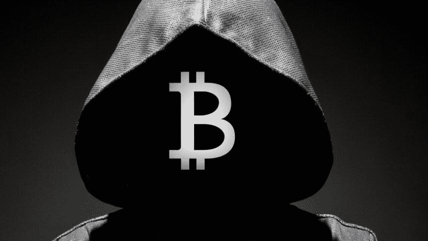

# 埃隆·马斯克揭示了中本聪理论

> 原文：<https://medium.com/coinmonks/elon-musk-reveals-the-satoshi-nakamoto-theory-d1bb28f5abe1?source=collection_archive---------15----------------------->

## 承认他没有“得到”以太坊，并做了一个狗心火星预测。

[**Sourse**](https://presearch.com/images?q=Elon%20Musk%20reveals%20who%20could%20be%20the%20founder%20of%20Bitcoin%2C%20Satoshi#view)

伊隆·马斯克(Elon Musk)这位亿万富翁已经成为加密领域最有影响力的人物之一，他今年推动并摧毁了比特币的价格。

现在，马斯克已经附和了关于**比特币之谜，称其真实身份…**