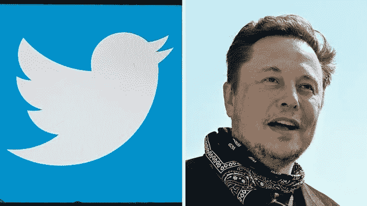
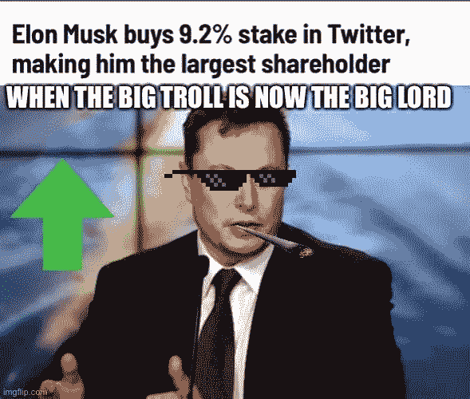
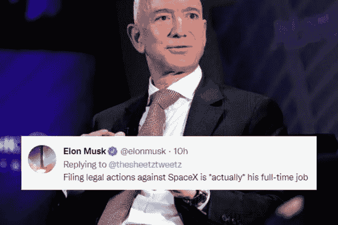
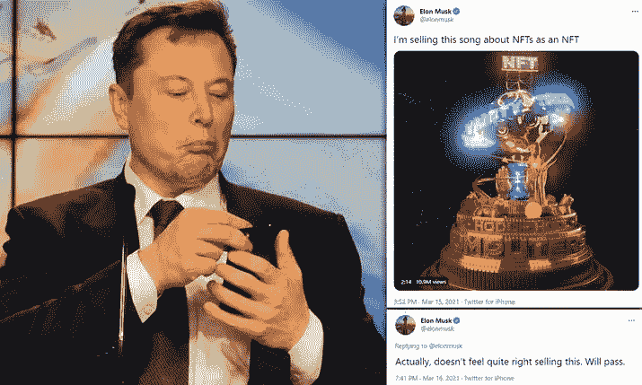
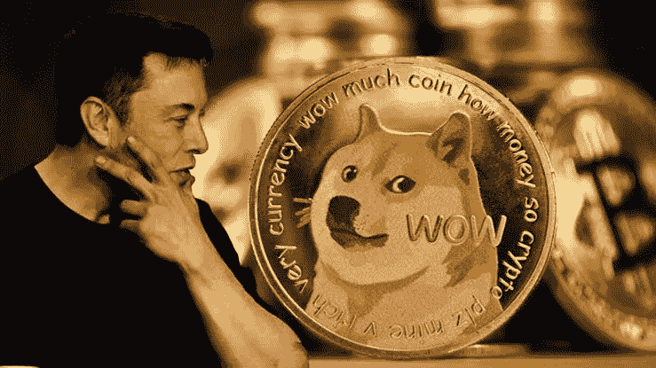
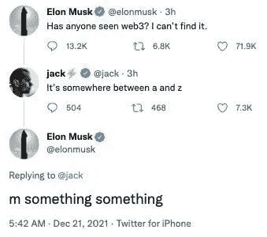
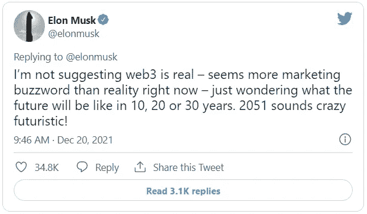
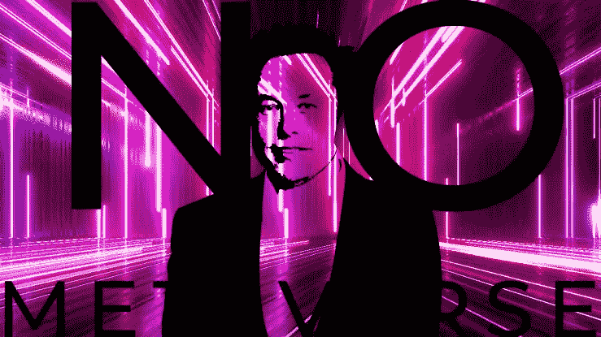

# 埃隆·马斯克收购 Twitter:对加密货币、Web3、NFTs、区块链和元宇宙的可能影响

> 原文：<https://medium.com/coinmonks/elon-musks-acquisition-of-twitter-possible-implications-on-cryptocurrency-web3-nfts-the-65100297da96?source=collection_archive---------8----------------------->

埃隆·马斯克收购 Twitter 的消息已经在互联网和几乎所有的社交网络平台上掀起了波澜，包括被视为专业网络平台的 LinkedIn。

这些包括高层管理人员被解雇的消息，应用程序新功能的提议，以及言论自由的促进，等等。

最近的大惊小怪把社交网络平台的休闲和专业用户分成了两派。有些人支持新的发展，有些人则强烈反对。

最终，他们都在追求自己的利益。似乎对立双方看不到太多或根本看不到任何东西。

> 他们的咖啡杯

作为宇宙和互联网生态系统的一部分；投资者、散户交易者和加密货币的先驱们也担心此次收购会给他们带来什么。

为什么？埃隆·马斯克似乎就是其中之一——但事实并非如此。他一直是一些加密货币的顶级先驱，并通过他的手柄公开展示这一点。

让我们快速进入 Twitter 收购交易，以及它可能如何影响这些新兴概念。

# 埃隆·马斯克收购 Twitter

2022 年 4 月 14 日，商业巨头、世界首富埃隆·马斯克开始收购 Twitter。

他开始购买该公司的股票，并在 2022 年 1 月以 9.2%的持股比例成为该公司的最大股东。

他随后被邀请加入该公司的董事会，他接受了邀请，但后来拒绝了。4 月 14 日，他提议以 430 亿美元收购这家社交媒体公司。

该公司以“毒丸”策略回应，将该提议标为敌意。4 月 25 日，该公司邀请他考虑以 440 亿美元收购该公司，协议将私下达成。

他让他们知道，他的首要计划是促进言论自由，同时使其算法开源，结束垃圾邮件帐户，并引入新功能。

然而，在 2022 年 7 月，埃隆·马斯克宣布他想停止这笔交易，称 Twitter 违反了一些协议。根据他的说法，违反的协议之一是该公司拒绝关闭 spambot 帐户。

该公司在特拉华州衡平法院对他提起诉讼，在审判前几周，他撤销了自己的决定。他已经准备好推进交易，在 10 月 27 日，交易最终完成。

他解雇了高管，此次收购标志着 Twitter 股票在纽约证券交易所的交易结束。自从他准备在平台上允许言论自由以来，已经出现了一些担忧。

有些人害怕虚假信息、错误信息和骚扰；其他人认为他做出了正确的选择。我们知道他的决定会带来什么后果只是时间问题。

# 埃隆对这些概念感兴趣吗？

## 论非金融交易系统和加密货币

大多数人都怀疑埃隆·马斯克是否精通密码，或者是否拥有一辆 NFT。这是他对概念的两面性反应的结果。

一次，他会支持，另一次；他在取笑这件事。在提议收购 Twitter 之前，他曾形容该公司加入 NFT 个人资料照片的决定令人恼火。

据几个十几岁的人描述，他曾经整理了一些无聊的猿类的截图，并把它作为自己的个人资料照片发给了巨魔 NFT 的主人。

在一些场合，他分享和转发了不同种类的模因，并因经常忽视原创者而受到批评。

早在 2021 年，他在推特上发布了一条迷因追踪 NFTs，内容如下:“这些‘NFT’——他们现在就在我们房间里吗？”

> “我不知道……似乎有点可替代性”
> ——埃隆·马斯克(@埃隆·马斯克)2022 年 5 月 4 日

这让一些人陷入困惑，不知道自己是否喜欢这些概念。

埃隆·马斯克将其总资本的一小部分投资于比特币，这使他成为了数字货币的粉丝。

他的言论往往以这样或那样的方式影响着货币的价格。有趣的是，他在自己的推文中一直对 Dogecoin 表现出无尽的兴趣。

他承诺在 2021 年将“一个真实的狗币”放在“真实的月亮”上，这使得这个模因币的价格上涨了 35%。在他的一条推文中提到“Doge 宝宝”后，又经历了另一次 90%的增长。

这为他赢得了“总督之父”的称号，他承诺将继续成为“迷因币”的倡导者。该承诺还在宣布后几分钟内将硬币的价值提高了 11%。

他似乎不是比特币的粉丝，因为他抱怨比特币的交易量很低。据他在接受彭博采访时表示，他从未建议人们投资加密货币，即使他是 BTC·霍德勒。

最重要的是，这位商业大亨一直在他的大多数消息中表达他对区块链的支持，早在 4 月份提议以 430 亿美元收购 Twitter 之前，埃隆·马斯克就发了一条短信；其中一条消息写道: ***“我认为需要一种新的社交媒体，它基于区块链，包括支付。”***

## 在 Web3 和元宇宙上

在埃隆·马斯克对 Web3 概念大放厥词之后，他在 2021 年 12 月 21 日的推特上写道:“2021 年有人见过 Web3 吗？找不到了。”

他在一些涉及 NFTs 或 Web3 本身的推文中连续嘲笑了这个概念的进展。

马斯克与 Twitter 联合创始人杰克·多西一起，一直在挖掘元宇宙、Web3 和不可替代令牌(NFTs 它是 Web3 不可或缺的组成部分。

他对这一概念的憎恨也在 2021 年发布的关于 NFTs 的歌曲中表达出来，其中包括:“NFT 为了你的虚荣。电脑从不睡觉。已经核实了。这是有保证的。”

埃隆·马斯克将元宇宙描述为一种吮吸技术，并提出 Neuralink 是一种更好的替代方案；在巴比伦蜜蜂报的采访中。

据该网站报道，他向他们提出了一个问题:
*“我是不是像那些在 1995 年对互联网不屑一顾的人一样，认为它只是一种时尚，或是永远不会有任何价值的东西？”*

他似乎在宣传他共同创立的公司 Neuralink，当时他将其描述为“长期、复杂的 Neuralink，它能够让你完全融入虚拟现实中。”

# 最终判决

Twitter 员工、左翼人士、自由主义者和民主党人都对埃隆马斯克(Elon Musk)决定将社交平台开源并建立言论自由感到担忧。

其他人，如右翼分子、共和党人和保守派都对这一决定感兴趣，并表示全力支持。

加密货币交易商、NFT 持有者、Web3 用户和元宇宙居民也期待着新的收购为他们带来什么。

你应该记得，我们确立了埃隆·马斯克对加密货币的热情和对非加密技术的仇恨。

然而，我们都记得当埃隆·马斯克提到 Dogecoin 时发生了什么。市场价格上涨，人们大量购买。收购交易完成几天后，同样的历史又重演了。

这就是加密货币在未来几天的前景。

对于 Web3 和元宇宙，我们希望看到埃隆·马斯克引入或建立一个 Web3 版本的 Twitter。更好的是，他可以简单地集成元宇宙中的关键元素，如增强和虚拟现实(AR/VR)、加密货币和社交平台本身——Twitter。现有的一个例子是 Reddit 公司。

有兴趣了解 Twitter 收购对加密货币、Web3、NFTs、区块链和元宇宙可能产生的影响，**在 Medium 上跟随我**，打开通知按钮，因为这将是下一个要写的东西。

请分享你对收购 Twitter 的想法以及埃隆·马斯克对任何概念的支持。**你认为接下来会发生什么？**

点击此处关注我的 [Medium](/@abdulmuminsolihu) ，了解更多关于加密货币、Web3、金融科技、区块链和元宇宙的内容。也可以在 [LinkedIn](https://linkedin.com/in/abdulmuminsolihu) 上和我联系。

> 交易新手？尝试[加密交易机器人](/coinmonks/crypto-trading-bot-c2ffce8acb2a)或[复制交易](/coinmonks/top-10-crypto-copy-trading-platforms-for-beginners-d0c37c7d698c)