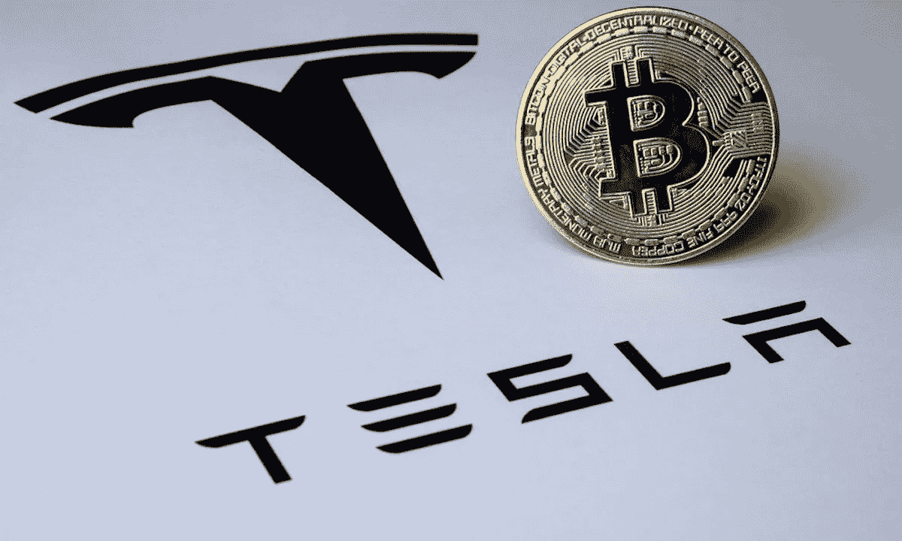

# 埃隆·马斯克的特斯拉出售了约 75%的比特币股份

> 原文：<https://medium.com/coinmonks/elon-musks-tesla-sells-off-about-75-of-its-bitcoin-holdings-409cc89773f4?source=collection_archive---------41----------------------->

埃隆马斯克拥有的电动汽车公司特斯拉最近在一份声明中透露，今年下半年，它已经出售了约 75%的比特币资产。通过出售世界上最受欢迎的密码筹集了 9 . 36 亿美元现金。

然而，这也带来了巨大的损失。电动汽车公司最初在 2021 年上半年购买了价值 15 亿美元的比特币，当时比特币的交易价格约为 31，000 美元。

在该公司周三发布的一封股东信中，它表示:

> “截至 Q2 年底，我们已经将购买的约 75%的比特币兑换成了法定货币，”Q2 的兑换为我们的资产负债表增加了 9.36 亿美元的现金。"

特斯拉目前持有价值 2.18 亿美元的比特币，低于上一季度的 12.6 亿美元。虽然实际销售价格尚未公布，但很明显比特币的减值对利润产生了负面影响。

Elon Musk 在一次公开的[收益电话会议](https://www.youtube.com/watch?v=kwpYe1Empwo)上透露，由于中国的 COVID 锁定带来的“流动性担忧”，他的公司出售了大部分持有的比特币。

他还表示，该公司当然愿意在未来购买更多比特币，以增加其持有量。还披露它没有减持 Dogecoin 的股份。*“我们没有卖出任何一只狗，”他在电话中透露。*

2021 年，该公司在一份声明中显示，它拥有来自数字资产的 2.72 亿美元现金流。这始于 2021 年 1 月，当时这位首席执行官宣布支持比特币，将加密货币的名称添加到他的个人 Twitter 个人资料中，几天后购买了价值 15 亿美元的比特币，并开始在特斯拉接受比特币支付。

请记住，比特币的价格在 2021 年最后一个季度飙升至 69，000 美元的历史高点，这在一定程度上受到了埃隆·马斯克当时为加密货币[进行宣传的影响。](https://36crypto.com/cryptocurrency/)

虽然比特币资产被出售的实际日期不得而知，但已知的是，它们是在 2021 年上半年以平均 31，700 美元的价格被购买的，并且从那时起[比特币](https://36crypto.com/bitcoin/)经历了大幅下跌，这表明该公司肯定经历了重大损失。

> 交易新手？尝试[加密交易机器人](/coinmonks/crypto-trading-bot-c2ffce8acb2a)或[复制交易](/coinmonks/top-10-crypto-copy-trading-platforms-for-beginners-d0c37c7d698c)