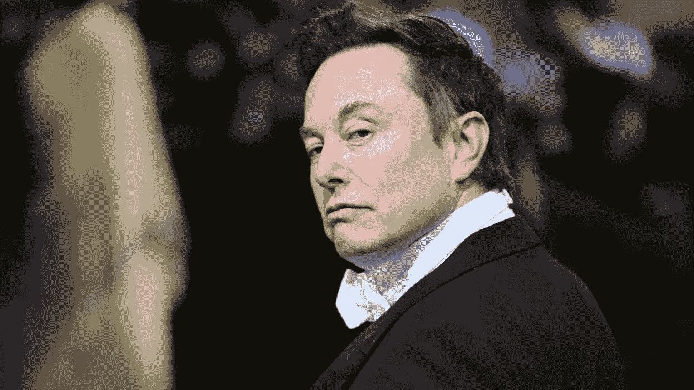
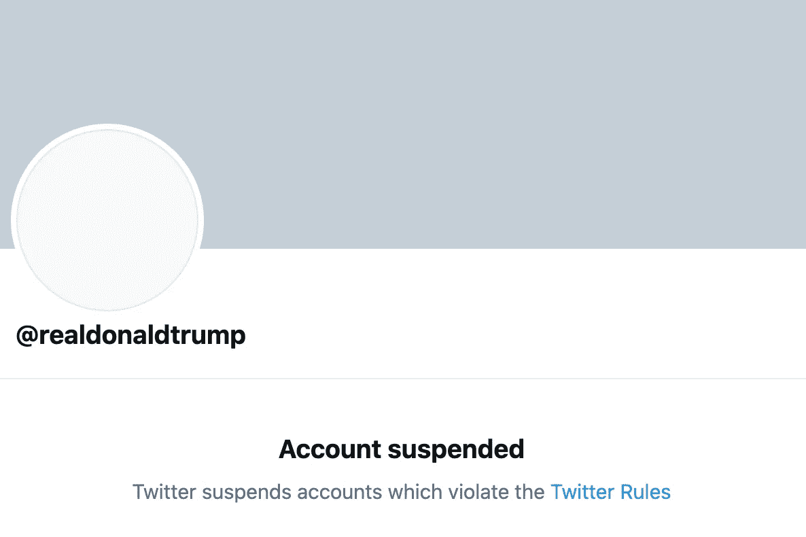
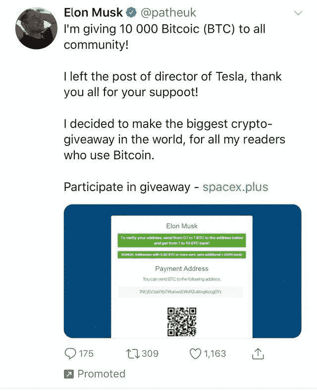
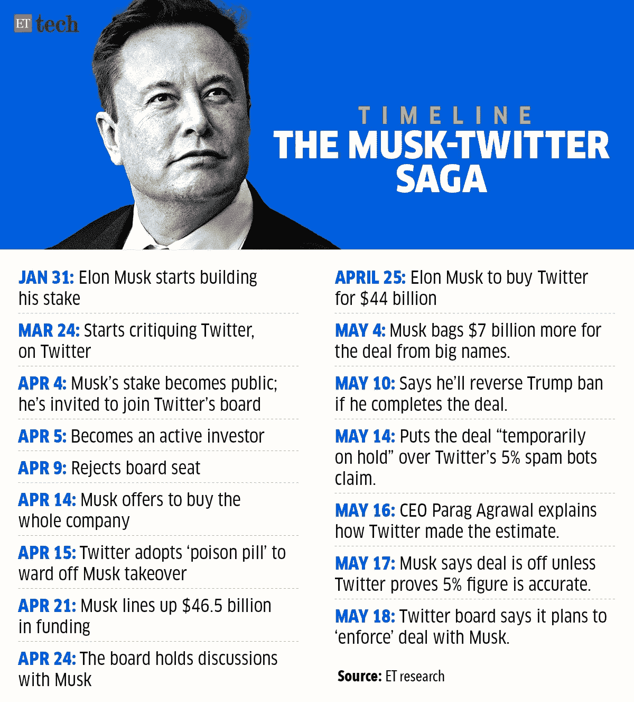
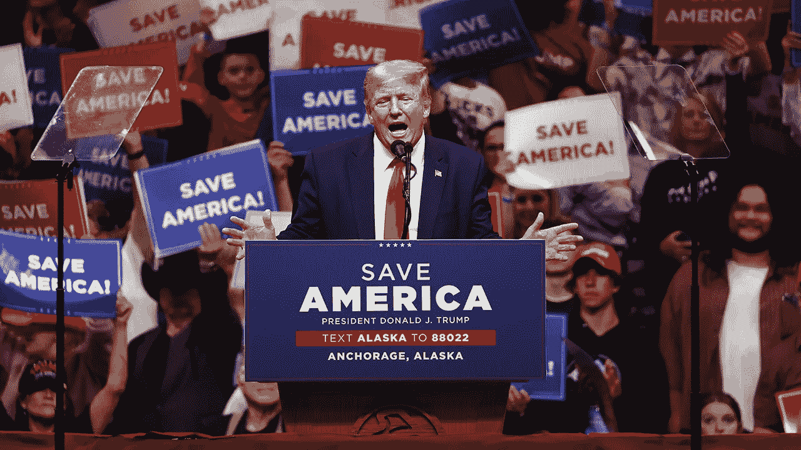

# 埃隆解禁推特——接下来会发生什么

> 原文：<https://medium.com/coinmonks/elon-unbuys-twitter-what-happens-next-f5b939859df1?source=collection_archive---------15----------------------->

每个人都喜欢的不食人间烟火的首席执行官现在已经收回了他收购 Twitter 的出价，理由是社交媒体平台未能提供足够的信息，说明其用户群中由机器人组成的百分比。与此同时，Twitter 希望迫使马斯克完成这笔价值 440 亿美元的交易。接下来很可能是一场旷日持久的法庭大战，最终将决定这场旷日持久的奇观的命运。

在长达几个月的故事中，马斯克成为 Twitter 的最大股东，引发了人们对他长期目标的猜测，这一举动是对 Twitter 交易的最新更新。然后，他拒绝了一个董事会席位，决定彻底收购这家社交媒体平台。这在当时成为了大量的头条新闻，因为互联网被马斯克大胆而看似冲动的决定所吸引。随着股票和密码市场在 4 月份开始崩溃，马斯克开始对 Twitter 上的 botted 活动表示担忧，并对交易的进行表示怀疑。马斯克的律师在周五提交的一封信中证实了退出收购的决定，该信指控 Twitter 实质上违反了合并协议的原始条款。

Twitter 被广泛认为是直接听取包括世界领导人、政治活动家、艺术家和首席执行官在内的有影响力人物意见的平台。马斯克特别喜欢 Twitter，因为他喜欢利用这个平台表达他的意识流、不良迷因和右翼政治意识形态，让人想起 2015 年的反 SJW 巨魔。马斯克也坚信言论自由，并直言不讳地表达了他对 Twitter 左翼偏见的担忧。最初收购 Twitter 的出价让右翼人士庆祝，因为马斯克掌权后，该平台允许的内容可能会发生巨大变化。在一次采访中，马斯克证实了许多人一直在猜测的事情。如果他接管 Twitter，埃隆将取消对特朗普的禁令，并允许这位前总统重返平台。

尽管马斯克有政治信念，但他仍然是一名商人，商业格局在过去两个月发生了巨大变化。随着股票和密码市场遭受重创，几乎所有东西的股价都跌至今年的历史低点。截至发稿时，特斯拉股价已从 4 月初的 1145 美元高位跌至 752 美元。马斯克计划用他的特斯拉股票为 Twitter 交易的一部分融资。随着过去几个月特斯拉股价的下跌，这一计划不再可行。

> 交易新手？试试[加密交易机器人](/coinmonks/crypto-trading-bot-c2ffce8acb2a)或者[复制交易](/coinmonks/top-10-crypto-copy-trading-platforms-for-beginners-d0c37c7d698c)

此外，Twitter 的股价在 4 月份因马斯克可能收购的消息而飙升至 54 美元的高点，在 7 月份也跌至 36 美元左右。随着 Twitter 股价的下跌，收购这家社交媒体平台的交易看起来不再像几个月前那样有利可图。随着市场在 4 月份开始崩溃，马斯克开始在 Twitter 上提出对瓶装活动的担忧。敏锐的观察家推测，对瓶装活动的担忧只是马斯克不再负担得起的交易的借口。

Twitter 上 botted activity 的说法不是没有根据的。建立一个 Twitter 账户是如此容易，以至于该平台已经成为假冒用户和诈骗账户的粪坑。这在 Web 3 Twitter 场景中尤其明显，在那里社区成员经常成为黑客和鱼叉攻击的目标。瞄准 Web 3 对骗子来说是非常有利可图的，因为获得某人的钱包可能是一个严重的发薪日，这取决于被破坏的加密和 NFT 资产的数量。也就是说，Twitter 上的欺诈账户和封闭活动是一个长期存在的问题。有理由假设马斯克和他的团队在决定收购 Twitter 之前就知道这些问题。Twitter 董事会对目前的借口并不买账，可以理解的是，这位自吹自擂的亿万富翁在 4 月份谈论一场相当大的比赛时的语气变化让他们感到沮丧。

“Twitter 董事会承诺按照与马斯克先生商定的价格和条款完成交易，并计划采取法律行动来执行合并协议，”Twitter 董事会主席布雷特·泰勒说

如果交易失败，有一个应急措施。如果马斯克退出收购，他将面临 10 亿美元的费用。马斯克的法律团队现在指控 Twitter 实质上违反了合并协议，以此作为避免 10 亿美元费用的手段。在周五提交的一封信中，马斯克的律师声称，Twitter 未能提供所需的用户数据，这些数据与评估该交易的可行性有关。显然，马斯克的团队没有收到关于 Twitter 如何审计和处理虚假账户的信息。此外，马斯克的团队未能获得足够的数据来评估可货币化的日活跃用户——mDAU 以及这些计算是如何进行的。最后，这封信声称 Twitter 未能发送关于其财务状况的足够信息。通过指控 Twitter 实质上违反了合并协议，马斯克的法律团队似乎正在建立一个论点，即他不仅可以退出交易，而且马斯克可能不会被 10 亿美元的分手费所拖累。

Twitter 仍致力于完成这笔交易，并寻求对马斯克采取法律行动。社交媒体平台很可能在诉讼中向法院提出两项要求。Twitter 可能会寻求裁定其没有违反与马斯克的合同，并要求马斯克完成收购。

"我们相信我们会在特拉华州衡平法院胜诉。"——推特董事会主席布雷特·泰勒

随着即将到来的法庭大战，马斯克和 Twitter 的事情将如何发展还不清楚。法官需要确信双方的主张，现在看来我们不太可能很快在这里看到解决方案。无论如何，这对于马斯克来说都不是一个好消息，他曾在 4 月份信心满满地采取行动收购 Twitter，现在似乎因为声称仅两个月后用户活动受限而退出。这位大胆的亿万富翁似乎高估了自己的实力，不再有能力完成这笔 440 亿美元的交易。

很难夸大这其中的利害关系。Twitter 是一个不可或缺的社交媒体平台，被全世界数百万人使用。该平台长期以来一直是言论自由问题的战场，除了巨额交易价值之外，马斯克收购 Twitter 的举动代表了一种举动，即让社交媒体平台成为极右翼意识形态人士的一个更安全的空间。此外，如果马斯克接管推特，可能会导致取消对特朗普的禁令，并对即将到来的中期选举产生重大政治影响。背弃这笔交易暴露了一个事实，即归根结底，马斯克首先是一个商人。马斯克的政治信念只延伸到他的商业利益，这并不奇怪。

昨晚在阿拉斯加安克雷奇的一次集会上，唐纳德·特朗普就马斯克在 Twitter 交易中食言一事发表了一些看法。

“埃隆。埃隆。埃隆。他不会收购 Twitter…你之前从哪里听说的？从我这里，”

“他把自己弄得一团糟，我看过他的合同”

“你知道，埃隆说他从来没有投票给共和党，但我不知道，因为他告诉我，他投了我的票，所以他是另一个扯淡的艺术家。”

已经有一分钟没听到一些经典的特朗普式台词了。随着美国最受欢迎的叛乱者离开 twitter，我不经常听到他的消息…对 Twitter 来说很糟糕，但也许这个交易失败是对我们的民主最好的事情。

感谢您的阅读。

看看我在推特上未经过滤的想法:

[https://twitter.com/wasifmrahman](https://twitter.com/wasifmrahman)

在 LinkedIn 上关注我的职业生涯:

 [## Wasif Rahman -美国纽约布鲁克林|职业简介| LinkedIn

### 查看 Wasif Rahman 在全球最大的职业社区 LinkedIn 上的个人资料。Wasif 有 4 个工作列在他们的…

www.linkedin.com](https://www.linkedin.com/in/wasifmrahman/) 

我对媒体的另一个想法是:

 [## 瓦西夫·拉赫曼-中号

### 阅读瓦西夫·拉赫曼在媒介上的作品。Web 3 德根 Ex Populus 营销伙伴关系总监。每天…

medium.com](/@wasifmrahman) 

来源:

 [## 内幕-埃隆-马斯克-推特-sec (1)。可移植文档格式文件的扩展名（portable document format 的缩写）

### 编辑描述

drive.google.com](https://drive.google.com/file/d/12C2Kgidm2VBoIxBG6n0eJrJKKqwZIdR6/view)  [## 阅读埃隆·马斯克致 Twitter 的信，取消他 440 亿美元的收购交易

### 埃隆·马斯克在其律师提交的一封信中放弃了以 440 亿美元收购 Twitter 的交易

www.businessinsider.com](https://www.businessinsider.com/read-elon-musk-letter-to-twitter-deal-is-off-2022-7)  [## 马斯克告诉 Twitter，他希望通过交易收购它。Twitter 表示，这将迫使他关闭销售

### 埃隆·马斯克周五下午终止了他以 440 亿美元收购 Twitter 的交易——这是旋风中的最新转折…

www.cnn.com](https://www.cnn.com/2022/07/08/tech/elon-musk-twitter-deal-exit/index.html)  [## 埃隆·马斯克退出 440 亿美元收购 Twitter 的交易

### “Twitter 有时会忽略马斯克先生的请求，有时会拒绝他们，原因似乎是…

www.bbc.com](https://www.bbc.com/news/business-62102821) 

[https://www . Bloomberg . com/news/articles/2022-07-10/trump-lashed-out-at-elon-musk-and-rotate-Twitter-deal](https://www.bloomberg.com/news/articles/2022-07-10/trump-lashes-out-at-elon-musk-and-rotten-twitter-deal)