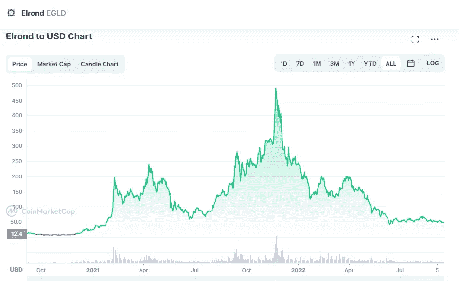

# 埃尔隆德(EGLD)2022–2025 年价格预测

> 原文：<https://medium.com/coinmonks/elrond-egld-price-prediction-2022-2025-d2f49bb7f43d?source=collection_archive---------21----------------------->

Source photo [Elrond price today, EGLD to USD live, marketcap and chart | CoinMarketCap](https://coinmarketcap.com/currencies/elrond-egld/)

# 什么是埃尔隆德？

埃尔隆德平台利用区块链的一个特性——分片，来确保快速安全地处理交易。使用网络的智能合同执行平台，每秒可处理 15000 笔交易。埃尔隆德的母语被称为 eGold(或 EGLD)。