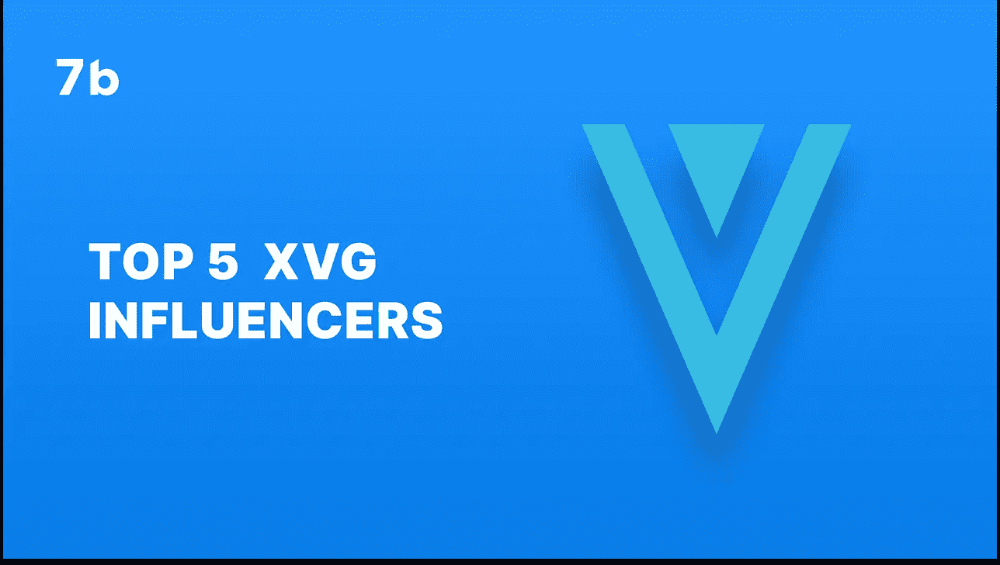
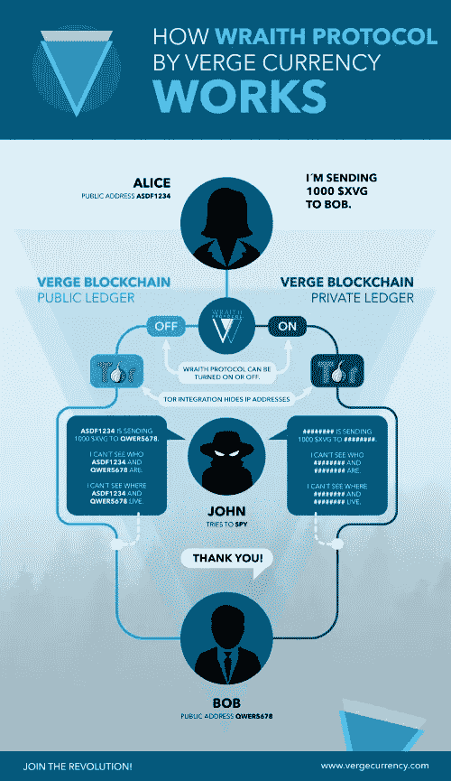

# 出现在边缘。前 5 名 XVG 影响者

> 原文：<https://medium.com/coinmonks/emerge-into-verge-top-5-xvg-influencers-ec1ec54457a6?source=collection_archive---------43----------------------->

# 过去几年，加密货币已经成为越来越受欢迎的投资。如果你打算 [**投资 Verge**](http://sevenb.io/currencies/verge?utm_source=medium&utm_medium=article) 或任何其他数字货币，你应该在这样做之前清楚地知道你会让自己陷入什么样的境地。

# 什么是边缘？

Verge，或称为 [XVG](http://sevenb.io/currencies/verge?utm_source=medium&utm_medium=article) 硬币，是一种为日常使用而创造的数字货币。它包括 vergePay，一个接受简化数字支付的系统。成立于 2014 年的 Verge 优先考虑用户隐私和匿名。人们可以在日常生活中使用比特币，因为它基于一个分散的开源网络，改进了比特币的区块链技术。

除了提供快速交易、高流通量和跨多个平台的支持，Verge 加密货币还以其低交易费用而闻名。

# Verge 是如何工作的？

Verge 的技术使其能够创建一种真正去中心化、私有和可访问的加密货币。在洋葱路由器(TOR)的帮助下，网络保护其用户的身份。

TOR 网络通过加密信息并将其发送到多个设备来模糊 IP 地址。到达最终目的地后，设备将能够解密信息，但不能确定其原始 IP 地址。Verge 的钱包整合了 TOR，因此没有一个点可以精确定位交易的来源或目的地。

凭借双密钥“隐形地址”技术，Verge 能够为其用户提供额外的一层保护。用户可以将多笔付款发送到不同的地址，即使它们被定向到同一个地址。有了秘密地址，交易变得更加私密和隐蔽。

The Verge 还在 ins 网络上实现了原子互换，允许在不同的区块链进行点对点交易。

有了 Verge，用户不再需要依赖传统的集中式交换。Verge 在其网站上表示:“通过启用原子互换功能，Verge 朝着去中心化的未来迈出了积极的一步。”

# 最佳边缘影响者

如果你真的对 Verge 项目感到好奇，并希望尽可能保持最新状态，你绝对应该关注这 5 个 twitter 影响者。

[**TheCryptoGhost**](https://twitter.com/DaCryptoGhost)

XVG 迅速成为最受欢迎的加密货币之一，CryptoGhost 是世卫组织的分析师和交易员，他将目光投向了 Verge。他拥有超过 94，900 名关注者，分享关于 XVG 加密货币价值变化、预测和更新的详细信息。

[**马克·维滕贝格**](https://twitter.com/itsmwittenberg)

作为该项目的业务发展策略师，Mark Wittenberg 将向您详细介绍您需要了解的关于 Verge 项目的所有信息。他的 Twitter 页面包含关于该项目的定期新闻，他也是 Verge 社区中最大的受众之一。在撰写本文时，他有超过 238，000 名粉丝，这使他成为了 Verge 爱好者中广受欢迎的人物。

**XVG 爱好者 Ellistheginge 定期发布关于区块链网络的新闻，并展示了对该项目的高度支持。他还参与了 XVG 的推广，因此如果您对尽可能保持最新感兴趣，这可能是一个值得关注的可靠影响者。**

**[**亚历山大**](https://twitter.com/AlexanDreEderer)**

**AlexanDreEderer 是社交媒体平台 Note Blockchain 的首席执行官，也是一名营销策略师。他也是 XVG 的影响者和支持者，分享关于这种安全和用户友好的数字货币的信息和见解。有些人甚至称他为“官方 XVG 忍者”**

**[**玛丽亚·迪亚斯**](https://twitter.com/maria___dias)**

**边缘社区的下一位杰出成员是玛丽亚·迪亚斯。在她的 twitter 账户中，Maria 通过提供 XVG 的基本信息并将其与其他加密货币进行比较来建立意识。**

# **结论**

**Verge 项目和它的本地货币 XVG 获得了加密货币爱好者的巨大支持。用户被 Verge 的安全性和开放性所吸引，因为它是完全去中心化和社区驱动的。**

**7b 支持 XVG 的大量采用，并允许在没有 kyc 的情况下进行加密交换。使用 7b，安全和[匿名密码交换](http://sevenb.io/?utm_source=medium&utm_medium=article)，享受[低密码交易费用](http://sevenb.io/about?utm_source=medium&utm_medium=article)。**

***原载于 2022 年 8 月 24 日*[*https://seven b . io*](https://sevenb.io/blog/emerge-into-verge-top-5-xvg-influencers/)*。***

> **交易新手？尝试[加密交易机器人](/coinmonks/crypto-trading-bot-c2ffce8acb2a)或[复制交易](/coinmonks/top-10-crypto-copy-trading-platforms-for-beginners-d0c37c7d698c)**