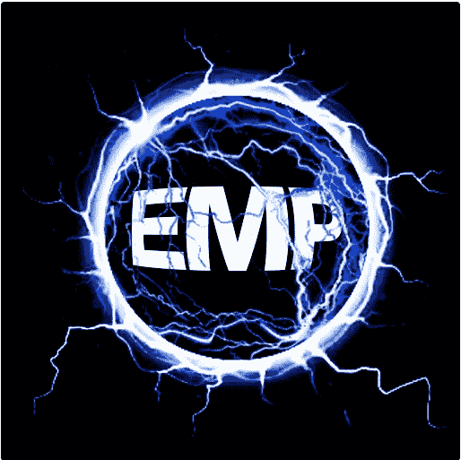
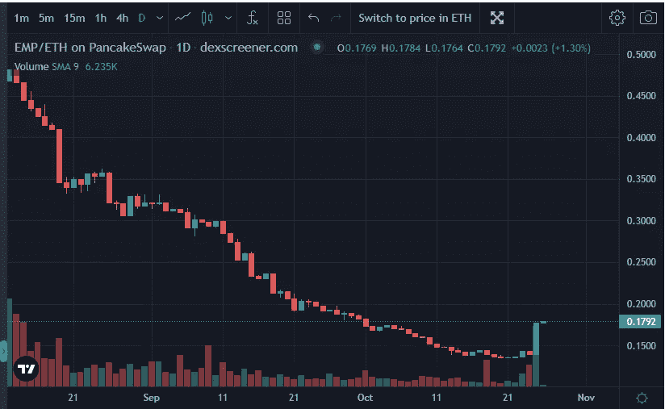
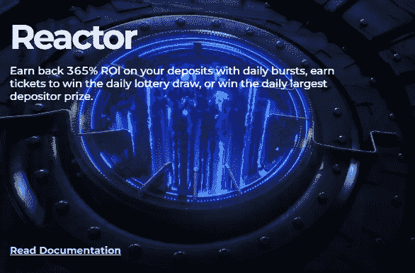

# EMP 货币更新

> 原文：<https://medium.com/coinmonks/emp-money-updates-2fcd3284c731?source=collection_archive---------14----------------------->

对于那些不知道 EMP Money 的人来说，这是坟墓金融的一个分支。原生令牌 **EMP** 与 **ETH** 价格挂钩，比例为 4000 **EMP** 比 **ETH** 。在以后的文章中，我会给出一个生态系统的布局，以及你如何参与其中。出于本文的目的，我假设您熟悉这个项目。

在一个值得休息的假期之后，AJ Brockman(项目负责人)从一个值得休息的假期回来了。经过几个星期的痛苦之后，对整个 DeFi 空间来说，这是一股清新的空气。到目前为止，EMP 和 ESHARE 的价格都对他的声明做出了积极的回应。BTC 和 ETH 的绿色蜡烛当然有所帮助。

EMP bucking the down trend.

AJ 宣布了 EMP Money 与 T21 合作的新 NFT 合作项目的细节。其次，他宣布**ESHARE/BNB**LP 农场将不再提供 **ESHARE** 奖励。我将简要介绍这些变化，并给出我的总体想法。

**NFT 与多边开发银行的伙伴关系**

一个新的 NFT 系列将通过 MDB 的网站发布(链接将由 MDB 和 EMP 稍后确认)。5000 枚 NFT 将以 300 **BUSD** 的价格或者相当于 MBD**凤凰+** 的价格铸造。

筹集的资金将存入 EMP Money 的**反应堆**合同。此外，该团队将按下“立即赢得”按钮，立即加倍对 Reactor 的投资。该账户将每天复利 70%的奖励，并要求 30%。索赔的 LP 将与支付给 NFT 持有者的 **ESHARE** 分开， **BNB** 将用于购买 **MDB** 然后支付给 NFT 持有者。

这对两个协议都是有利的。对于 EMP 资金，它将为**反应堆**增加额外的流动性，同时也为不想每天与合同打交道的人提供了一个被动流。规模较小的玩家(比如我)没有能力向 Reactor 投入这么大一笔资金，他们将从资本较少的“立即赢”功能中受益。AJ 还在他的一份 ama 中提到，EMP 财政部将收到存入**反应堆**的资金的 10%，以继续支持生态系统。

**ESHARE/BNB 停止支付 ESHARE 奖励**

这一宣布有点令人惊讶，但经过适当考虑后，更有意义。由于 **EMP** 和 **ESHARE** 的价格下跌， **EMP/ETH LP** 农场和 **EShare/BNB LP** 农场的 APR 都大幅下跌。然后，当人们由于低回报而退出该协议时，这种情况会自我反馈。这一变化意味着大部分的电子共享奖励将支付给农场。一部分还将用于为**雷管**和**反应堆**合同提供流动性。

这将对 **EMP/ETH LP** 农场 APR 的潜在提升和 **EMP/ETH LP** 的更多采购产生综合影响。这两种情况都是乐观的，因为人们将会收到更多的电子邮件，或者随着更多的购买压力施加在雇员身上，电子邮件的价格将会上涨。

EMP 资金团队现在还为投资者提供激励措施，如果人们想持有 ESHARE 并从中赚取收益，就将 ESHARE/BNB LP 存入 Reactor。另一个激励是让人们通过建立他们在 **EMP/ETH LP** 中的地位来支持 **EMP** 本身。

由于变化的性质，该团队同意让 EMP 资金部在 3 天内以 130 BUSD 的价格进行回购，从而提供了一个临时的价格下限。这为电子股票提供了支撑，并推动价格大幅上涨。

**我做了什么和将要做什么**

最新的公告相互补充，表明 AJ 一直在努力加强 EMP 资金生态系统。我个人决定打破我的 **ESHARE/BNB LP** 坐在农场里，然后把我的 **ESHARE** 换成 **ETH** 并把它和来自我节点的 **EMP** 配对。我一直把 BNB 放在我的钱包里。我还没有决定如何处理我在**反应器**中现有的 5-2 化合物/索赔策略。我倾向于使用 **ESHARE** 来建立我在 **EMP/ETH LP** 农场的地位，并保留 **BNB** 。

我已经决定不参加 NFT 造币厂，因为它将在我睡觉的时候举行。尽管我喜欢加密和 EMP 钱，但我不会因为任何原因放弃睡眠。这会养成坏习惯，健康对我很重要。相反，我决定购买更多的 **EMP/ETH LP** 以期待看涨的势头。如果二手市场上的价格合理，我可能会考虑以后购买。

**最后的想法**

像其他古墓丽影一样，EMP 最近经历了一段困难时期，但总体上在这个领域表现突出。这在很大程度上归结于 AJ 参与社区和推广项目的方式。过去的一个月是充满挑战的，有很多 FUD，但除了对价格的失望之外，没有任何实质性的东西。

***免责声明:*** *本文所写内容均不构成理财建议。投资加密货币，尤其是去中心化金融，是高风险的。我写的不是投资我讨论的项目的建议。我不清楚你的个人情况。只投资你能承受的损失。确保做你自己的研究，而不是仅仅依靠我的内容。*

**链接**

EMP Money 主页:[https://emp.money/#/](https://emp.money/#/)

EMP 钱雷管链接:[https://emp.money/#/detonator?ref = 0x a 7 AC 3 ea 7d 8d EC 039 f 459934 CB 0d 0152 a2 e2b 28 f 1](https://emp.money/#/detonator?ref=0xa7AC3Ea7D8dEC039F459934Cb0d0152a2e2B28f1)

电报组:[https://t.me/empmoney](https://t.me/empmoney)

不和:[https://discord.gg/9wDDa26Z6e](https://discord.gg/9wDDa26Z6e)

https://youtube.com/playlist?list = pl 2 zux 77 bqsmkeois jyeieiws 6 egmmvbd

> 交易新手？尝试[加密交易机器人](/coinmonks/crypto-trading-bot-c2ffce8acb2a)或[复制交易](/coinmonks/top-10-crypto-copy-trading-platforms-for-beginners-d0c37c7d698c)