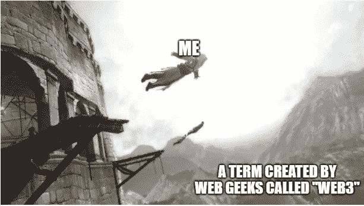

# 成为一名精明的合同审计员—第 1 周

> 原文：<https://medium.com/coinmonks/en-route-to-becoming-a-smart-contract-auditor-week-1-c5348c5b153d?source=collection_archive---------11----------------------->

> 第 1 周:迈出一大步

受到西尔维娅·玛格丽塔的启发，我决定开始记录每天的学习进度。我已经在 web3 进进出出超过半年了。对 web3 的不专注、支离破碎和开玩笑的学习实际上意味着我的学习基本上是平淡无奇的。

一个最大的原因也是因为我在开始涉足 web3 之前找到了我的第一份工作，这改变了我的思维方式，把 web3 知识当成了一种爱好…在这 6 个月的时间里，我会对这个爱好产生不可分割的兴趣。我花时间四处冲浪，慢慢地，我开始了解智能合约的安全方面，最初是通过坏消息，如协议被黑客攻击(lmao)。

找到更多相关的文章为我打开了一个全新的世界。智能合约安全的世界。我意识到它其实并不遥远，有很多教程、分析和挑战，比如 ethernaut。

将我从“meh”的随意态度转变为“MURICAAA”的转折点是:[采访 Alexander Schlindwein](/immunefi/interview-with-legendary-bug-bounty-hunter-alexander-schlindwein-cced9c73c02a) 。看完之后我内心的某个东西咔嚓一声。我感觉到了真正做出“不成功便成仁”决定的动力。所以我开始写日记来给自己压力，这不仅仅是一个冲动的决定，而是我长久以来想要的东西。

该日志将在我添加智能合同审核/安全永久角色时结束。千里之行始于足下。

> **💡我学到了什么？**

## **10 月 3 日，周一< 3 小时**

*   **隐型僵尸(3/14):高级坚固概念(✅ )**

与 web2 相比，Gas 考虑改变了代码的编写方式。在这一章中，我们不是直接从存储器中获取所有者的僵尸，而是查看函数并在返回之前迭代顺序。为什么？因为如果我们直接从仓库中得到它，僵尸的序列需要在仓库中重新排列，每一步都要耗费汽油。

*   **buildspace:用 Solidity (50%)构建一个 web 3 App**

Solidity 基础，Hardhat 开发工具，ethers.js Js API，quicknode 节点提供者。用 Js 编写测试和部署脚本。

*   **听了** [**BNB 连锁**](https://twitter.com/BNBCHAIN) **推特空间 Web3 商业模式及其重要性？”当我打瞌睡并假装在工作的时候**

## **10 月 4 日，周二< 3 小时**

*   **隐型僵尸(4/14):僵尸战斗系统(✅ )**

通过可公开访问的信息(如时间戳)生成的不良随机性可被节点利用。方法之一是通过 oracle 生成。[详情](https://ethereum.stackexchange.com/questions/191/how-can-i-securely-generate-a-random-number-in-my-smart-contract)

*   **buildspace:构建一个坚固性(93%)的 web 3 App**

使用 React 处理 Replit 时遇到错误。完全被它摧毁了，因为我不熟悉 React

## **10 月 5 日，周三< 4 小时**

*   **隐型僵尸(14 年 5 月):ERC721 &密码收藏品(✅ )**

ERC721 的实施

创作者关于[2038 年问题](https://stackoverflow.com/questions/2012589/php-mysql-year-2038-bug-what-is-it-how-to-solve-it)和 [natspec](https://docs.soliditylang.org/en/latest/natspec-format.html) 的有趣评论。

*   **buildspace:用 Solidity 构建一个 Web3 应用(✅ )**

从智能合约中调用函数，但未设置事件监听器`useEffect`。在不和谐小组查看后设法解决了这个问题，肯定需要上 React 的课程…(添加到我的学习列表中)

*   **在 twitter 空间主持人由**[**Savvas Stephanides**](https://twitter.com/SavvasStephnds)**听了“你开始编码时面临了哪些困难”。**
*   **参加了由 thirdweb 举办的** [**新 ThirdWeb 周工作坊**](https://lu.ma/tw-weekly) **分享。在 buildspace 的一个关于 dao 的项目中偶然发现了这个 sdk。**

## 10 月 6 日，周四< 3 hours

*   **CryptoZombie (6/14) : App 前端& Web3.js (✅ )**

web3.js 和前端基础。一切都是 Js 和 HTML。理解有困难，在我上了 Js，HTML 课程后，我想停止课程并继续，但我认为我现在应该把重点放在可靠性和 Dapps 部署逻辑上。完成这一章，以后再来看。

*   **开始** [**通往 Web3**](https://www.alchemy.com/road-to-web3) **(1/10):如何用炼金术开发一个 NFT 智能契约(ERC 721)【✅】**

Remix IDE、 [Openzeppelin 的契约向导](https://docs.openzeppelin.com/contracts/4.x/wizard)、 [filebase](https://filebase.com/) 和元数据标准等工具介绍。

*   **阅读关于 NFTs** 的 [**元数据标准**](https://docs.opensea.io/docs/metadata-standards)

## **10 月 7 日，周五< 3 hours**

*   ****(7/14):数据馈送和计算(✅ )****

**通过 ChainLink 使用分散式 Oracle 网络(DON)提供数据以避免单点故障。**

**通过链接生成随机数。**

*   ****web 3 之路(2010 年 2 月):如何构建“请我喝杯咖啡”DeFi dapp ( 50% )****

**处理给定的挑战**

**a)更新功能以更改取款地址**

**b)为用户添加选项，以提供不同数量的咖啡(ETH)**

****🌟在** [**推特**](https://twitter.com/samczsun/status/1578167198203289600?s=20&t=kQB329NaCkGD23LLA45eWw) **上观看整个 BNB 的剥削是如何展开的。我什么时候能这么好？T.T****

## **10 月 8 日星期六< 6 hours**

*   ****网络之路 3(2010 年 2 月):如何建立“给我买杯咖啡”DeFi dapp (✅)****

**a)修改了 withdrawTip()，让所有者将 ETH 转移到输入的地址**

**b)决定保持支付功能，并在前端处理不同的选项**

**大部分时间花在了理解 React 上。设法添加了一个文本输入和按钮，让所有者键入要撤回的地址。添加了一个下拉列表，用户可以选择不同大小的咖啡，以给出不同金额的小费。没有完善我的用户界面，在我参加了前端设计的 HTML、CSS 和 Js 课程后，我将重新访问 ltr 来“美化”网站。**

*   ****阅读关于** [**地址**](https://jeancvllr.medium.com/solidity-tutorial-all-about-addresses-ffcdf7efc4e7) **在实度****
*   ****读上 ether eum 101**[**@ Secureum**](https://secureum.substack.com/)**以下** [**思维导图**](https://github.com/x676f64/secureum-mind_map) **。**(20/101)**

## **9 Oct，孙< 4 hours**

*   **[**学网 3**](https://learnweb3.io/) **(1/4):大一()****

**巩固基础知识。**

*   **[**学网 3**](https://learnweb3.io/) **(2/4):大二(15%)****

**React js 和 Next js 的简洁介绍。气体计算的详细细目，气体估算。**

*   ****阅读 ether eum 101**[**@ Secureum**](https://secureum.substack.com/)**以下** [**思维导图**](https://github.com/x676f64/secureum-mind_map) **。(40/101)****

> **交易新手？试试[加密交易机器人](/coinmonks/crypto-trading-bot-c2ffce8acb2a)或者[复制交易](/coinmonks/top-10-crypto-copy-trading-platforms-for-beginners-d0c37c7d698c)**