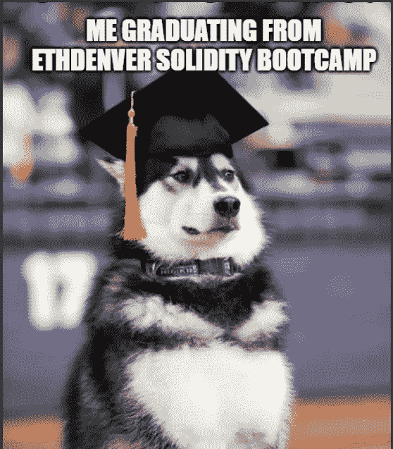
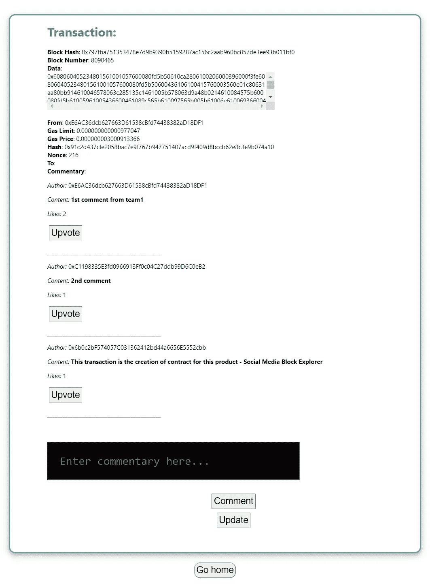

# 成为一名精明的合同审计员——第 10 周

> 原文：<https://medium.com/coinmonks/en-route-to-becoming-a-smart-contract-auditor-week-10-ab61683728be?source=collection_archive---------33----------------------->

> *毕业啦！👨‍🎓*

经过 8 周的密集训练营，ETHDenver Solidity 训练营终于结束了。我们的团队在 12 个小组中首次展示了我们的项目“社交媒体块浏览器”。虽然有很多缺点，但我们为该产品感到骄傲！

Picture of our project

下面是由[编码俱乐部](https://medium.com/encode-club)在[举办的训练营最后项目展示](/encode-club/ethdenver-bootcamp-powered-by-encode-early-cohort-summary-15f2f5889de6)的摘要。

这是紧张的两个月，所以我想放松几天，整理一下我的回购。是时候写一份简历申请实习职位了…任何人遇到任何合适的角色请填我呵呵(提前爱你😘)

> *💡我学到了什么？*

## 5**12 月 1 日< 9 小时**

*   **ETHDenver Solidity 训练营(8/8):第 8 周**

从事最终项目

## 6**12 月星期二< 9 小时**

*   **ETHDenver Solidity 训练营(8/8):第 8 周**

从事最终项目

## 7**12 月 3 日< 9 小时**

*   **ETHDenver Solidity 训练营(8/8):第 8 周**

从事最终项目

## 8**12 月 4 日< 6 小时**

*   ETHDenver Solidity 训练营(8/8):第 8 周

从事最终项目

## 9**12 月 Fri < 3 小时**

*   ETHDenver Solidity 训练营(8/8):第 8 周

项目演示！

## 10 **十二月星期六&11**十二月太阳****

*   冷却🌴

> 交易新手？尝试[加密交易机器人](/coinmonks/crypto-trading-bot-c2ffce8acb2a)或[复制交易](/coinmonks/top-10-crypto-copy-trading-platforms-for-beginners-d0c37c7d698c)