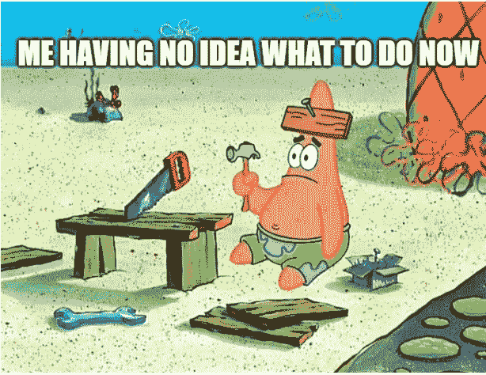

# 成为一名精明的合同审计员——第 12 周

> 原文：<https://medium.com/coinmonks/en-route-to-becoming-a-smart-contract-auditor-week-12-32c4fae51a0f?source=collection_archive---------47----------------------->

> *失落感*

几天前，我加入了 [Buildspace](https://buildspace.so/) 项目的“[之夜&周末](https://buildspace.so/nights-and-weekends)”sprint，这是一个为期 6 周的时间段，供建筑商在他们白天工作之外的空闲时间开发和发布他们的产品。这类似于黑客马拉松。我计划利用这个机会开展我的导师项目，包括开发几份复杂的智能合同。

> 从顶级交易者那里复制交易机器人。免费试用。

然而，我一直在努力保持动力，我开始感到筋疲力尽。我不确定我是否能完成这个项目，但在此期间，我一直专注于完成我的简历和申请实习。尽管我没有计算机科学背景，但我希望我至少能够获得一家公司的面试机会。

> *💡我学到了什么？*

## 19**12 月 1 日< 3 小时**

*   [**build space**](https://buildspace.so/nights-and-weekends)**x 导师项目(1 /6):晚上&周末第一周**

车间列表

*   **个人投资组合**

致力于将位于 Rinkeby 的旧项目迁移到 Goerli。嘿，在我的 [Dapp](https://0xsenzel-wave-portal.vercel.app/) 给我发个波吧！

## 12 月 20 日**星期二<1 小时**

*   [**buildspace**](https://buildspace.so/nights-and-weekends)**x 导师项目(1 /6):晚上&周末第一周**

用一行文字和简短描述生成我的项目的 figma 幻灯片。

## 21**12 月 3 日<2 小时**

*   [**buildspace**](https://buildspace.so/nights-and-weekends)**x 导师项目(1 /6):晚上&周末第一周**

在 twitter 上阅读其他 n&w2 参与者的想法，并给出反馈

## 12 月 22 日星期四，12 月 23 日 Fri，12 月 24 日**星期六&12 月 25 日星期日**

*   圣诞快乐！！🎅

> 加入 Coinmonks [电报频道](https://t.me/coincodecap)和 [Youtube 频道](https://www.youtube.com/c/coinmonks/videos)了解加密交易和投资

# 另外，阅读

*   [有哪些交易信号？](https://coincodecap.com/trading-signal) | [Bitstamp vs 比特币基地](https://coincodecap.com/bitstamp-coinbase) | [买索拉纳](https://coincodecap.com/buy-solana)
*   [加密交易机器人](/coinmonks/crypto-trading-bot-c2ffce8acb2a) | [维护审查](https://coincodecap.com/uphold-review)
*   [如何给 MetaMask 钱包添加 Arbitrum？](https://coincodecap.com/how-to-add-arbitrum-to-metamask-wallet)
*   [KuCoin vs 北海巨妖 vs BitYard](https://coincodecap.com/kucoin-vs-kraken-vs-bityard)
*   [加密交易的最佳 VPN](https://coincodecap.com/best-vpns-for-crypto-trading)