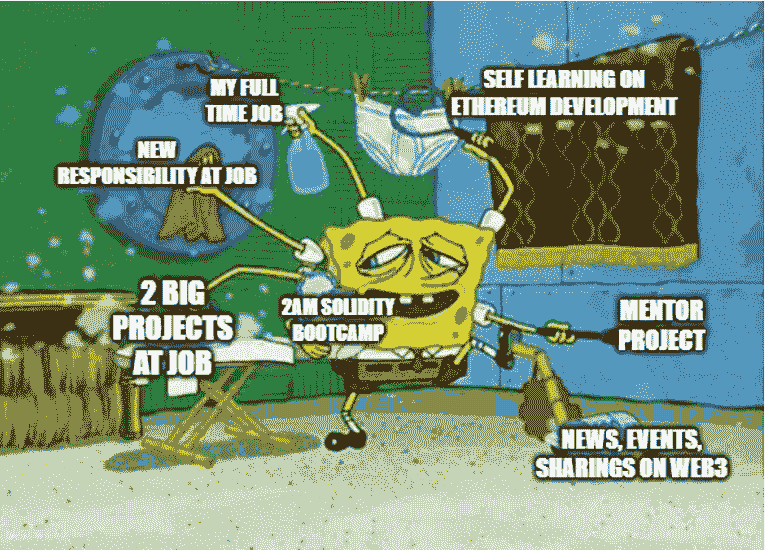
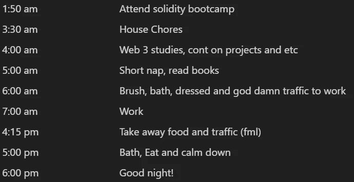

# 成为一名精明的合同审计员—第 3 周

> 原文：<https://medium.com/coinmonks/en-route-to-becoming-a-smart-contract-auditor-week-3-57e55f58260c?source=collection_archive---------10----------------------->

> 第三周:跨越一个小障碍

这标志着我开始 solidity 训练营的第一周。训练营每周举行 4 天，连续 8 周，每次课后都有作业。一切都很好，除了一点点…我的时区是 GMT +8，所以是凌晨 2 点(😭)公平地说，现在是英国时间晚上 7 点(GMT+1)。当然，我接受了这个提议，并清楚地意识到这一点。在接受邀请后，我已经做好了准备，主要是改变我的睡眠时间表。

My new daily schedule

我的时间表排得满满的，我的工作让我付出了代价，我还被赋予了新的责任去照顾他人😪)，几个新的大项目被分配给我。我不会继续在工作上瞎搅和，只会让我筋疲力尽…

即使所有这些正在进行，我仍然很高兴我目前的职位，我如何能够与所有这些机会着陆。这些对我来说只不过是一个小目标。让一让。

p/S:[Web 3 之路](https://university.alchemy.com/)有了新的更新！它已经被列入[炼金术大学](https://twitter.com/AlchemyLearn)的子部分！对于现有的学生来说，没有什么太大的变化，除了提交现在变成了不和谐，学生们分享他们的学习成果并发布它们(如推特或这种媒体)作为一种“开放学习”的形式，这是一种经过深思熟虑和深思熟虑的变化。

> 💡我学到了什么？

## **17 日 10 月 1 日< 3 小时**

*   **web 3 之路(3/10):如何用链上元数据制作 NFTs(25%)**

引入到 SVGs，tokenURI

*   **阅读关于** [**字节**](https://jeancvllr.medium.com/solidity-tutorial-all-about-bytes-9d88fdb22676) **在实度**
*   **阅读关于**的内容`[**abi.encodePacked**](https://docs.soliditylang.org/en/latest/abi-spec.html#non-standard-packed-mode)`
*   **阅读关于** [**JSON 对象**](https://www.w3schools.com/js/js_json_objects.asp)
*   **师友项目**

处理 DAO 多重签名合同

## **10 月 18 日星期二< 3 小时**

*   **稳固训练营(1/8):第 1 周**

区块链背景，以太坊基础，区块链基础。

*   **师友项目**

处理 DAO 多重签名合同

*   [**web 之路 3**](https://university.alchemy.com/)**[**@ AlchemyLearn**](https://twitter.com/AlchemyLearn)**(3/10):如何用链上元数据制作 NFTs(25%)****

**我遇到了一个小问题，因为 SVG 没有更新我的 getLevel()函数。正在解决这个问题**

## ****19 年 10 月周三< 3 小时****

*   ****坚固训练营(1/8):第 1 周****

**区块链理论、共识理论、区块链交易基础、EVM 基础、智能合约基础、Remix IDE 基础、可靠性基础**

*   ****师徒项目****

**正在处理 DAO multisig 合同。**

**阅读函数可见性。[实度函数可见性，已解释(bitsofco.de)](https://bitsofco.de/solidity-function-visibility-explained/)**

*   **[**web 之路 3**](https://university.alchemy.com/)**[**@ AlchemyLearn**](https://twitter.com/AlchemyLearn)**(3/10):如何用链上元数据制作 NFTs(50%)******

****原来只需要刷新 opensea 上的元数据来查看更新的图像，代码没有任何问题****

## ****10 月 20 日**周四< 3 小时******

*   ******稳固训练营(1/8):第 1 周******

****Remix IDE 上的基本智能契约编写(函数、变量、修饰符、事件+索引、映射、数组、结构)****

*****注意，如果我们遍历一个太大的数组，用完了所有的 gas，事务将会失败****

*   ****[**web 之路 3**](https://university.alchemy.com/)**[**@ alchemylearn**](https://twitter.com/AlchemyLearn)**(3/10):如何用链上元数据制作 nfts**(✅)******

****完成了挑战，为角色的 stat 添加了一个结构，在铸造时为 stat 设置了一个初始值，添加了一个简单的函数来生成随机数(不安全，使用 keccak256)以便在用户调用 train()方法升级角色的 stat 时随机化角色的 stat 升级结果。****

## ****21 **十月 Fri < 2 小时******

*   ******坚固训练营(1/8):第 1 周******

****所有数据类型介绍，错误处理语句(require，assert，revert，try/catch)，openzeppelin 库****

****第一次团队成员会议。****

## ******10 月 22 日星期六< 6 小时******

*   ******坚固训练营(1/8):第 1 周******

****已完成作业 1、作业 2、作业 3、作业 4****

*   ******学网 3:大二(2/4) (53%)******

****关于映射、枚举、结构、视图和纯函数、事件、继承、调用外部契约、提供者、签名者、ABI、批准令牌函数、转移自函数的详细而全面的总结****

## ******10 月 23 日星期日< 10 小时******

*   ******学 Web3:大二(2/4) (61%)******

****next . js[web 3 mode](https://github.com/Web3Modal/web3modal)库介绍。****

****完整的白名单 Dapp -****

****遇到了合同无法部署的问题。最初以为可能是 import @openzeppelin 错误，尝试了很多方法: [1](https://forum.openzeppelin.com/t/source-openzeppelin-not-found-file-import-callback-not-supported/1812) 、 [2](https://stackoverflow.com/questions/67321111/file-import-callback-not-supported/68459731#68459731) 、 [3](https://github.com/OpenZeppelin/openzeppelin-contracts/issues/2611) 为了修复它，ntg works 最后下载了 solidity 扩展的 hardhat 版本(之前用的是 Juan Blanco 版本)。@openzeppelin 不再工作，但是合同仍然无法部署。编译无错误，部署无错误继续返回没有事务历史的地址。添加了`await deployedCryptoDevsContract.deployed()`事务似乎卡住了，在 remix ide 上部署合同，而我之前尝试的所有合同都被一次性部署在一起，奇怪的问题，但还是通过了。****

****完整的 ICO Dapp****

> ****交易新手？尝试[加密交易机器人](/coinmonks/crypto-trading-bot-c2ffce8acb2a)或[复制交易](/coinmonks/top-10-crypto-copy-trading-platforms-for-beginners-d0c37c7d698c)****