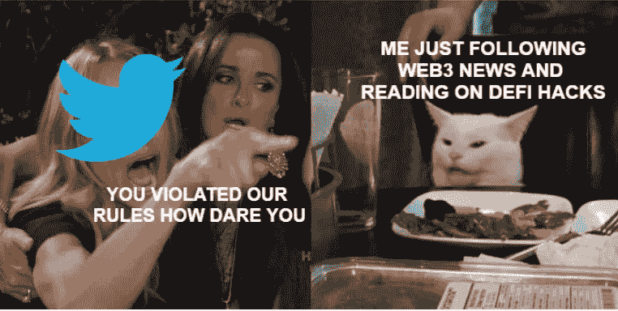

# 成为一名精明的合同审计员—第 4 周

> 原文：<https://medium.com/coinmonks/en-route-to-becoming-a-smart-contract-auditor-week-4-4d68cfa31cac?source=collection_archive---------9----------------------->

> 第四周:愤怒的推特

出乎意料的是，我的推特账户被封了。现在已经过了相当一段时间了(大概 2 周？他们甚至在这段时间更新了他们的支持页面，这让我更加愤怒)我一直在发垃圾邮件“提出上诉”和回复他们的电子邮件。我特意创建了这个 twitter 账户来关注 web3 新闻。我所做的只是继续阅读并转发聪明的合同黑客，如果这就是让你被禁的原因，我无话可说🐔

我一直在关注[安全博物馆](https://secureum.substack.com/)，他们最近开始了他们的比赛。好消息是，本次比赛结束后，前 16 名参赛者有资格参加 ConsenSys 勤奋涂鸦工作室。老实说，我不认为我有那么好，所以至少我希望在以最好的状态参加这场比赛之前，至少学习一下过去的比赛。这场比赛的截止时间是世界协调时 2022 年 10 月 30 日 23:59，祝我和其他参赛者好运！

> 💡我学到了什么？

## **10 月 24 日星期一<2 小时**

*   **学网 3:大二(2/4) (✅)**

完成的 DEX 交换 Dapp

## 10 月 25 日**周二< 3 小时**

*   **稳固训练营(2 /8):第 2 周**

EVM 基础，修改状态的语句，堆栈介绍，EVM 的数据存储，EVM 的代码执行，

作业 5 与团队讨论

## 10 月 26 日星期三< 3 hours

*   **稳固训练营(2 /8):第 2 周**

作业 6，我们的第一个团队游戏！刺激，好玩，乱七八糟(不是训练营而是我们队 lmao)！凌晨 2 点，我暴躁的大脑花了一段时间才开始工作，但我们做到了！

*   [**road tower B3**](https://university.alchemy.com/)**[**@ AlchemyLearn**](https://twitter.com/AlchemyLearn)**(4/10):如何创建一个 NFT 画廊(10%)****

**初遇[顺风 CSS](https://tailwindcss.com/docs/installation) 。**

**顺风 CSS 造型见[此处](https://tailwindcss.com/docs/preflight)。**

## **10 月 27 日星期四< 3 hours**

*   ****稳固训练营(2 /8):第 2 周****

**关于 polynetwork 600mil hack 的解释。智能合同安全资源、攻击类型、可靠性(如事件监控、跟踪等)简介。**

**做家庭作业 7。**

*   **[**road tower B3**](https://university.alchemy.com/)**[**@ AlchemyLearn**](https://twitter.com/AlchemyLearn)**(4/10):如何创建一个 NFT 画廊(50%)******

****介绍如何通过[炼金术](https://docs.alchemy.com/reference/nft-api-quickstart)获取 NFT api，以及[获取收藏的 NFT](https://docs.alchemy.com/reference/getnftsforcollection)****

****[获取](https://reqbin.com/Article/HttpGet)请求****

*   ******Secureum Race******

****阅读第四场比赛****

## ****10 月 28 日 Fri < 3 hours****

*   ******稳固训练营(2 /8):第二周******

****刀客解读。****

****介绍开发工具，如安全帽，铸造，松露。****

****做作业 8。****

*   ****[**road tower B3**](https://university.alchemy.com/)**[**@ AlchemyLearn**](https://twitter.com/AlchemyLearn)**(4/10):如何创建一个 NFT 画廊(75%)********

****已完成的挑战 1 添加复制按钮，供用户使用[react-copy-on-clipboard](https://www.npmjs.com/package/react-copy-to-clipboard)复制合同地址，同时参考此[博客](https://blog.logrocket.com/implementing-copy-clipboard-react-clipboard-api/)。从 [fontawesome](https://fontawesome.com/v5/docs/web/use-with/react) 添加了一个复制图标。****

****正在处理挑战 2 分页以显示接下来的 100 个 NFT。****

## ****29 Oct Satu< 6 hours****

*   ****[**road tower B3**](https://university.alchemy.com/)**[**@ AlchemyLearn**](https://twitter.com/AlchemyLearn)**(4/10):如何创建一个 NFT 画廊(75%)********

****致力于添加分页，还没有什么成果…我想可以使用 Alchemy Api 的“nextToken”实现下一步按钮，但是仍然不知道如何制作分页的编号按钮(T.T 前端很难)。****

*   ******Secureum Race******

****阅读第五场比赛。****

****阅读[第六场](https://ventral.digital/posts/2022/5/16/secureum-bootcamp-epoch-may-race-6)。****

## ****10 月 30 日孙< 10 hours****

*   ******Secureum Race******

****在[赛道 7](https://ventral.digital/posts/2022/07/secureum-bootcamp-epoch-june-race-7) 上阅读。****

****在 [Race 8](https://ventral.digital/posts/2022/7/25/secureum-bootcamp-epoch-july-race-8) 上阅读，偶然发现 [smtg 有趣](/web-design-web-developer-magazine/the-offset-approach-to-fair-nft-reveals-and-other-metadata-reveal-strategies-considerations-2e2c69e5c274)。****

****阅读[比赛 9](https://ventral.digital/posts/2022/8/29/secureum-bootcamp-epoch-august-race-9) 。****

****阅读[第 10 场](https://ventral.digital/posts/2022/10/3/secureum-bootcamp-epoch-october-race-10)。****

****尝试第 11 场比赛的结果:5.7/8 (T.T i suck 还有很长的路要走)****

*   ****[**road tower B3**](https://university.alchemy.com/)**[**@ alchemylearn**](https://twitter.com/AlchemyLearn)**(4/10):如何创建一个 NFT 图库(✅)********

****最终通过简单粗糙的方式添加“下一个按钮”和“上一个按钮”，只是通过计算令牌 Id…对这个结果一点也不满意…甚至没有实现整个分页栏只是一个显示页码的指示器。****

*   ****另一件事是关于如何在下一个 Js 中[导出 API 密钥。](https://nextjs.org/docs/basic-features/environment-variables#exposing-environment-variables-to-the-browser)****

> ****交易新手？尝试[加密交易机器人](/coinmonks/crypto-trading-bot-c2ffce8acb2a)或[复制交易](/coinmonks/top-10-crypto-copy-trading-platforms-for-beginners-d0c37c7d698c)****