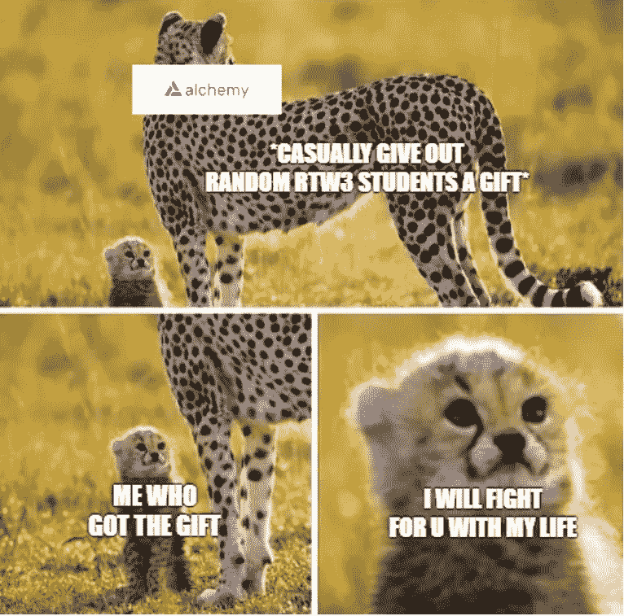
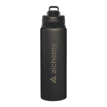

# 成为一名聪明的合同审计员—第 6 周

> 原文：<https://medium.com/coinmonks/en-route-to-becoming-a-smart-contract-auditor-week-6-89e3f73ac478?source=collection_archive---------13----------------------->

> *第六周:暖心惊喜*

又是一周的学习！这周我遇到了一个小小的惊喜。我被 Alchemy 的版主标记为通知我我赢得了一份关于网络之路 3 的家庭作业的礼物！

Alchemy Matte Black Gold Foil Water Bottle

我选择了这个瓶子，因为它看起来很恶心。这无疑是对我动力的巨大推动，让我的电池从过去 6 周不停的工作中立即充电。向炼金术团队问好💕

> *💡我学到了什么？*

## 7**11 月 1 日< 3 小时**

*   [**road tower B3**](https://university.alchemy.com/)**@**[**AlchemyLearn**](https://twitter.com/AlchemyLearn)**(6/10):如何构建一个 Staking Dapp (10%)**

脚手架介绍-eth

*   **学 Web3:三年级(3/4) (27%)**

状态通道、侧链、卷绕、等离子体的第 2 层介绍。

介绍近，流，雪崩，索拉纳。

遇到了 useRef()对象是“未定义”的问题。在 localhost 上运行没有问题，但无法在 Vercel 上部署。

## 8**11 月星期二< 3 小时**

*   稳固训练营(3/8):第 4 周

继续家庭作业 12 气体优化，并由讲师给出答案样本。

继续走我自己的 HW12。

*   [**road tower B3**](https://university.alchemy.com/)**@**[**AlchemyLearn**](https://twitter.com/AlchemyLearn)**(6/10):如何建立一个 Staking Dapp (20%)**

完成前端和合同。

*   **学 Web3:初级(3/4) (45%)**

走近不和组的好心哥们教我把`useRef()`声明为`useRef<any>()`。问题已解决，可以在 vercel 上部署。

Github 分散式替代方案介绍:[胚根](https://radicle.xyz/)

本地测试智能合约教程。

## 9**11 月 3 日< 3 小时**

*   **坚固训练营(3/8):第 4 周**

关于安全的团队游戏。给了一份猜数字的合同。设法利用合同的下溢，但没有足够的时间来编写攻击合同来耗尽合同。

*   [**road tower B3**](https://university.alchemy.com/)**@**[**AlchemyLearn**](https://twitter.com/AlchemyLearn)**(6/10):如何建立一个 Staking Dapp (50%)**

熟悉脚手架。

使用 Metamask 和 hardhat 进行本地测试时遇到问题。通过[这篇博文](/@thelasthash/solved-nonce-too-high-error-with-metamask-and-hardhat-adc66f092cd)解决。

## 10**11 月 4 日< 3 小时**

*   **稳固训练营(3/8):第 4 周**

分享区块链的可扩展性问题。

做家庭作业 15，写一份攻击合同，以耗尽昨天课堂上给出的团队游戏。

*   [**road tower B3**](https://university.alchemy.com/)**@**[**AlchemyLearn**](https://twitter.com/AlchemyLearn)**(6/10):如何建立一个 Staking Dapp (50%)**

利用指数函数计算赌注的回报

## 11 月 11 日**Fri<3 小时**

*   **稳固训练营(3/8):第 4 周**

分散存储 IPFS 上的类共享。

通过向 IPFS 映像添加设置令牌 URI 完成了 HW16

*   [**road tower B3**](https://university.alchemy.com/)**@**[**AlchemyLearn**](https://twitter.com/AlchemyLearn)**(6/10):如何建立一个 Staking Dapp (50%)**

处理外部合同和打桩合同之间的交互功能

## 12**11 月周六< 3 小时**

*   [**road tower B3**](https://university.alchemy.com/)**@**[**AlchemyLearn**](https://twitter.com/AlchemyLearn)**(6/10):如何建立一个 Staking Dapp (75%)**

完整的指数函数。

正在为前端添加功能。

## 13**11 月孙< 3 小时**

*   [**road tower B3**](https://university.alchemy.com/)**@**[**alchemylearn**](https://twitter.com/AlchemyLearn)**(6/10):如何建立一个 Staking Dapp (✅)**

完成所有挑战。润色合同和前端。

> 交易新手？尝试[加密交易机器人](/coinmonks/crypto-trading-bot-c2ffce8acb2a)或[复制交易](/coinmonks/top-10-crypto-copy-trading-platforms-for-beginners-d0c37c7d698c)