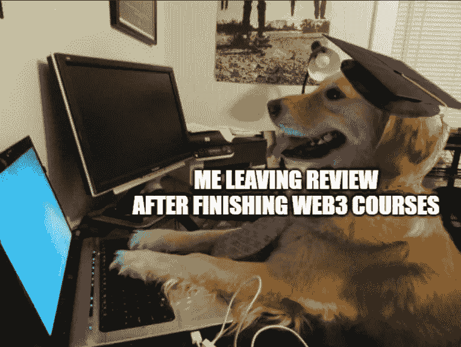

# 成为一名精明的合同审计员—第 7 周

> 原文：<https://medium.com/coinmonks/en-route-to-becoming-a-smart-contract-auditor-week-7-480adfcf13d5?source=collection_archive---------25----------------------->

> *第 7 周:回顾*

我在这段时间的学习策略是在进入下一阶段之前，利用所有可用的教程来充分展示自己的 Web3 基础知识。在此期间，我参加了一些教程和课程，如 RoadToWeb3、buildspace、LearnWeb3、Cadena、metaschool 等。

RoadToWeb3 和 buildspace 教程经过改进，易于理解。教程的重点是向我们展示不同的概念和库，以便我们能够熟悉和使用它们。他们还建立了一个社区，当你在不和谐中接近他们时，这个社区会很有帮助。

LearnWeb3 的课程涵盖了更全面的概念，通常也更深入。但是有些情况很难理解。总的来说，这些课程很棒，涵盖了许多有用的工具、包和库，当我想在不久的将来构建一些东西时，这些肯定会对我有所帮助。

另一方面，Cadena 实际上并不坏，它只是没有推出太多的内容，也没有把太多的注意力放在营销上，所以它感觉缓慢而不活跃。metaschool 是镇上的新人，到目前为止我选了两门课，他们的课程肯定没有其他的精致。不和谐没有得到很好的缓和，因为它充满了机器人和骗子。希望随着时间的推移会变得更好，同时我会先关注其他教程。

总的来说，虽然这些网站有时有过时的教程，如使用过时的链，库，工具，但对像我这样的新手来说仍然是一个好的开始。此外，Web3 空间移动非常快，即使我每天都上课，我仍然觉得我只是跟上了步伐。前方的路还很长…

> *💡我学到了什么？*

## 14 日**11 月 1 日< 3 小时**

*   **学 Web3:初级(3/4) (63%)**

关于如何通过 hardhat deploy 脚本验证合同的教程，而不是我们以前如何通过 etherscan 进行验证

由[协议实验室](https://protocol.ai/)开发的 IPFS 简介

完整的 nft-ipfs Dapp。

## 15 日**11 月周二< 3 小时**

*   **坚固训练营(5/8):第 5 周**

零知识证明介绍，ZKP 用例如 Monero，区块链可扩展性应用如以太坊和核条约验证。

穿过 zkSNARKs。

导师团队开发产品介绍 [ZOKRATES](https://zokrates.github.io/)

使用 hardhat 在 HW17 上工作以分叉 mainnet。参考这篇伟大的[文章](/ethereum-grid/forking-ethereum-mainnet-mint-your-own-dai-d8b62a82b3f7)。

*   **元学校:如何创建自己的区块链(50%)**

介绍区块链并给初学者提供 linux 终端上的[资源](https://hackr.io/blog/basic-linux-commands)。

通过安装 windows Subsystem for Linux (WSL)来设置 Windows 环境。

[基板](https://docs.substrate.io/quick-start/)介绍。

## 16 日**11 月 3 日< 3 小时**

*   **坚固训练营(5/8):第 5 周**

使用 MEV 教学。一个有趣的教师笔记描述以太坊为黑暗森林。

让我们暴露在竞争中。

在 HW17 上工作时，阅读 [hardhat](https://hardhat.org/hardhat-network/docs/reference#eth_accounts) 作为参考，并使用 [Alchemy 的文档](https://docs.alchemy.com/lang-zh/reference/eth-blocknumber-astar)获得正确的语法。

*   **元学校:如何创建自己的✅区块链**

克隆并运行[substrate-note-template](https://github.com/substrate-developer-hub/substrate-node-template)遇到错误:在 github 中创建[此问题标签](https://github.com/substrate-developer-hub/substrate-node-template/issues/333)后，无法为能够解决的`tikv-jemalloc-sys v0.5.2+5.3.0-patched`运行自定义构建命令。

## 17**11 月 4 日< 3 小时**

*   **坚固训练营(5/8):第 5 周**

关于代码文档的教训。

*   **元学校:用 Solidity (30%)构建自己的 web 3 Twitter Dapp**

写了智能合同。

[Torus 钱包](https://app.tor.us/)和 [Web3Auth](https://web3auth.io/) 介绍

*   **学 Web3:初级(3/4) (63%)**

写了合同，以产生随机赢家使用链环 VRF。

## 18**11 月 Fri < 3 小时**

*   **坚固训练营(5/8):第 5 周**

与 Defi 交互示例，如 Uniswap、LP 令牌和遍历 Uniswap 代码，

*   **元学校:用 Solidity 构建你自己的 web 3 Twitter dapp(✅)**

完成前端。

## 19 日**11 月周六< 6 小时**

*   **学 Web3:初级(3/4) (81%)**

介绍陶瓷，安装和遇到的问题节点 js 版本。能够使用本[指南](https://www.freecodecamp.org/news/node-version-manager-nvm-install-guide/)操作不同版本的节点 js。

## 11 月 20 日**日< 8 小时**

*   **学习网 3:少年(3/4) (✅)**

对[图形](https://thegraph.com/)的介绍，用它来查询和索引我们的智能合约发出的事件。这个概念很复杂，虽然设法完成了，但我的理解肯定是不够的。以后再来。

> 交易新手？试试[密码交易机器人](/coinmonks/crypto-trading-bot-c2ffce8acb2a)或[复制交易](/coinmonks/top-10-crypto-copy-trading-platforms-for-beginners-d0c37c7d698c)