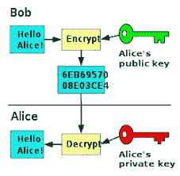

# 在 Dapps 上加密您的数据

> 原文：<https://medium.com/coinmonks/encrypt-your-data-on-dapps-329289177689?source=collection_archive---------18----------------------->

去中心化和对等网络的概念是 Web3 应用的核心。整个运动是第三方应用程序利用的结果，无论是你的政府，你的银行，甚至是我们使用的社交媒体应用程序，但这是如何实现的——将你的数据存储在区块链的公共账本上。数据在链上的这种存储称为链存储。由于它存储在公共账本上，任何人都可以查看，因此产生了巨大的隐私问题。

但是有很多方法可以加密你在区块链的数据，这样只有授权方(由你批准)才能访问你的数据，公钥加密是其中一种方法。

# 公钥加密

这是我们的钱包最常用的，你用公钥加密你的数据，但如果你想解密，你需要私钥。

让我们举一个例子，假设你有一个邮箱，要把邮件放在里面，你需要一把钥匙，这把钥匙你已经和想给你发邮件的人分享了，甚至可以公开，但要打开邮箱，你还需要另一把钥匙，但那把钥匙你只有，你不会和任何人分享，那是你的私人钥匙。

同样的方式，你用公钥加密你的数据，但只能用私钥打开。



# 如何在应用程序中使用公钥加密

# 🔥Lit 协议

Lit 在 EVM 链和索拉纳之上提供分散的访问控制。通过 Lit 协议提供的加密，您可以在公共网络上存储许可(加密)资源，并且只能根据选定的条件进行解密。

# 如何将 Lit 协议添加到代码中

1.  npm 安装 lit-js-sdk
2.  创建名为 lit.js 的实用程序文件
3.  导入 lit-js-sdk 创建节点客户端
4.  添加您的链

```
import LitJsSdk from "lit-js-sdk";
const client = new LitJsSdk.LitNodeClient();
// chain your smart contract is deployed
const chain = "polygon";
```

1.  添加解密的访问条件

```
const accessControlConditions = [
    {
      contractAddress,
// If your contract is an ERC add it here
      standardContractType,
      chain,
// method will be function on which your condition is based
      method,
// add parameters for your method here with user address
      parameters: [":userAddress",parameters],
// comparator to check the condition
      returnValueTest: {
        comparator,
        value
      },
    },
  ];
```

1.  添加加密方法

```
export const encrypt = async(message)=>{
    // connect with the node
    await client.connect();
    let litNodeClient= client
// get signature from wallet to encrypt the message
    const authSig = await LitJsSdk.checkAndSignAuthMessage({ chain })
// encrypted the message
    const { encryptedString, symmetricKey } = await LitJsSdk.encryptString(message) // created the symmetric key and added to lit node
    const encryptedSymmetricKey = await litNodeClient.saveEncryptionKey({
      accessControlConditions,
      symmetricKey,
      authSig,
      chain,
    }); return {
      encryptedString,
      encryptedSymmetricKey: LitJsSdk.uint8arrayToString(encryptedSymmetricKey, "base16")
    }
  }
```

1.  添加解密方法

```
export const  decrypt=async(encryptedString, encryptedSymmetricKey)=> {
    await client.connect();
    let litNodeClient = client; const authSig = await LitJsSdk.checkAndSignAuthMessage({ chain })
    const symmetricKey = await litNodeClient.getEncryptionKey({
      accessControlConditions,
      toDecrypt: encryptedSymmetricKey,
      chain,
      authSig
    }) const decryptedString = await LitJsSdk.decryptString(
      encryptedString,
      symmetricKey
    ); return { decryptedString }
```

对于任何想了解它的人，你可以查看他们的文档，如果你想要一个工作实例，可以查看这个 T2 项目

对存储在区块链的数据进行加密创造了一种方式来显示你已经添加了你的数据，但没有告诉确切的数据是什么！！

> 加入 Coinmonks [电报频道](https://t.me/coincodecap)和 [Youtube 频道](https://www.youtube.com/c/coinmonks/videos)了解加密交易和投资

# 另外，阅读

*   [block fi vs Celsius](/coinmonks/blockfi-vs-celsius-vs-hodlnaut-8a1cc8c26630)|[Hodlnaut 审核](/coinmonks/hodlnaut-review-best-way-to-hodl-is-to-earn-interest-on-your-bitcoin-6658a8c19edf) | [KuCoin 审核](https://coincodecap.com/kucoin-review)
*   [Bitsgap 评审](/coinmonks/bitsgap-review-a-crypto-trading-bot-that-makes-easy-money-a5d88a336df2) | [Quadency 评审](/coinmonks/quadency-review-a-crypto-trading-automation-platform-3068eaa374e1) | [Bitbns 评审](/coinmonks/bitbns-review-38256a07e161)
*   [加密复制交易平台](/coinmonks/top-10-crypto-copy-trading-platforms-for-beginners-d0c37c7d698c) | [Coinmama 审核](/coinmonks/coinmama-review-ace5641bde6e)
*   [印度的加密交易所](/coinmonks/bitcoin-exchange-in-india-7f1fe79715c9) | [比特币储蓄账户](/coinmonks/bitcoin-savings-account-e65b13f92451)
*   [OKEx vs KuCoin](https://coincodecap.com/okex-kucoin) | [摄氏替代品](https://coincodecap.com/celsius-alternatives) | [如何购买 VeChain](https://coincodecap.com/buy-vechain)