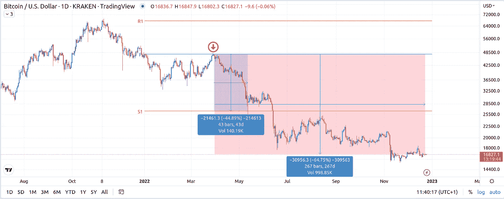
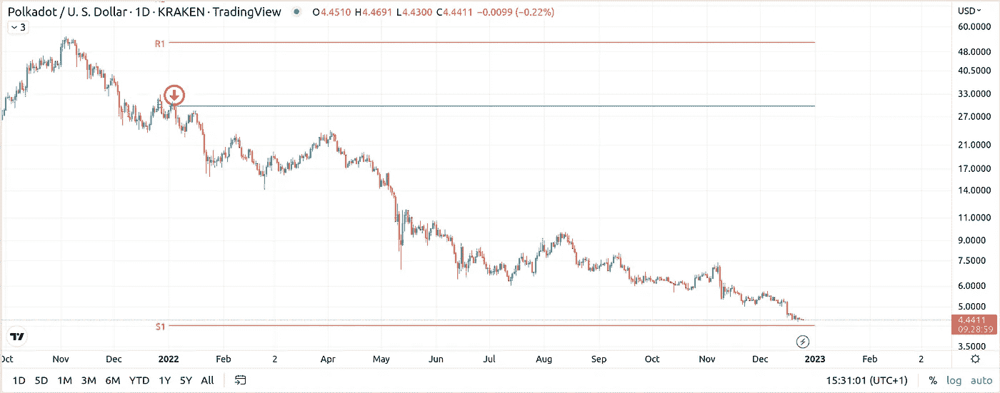

# 年末市场中枢分析

> 原文：<https://medium.com/coinmonks/end-of-the-year-markets-pivot-analysis-b88bce02d195?source=collection_archive---------26----------------------->

## 事后看来，一切都很容易，或者你和我在 2022 年应该如何主要使用支点进行交易，以及支点告诉我们要远离哪些资产

今年是黑仔的一年。各地的交易者都摆脱了多年的看涨偏见。即使是经历了一个世纪的交易波动压缩到十年的加密交易员，也发现很难适应宏观基本面的变化和困扰加密的特定系统性事件。我不会猜测今年只是漫长市场寒冬的开始，也不会猜测市场已经结束定价痛苦的可能性。在我看来，这种问题不属于技术交易，正如我以前多次提到的，有一个问题要问:概率问题——对于某个方向的交易，这是一个好的概率设置吗？这是我在看图表时问自己的唯一一件事。剩下的就是头寸和风险管理。

> 从顶级交易者那里复制交易机器人。免费试用。

在检查今年的图表时，我试图首先找出哪一个在使用支点时提供了最高概率的交易。如果你不是中枢交易者，也不了解内幕，请去看看我过去的一些帖子，还有一个[畏缩视频](https://www.youtube.com/watch?v=A206aRhpBrY)，我试图在其中展示他们的巫术。

但是每个交易系统都是一样的。如果你是均线交易者，去搜索那些概率最高的图表。同样的道理也适用于 Ichimoku、RSI 或你正在使用的其他系统。另一方面，避开那些概率设置很差的资产，除非你愿意把它们作为市场领导者或指数的衍生品来交易。证明我的意思的最简单的例子是比特币。

比特币是加密市场的推动者。如果你是一名加密交易员，你会知道当比特币波动时，市场也会波动。很少是相反的，如果是这样，那是因为 BTC 在盘整时一直在发出看涨信号，而市场的其余部分也在跟随它的脚步。我喜欢比特币的是它服从枢轴的方式。通过在该系统上为交易者提供更高概率的交易，它也很容易被强加到其他不太支持枢轴的加密资产上。当正确的信号来自比特币时，我喜欢购买一篮子这样的资产。例如，我对以太坊有强烈的感情，但它不太符合枢轴。用比特币作为我的市场信号是一条路要走(直到它不是)。这里有一个例子:

你可以清楚地看到，进入空头头寸交易的地方是在 3 月底，当时比特币在测试阻力时与年度支点(蓝线)吻别。老实说，这是几乎所有传统市场提供相同交易的同一时间。有些比其他的更清晰，结果更好。

然而，当它来到以太坊时，它的噪音和与当时的比特币相比增强的看涨程度，在进入枢轴时令人困惑。但如果像比特币一样下跌，并以年度 S1 为目标，将会有 63%的波动。你如何退出交易并管理它们是你的事，但我喜欢在设定的点上承担一些风险，直到市场有所反应。因此，即使比特币很快完成了从年度支点到 S1 的交易，让一些头寸继续运行仍是明智的。特别是如果你是一个有长期目标的仓位交易者。

今年根据支点理论提供高概率交易的其他加密资产有:Dot、Link、Solana、ADA，甚至是起伏不定的 XMR。

# 传统市场今年在 Pivots 方面表现如何？

对我来说，今年只有一个市场指数显示了方向，并遵循支点巫术。那是纳斯达克。

看看上面的图表就知道了。在今年开始疲软后，纳斯达克指数正在回升，以测试年度支点(就像比特币一样)，但失败了。年度支点是在看跌的迹象，我想把我的卖单。在我看来，这是一笔很有可能等待执行的交易。但 NDX 比这做得更好——它还在一年一度的 S2 上提供了一个高概率的退出机会。是的，这是一段相当颠簸的旅程，很可能会让大多数交易者在到达 S2 之前出局，但纳斯达克和比特币提供的东西是独一无二的:预测未来的交易水平受到市场的尊重。在这两种情况下，这些交易机会及其时机和水平也可以用于对同一资产类别的其他资产执行类似的交易。这就是找到服从支点的领先资产的真正力量。

这里是亚马逊股票，今年提供的不是一个或两个，而是三个年度支点，年度 S1 和年度 S2 的短条目，以及方便获利。

这是特斯拉在今年的大部分时间里对抗熊市，直到屈服于(在其激烈的领导者的帮助下)年度支点提供持续-60%。

下面这个怪物，出于 AAPL 的好意，我不会用长杆去碰它。是的，你可以辩称，在一年一度的 S1 上有买入机会，但混乱、混乱和血腥太多了。尽管它是今年市场中表现出相对强势的股票之一，但我不想交易它，因为苹果和 Pivots 之间的分歧太大，无法弥合。

然而，也有一个重要的商品，如果你仔细听，会在 3 月底之前做空大多数资产，它也很好地服从了 Pivots。是原油。

在地缘政治的支持下，今年 3 月初，油价飙升至年度 R3。为多头提供一个光荣的出场，为空头提供一个史诗般的进场。如果你在一年的大部分时间里都在做这个交易，你可以在 12 月初的年度支点上再次出场。这是一个完美的头寸交易。

好的。那么，今年的教训是什么呢？

第一课:枢轴规则！

第二课:等我 2023 支点分析快到了。阅读它，然后…

第三课:实施第一课。

> 加入 Coinmonks [电报频道](https://t.me/coincodecap)和 [Youtube 频道](https://www.youtube.com/c/coinmonks/videos)了解加密交易和投资

# 另外，阅读

*   [投资印度的最佳密码](https://coincodecap.com/best-crypto-to-invest-in-india-in-2021)|[WazirX P2P](https://coincodecap.com/wazirx-p2p)|[Hi Dollar Review](https://coincodecap.com/hi-dollar-review)
*   [加拿大最佳加密交易机器人](https://coincodecap.com/5-best-crypto-trading-bots-in-canada) | [库币评论](https://coincodecap.com/kucoin-review)
*   [火币加密交易信号](https://coincodecap.com/huobi-crypto-trading-signals) | [HitBTC 审核](/coinmonks/hitbtc-review-c5143c5d53c2)
*   [TraderWagon 回顾](https://coincodecap.com/traderwagon-review) | [北海巨妖 vs 双子 vs 比特亚德](https://coincodecap.com/kraken-vs-gemini-vs-bityard)
*   [如何在 FTX 交易所交易期货](https://coincodecap.com/ftx-futures-trading)