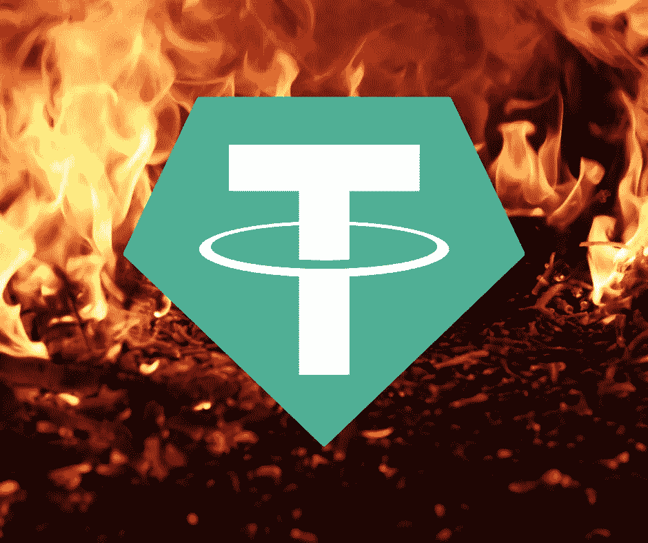
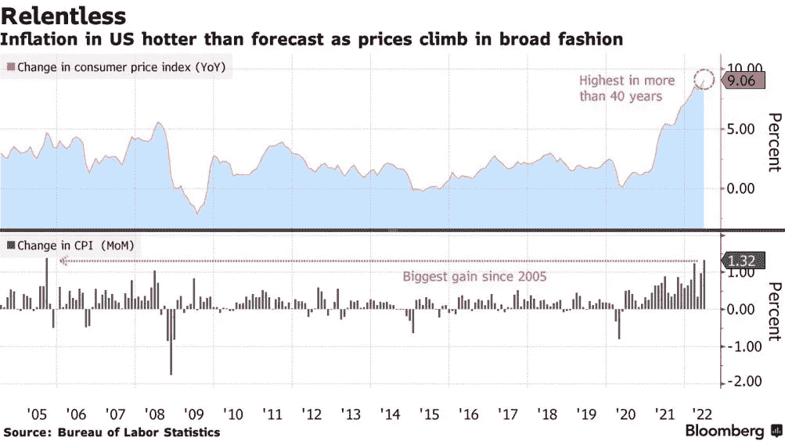
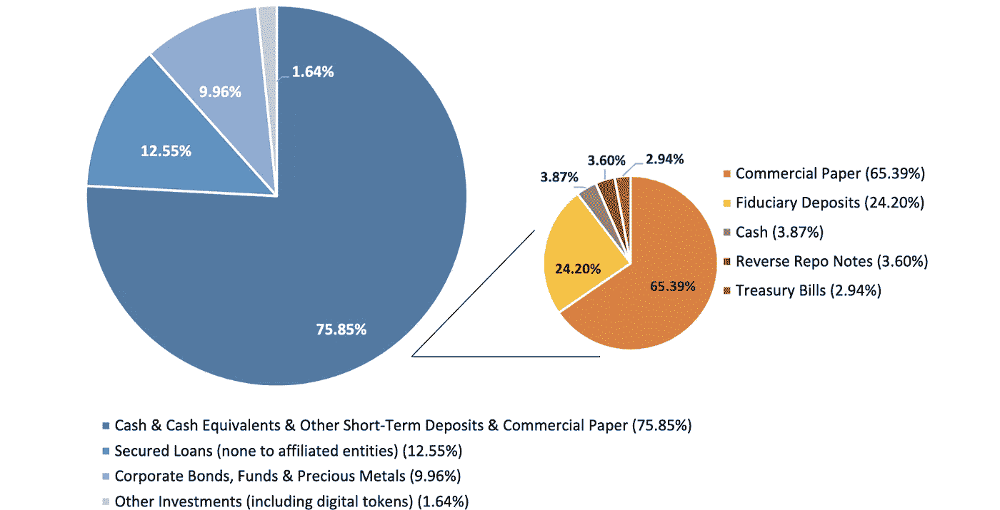

# 终局:对冲基金为何做空系绳

> 原文：<https://medium.com/coinmonks/endgame-why-hedge-funds-are-shorting-tether-f49724ac0e9?source=collection_archive---------1----------------------->

过去一个月，对冲基金一直在做空泰索，押注于与美元挂钩的稳定货币可能崩溃。

卖空指的是出售一项资产，并预期其未来会贬值的行为。当资产价值下降时，卖空者一般希望回购该资产，并从市场价格差异中获利。

Genesis 的机构销售主管利昂·马歇尔(Leon Marshall)表示，“传统对冲基金的兴趣确实出现了飙升，它们正在关注系绳，并寻求做空它，”

如果 Tether 崩溃，将对整个 Web 3 生态系统产生深远的影响。

这里有三个主要因素在起作用:

1.整体经济看起来并不乐观。美国目前正经历近 40 年来最高水平的通胀，导致投资者回避加密货币等投机资产。虽然还没有得到官方的证实，但有理由说我们目前正处于衰退之中，而且看不到隧道尽头的亮光。

2.长期以来，人们一直在担心支持泰索稳定币的资产质量。2019 年，投资者注意到，Tether 已经取消了所有代币 100%由美元支持的声明。Tether 现在声称维持包括现金、银行存款、短期贷款、商品、债券和其他加密货币在内的储备。

3.监管压力进一步加剧了对 Tether 及其基础资产的担忧。该公司及其相关实体在 2021 年与纽约总检察长办公室达成了 1850 万美元的和解。该公司被指控公开谎报其美元储备。尽管泰瑟承认没有任何不当行为，但巨额和解对投资者信心来说并不是一个好兆头。

Tether 的 CTO Paolo Ardoino 在 Twitter 上表达了对 stablecoin 稳定性的担忧。他认为，竞争对手正在利用一场协调的巨魔运动来传播 FUD——恐惧、不确定性和怀疑，目的是破坏泰瑟的声誉，引发另一场黑天鹅事件，类似于我们在 Terra-Luna 崩溃时看到的情况。

值得考虑的是，如果系绳崩溃，影响将远远超过我们在月球上看到的。Tether 是世界第四大加密货币和最大的稳定货币，市值 200 亿英镑。作为仍然与美元挂钩的最重要的稳定货币，Tether 基本上是整个加密生态系统的命脉。如果对冲基金做空系绳是正确的，后果将是灾难性的。很难夸大系绳崩溃会有多糟糕。这可能意味着游戏终于结束了。

感谢您的阅读。

看看我在推特上未经过滤的想法:

[https://twitter.com/wasifmrahman](https://twitter.com/wasifmrahman)

在 LinkedIn 上关注我的职业生涯:

https://www.linkedin.com/in/wasifmrahman/

我对媒体的另一个想法是:

【https://medium.com/@wasifmrahman 

来源:

[https://www . coin desk . com/markets/2022/06/29/first-Mover-Asia-how-traders-is-shorting-tether-stable coins-bit coin-falls-but-holds-above-20k/](https://www.coindesk.com/markets/2022/06/29/first-mover-asia-how-traders-are-shorting-tether-stablecoins-bitcoin-falls-but-holds-above-20k/)

[https://cryptos late . com/tether-respons-to-the-increase-in-the-increase-the-risk-funds-shorting-usdt/](https://cryptoslate.com/tether-responds-to-the-increase-in-hedge-funds-shorting-usdt/)

[https://www . fn London . com/articles/why-hedge-funds-is-shorting-tether-2022 06 27](https://www.fnlondon.com/articles/why-hedge-funds-are-shorting-tether-20220627)

 [## Tether 首席技术官对对冲基金做空 USDT 的报道的回应| Bitcoinist.com

### 最新披露的报告显示，一些对冲基金现在正在做空泰瑟 USDT。来自墙上的周一报道…

bitcoinist.com](https://bitcoinist.com/response-from-tether-cto-on-reports-of-shorting-usdt-by-hedge-funds/) 

> 交易新手？尝试[加密交易机器人](/coinmonks/crypto-trading-bot-c2ffce8acb2a)或[复制交易](/coinmonks/top-10-crypto-copy-trading-platforms-for-beginners-d0c37c7d698c)