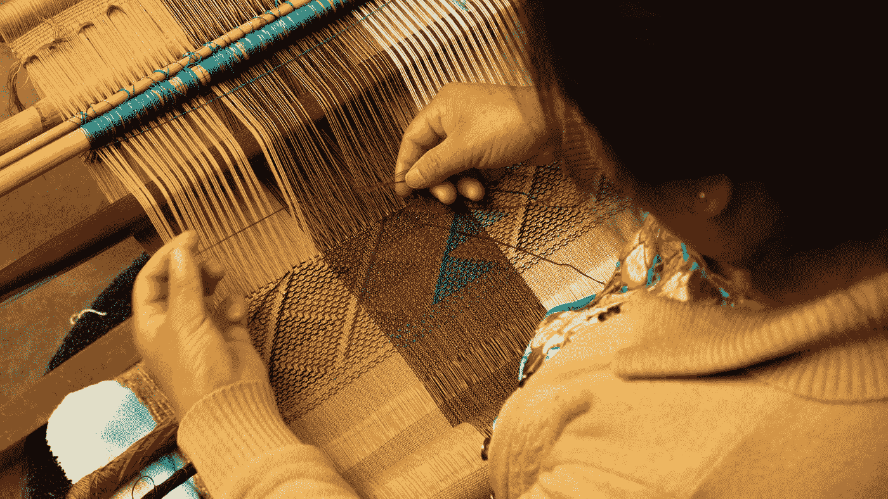

# 用比特币赋予你的小众兴趣

> 原文：<https://medium.com/coinmonks/endowing-your-niche-interests-with-bitcoin-f837f08a21e1?source=collection_archive---------46----------------------->

Photo by [ALAN DE LA CRUZ](https://unsplash.com/@alandelacruz4?utm_source=medium&utm_medium=referral) on [Unsplash](https://unsplash.com?utm_source=medium&utm_medium=referral)

比特币未来最酷的事情之一是，它将允许普通人在死后继续他们的遗产，永远。在这个世界里，人们可以将自己一生的工作或激情赋予比特币，这样其他人就可以永远享受和延续比特币。

当人们死去的时候，他们想留下一些东西，一些美好的东西，让人们记住他们。对大多数人来说，这意味着把他们的财富传给他们的孩子。但如果他们想为社会留下点什么，用法定货币几乎不可能实现。

目前，捐赠基金是只有非常富有的人才能获得的东西。想想看:以赞助人名字命名的大学、国家公园或博物馆。为了确保这些遗嘱在死后得到妥善执行，执行了一整套受托人结构。他们不监督钱是怎么花的，而是监督钱是怎么维持的，因为你知道，现代货币随着时间的推移会贬值。

但如果这些捐赠是围绕比特币(一种随着时间推移而升值的硬通货)构建的，会怎么样呢？这将意味着，无论你赋予比特币什么，总有一天都将能够自我维持，即使今天的价值还不够。当我说“无论什么”时，我指的是对你来说重要的任何激情、爱好或社区。

假设你玩某个不知名的视频游戏，有一小群忠实的追随者。例如，你可以向社区捐赠比特币来维持一个多人游戏服务器——直到永远。或者假设你是一名语言学家，毕生的工作就是翻译一种土著语言。例如，你可以赋予一个翻译应用比特币，并永远维持翻译服务。它可以像你家附近的公园一样简单，用比特币支付维护和发展费用——永远如此。

所有这一切都是为了说明，有了比特币，未来的人们将能够在任何规模的前人工作的基础上进行建设。这意味着无论你的热情与世界上的其他人多么不相关，如果它与少数和你一样的人相关，那么他们可以在你已经完成的工作的基础上再接再厉。(我看着你呢，动漫编织爱好者！).

我不想描绘一个乌托邦，但是想到一代又一代人之后这个世界会变成什么样子，我确实很兴奋。比特币是几代人共同拥有的强大技术。疯了！！

你的想法，意见，不同意见都欢迎写在下面！如果你对比特币及其更具知识性的话题感兴趣，请加入我在 https://discord.gg/XvxYuS2WF6 的新比特币社区。