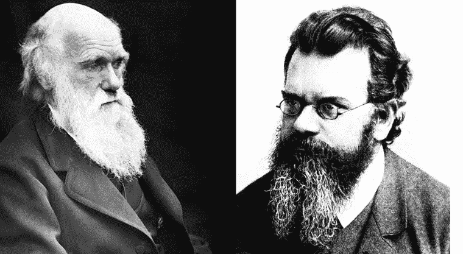
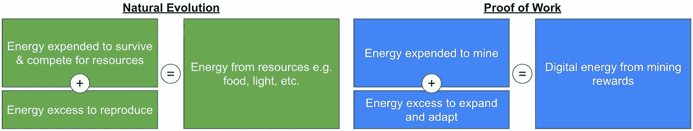

# 能量消耗是比特币最大的特点

> 原文：<https://medium.com/coinmonks/energy-consumption-is-bitcoins-best-feature-ca728030524c?source=collection_archive---------24----------------------->

## 为什么比特币的能耗本质上是一种优化设计，永远不应该改变

比特币的能源消耗受到了广泛批评。人们声称这是一个过时的功能，更新，更现代的区块链已经克服了这个问题。

这是对比特币的普遍误解。文章认为**比特币的能源使用是基于自然规律的最优设计选择。**让比特币成为最高级、最安全的价值储存手段，这是最关键的组成部分。

Source: [Crypto Valley Journal](https://cvj.ch/wp-content/uploads/2022/03/CVJ.CH-bitcoin-energy-pic.jpg)

## 目录:

1.  [**比特币如何使用能量**](#42bb)
2.  [**控制共识机制的后果**](#0e6a)
3.  [**师法自然**](#9a07)
4.  [**比特币中的自然法则**](#de2c)
5.  [**总结**](#aada)
6.  [**关于股权证明的最后说明**](#f571)

## 1.比特币如何使用能源

我们先从比特币网络为什么要用能源开始说起。

比特币的目的是存储和传递价值。因此，网络将事务存储在块中，并将它们附加到一个不断增长的链中。

存储在块中的信息(即交易数据)对所有网络参与者都是公开可用的。比特币网络是无许可的，因此对任何有平等机会参与网络的人开放。通过将一台名为 node 的计算机连接到网络上，参与是可能的。

完整节点存储整个比特币区块链，包括所有单个交易。他们不仅执行自己的交易，还验证所有其他单个交易并计算余额。如果人 A 想要支付给另一个人 B，系统中的每个完整节点将能够验证人 A 是否有所需的资金。

为了执行新的事务，需要将新的块附加到链上。因此，网络需要建立规则，让节点同意将被添加到链中的正确的新信息。这些规则是由区块链共识机制定义的。

比特币使用“工作证明”(PoW)共识机制，让节点相互竞争:为了给链添加新的区块，节点需要解决一个数学难题。找到解决方案的可能性随着计算能量的消耗而成比例地增加。对于每个附加的新块，节点会收到比特币奖励和交易费。这个过程叫做采矿。

这表明区块链的共识机制选择将新信息附加到链上的参与者。比特币的共识机制是基于能量消耗的 PoW。

## 2.控制共识机制的后果

因此，谁控制了共识机制，谁就控制了新区块的创建。谁控制新块的创建:

1.  **捕获比特币挖矿奖励和交易费用**
2.  **控制投票权:**比特币协议的小改动可以在让矿工用各自的矿权投票后实施
3.  **控制网络广播的新交易:**从技术上来说，该方可以恢复自己的交易，因此在将比特币从自己的地址发送到另一个地址后，比特币可以被恢复。此外，节点可以提交一个没有事务的空块，并延迟它们的执行。

因此，分散式网络需要保护自己，防止恶意方获得对共识机制的控制，从而控制整个网络。这将通过对定义共识机制的竞争性选择程序的 51%的控制来实现。

**因此，我们需要一个竞争激烈的选拔程序，给每个参与者最公平、最平等的机会。只有这样，我们才能将少数人获得控制权的风险降至最低。**

## 3.向自然学习

在寻找一个完美的竞争选择过程中，人们可以简单地从自然中学习，以得出类似的原则。

1859 年，查尔斯·达尔文发表了《物种起源》，并发展了他的生物进化论。它指出生物需要通过自然选择来竞争、生存和繁殖。一个人的特征越有利，就越有可能将这些特征传递给下一代。如果足够多的这些特征经过几代人的积累，全新的物种就会出现。

大自然已经为公平客观的竞争“开发”出了完美的机制。由于环境因素千变万化，它需要不断的适应和为生存而战。即使是最优秀的物种也永远无法发展出不受争议的控制地位，必须不断变化才能保持相关性。

> “幸存下来的不是最强壮的物种，也不是最聪明的物种。它是最能适应变化的”。—查尔斯·达尔文

Darwin & Boltzmann — source: [Matthew R. Francis](https://www.smithsonianmag.com/science-nature/hidden-connections-between-darwin-and-physicist-who-championed-entropy-2-180961461/)

奥地利物理学家、达尔文的推广者玻尔兹曼随后将其理论与基础物理学联系起来。他认为，为了生存，生物本质上需要从环境中获取能量，这些能量来自食物和光线等资源。然而，为了寻找和获取资源，生物也需要消耗能量，例如在寻找植物或捕猎其他动物的过程中。

从根本上来说，这意味着生物体需要最大限度地提高能量效率:它们必须从周围环境中获取尽可能多的能量，同时将自身消耗的能量降至最低。

## 4.比特币中的自然法则

那么，这与比特币和 PoW 有什么联系呢？

首先，电力需要矿工消耗能量:他们捕捉任何形式能量，如太阳能、风能、水能，并将其转化为计算能量，以开采比特币。能源和采矿基础设施的成本对试图在区块中附加恶意信息的参与者不利。

每成功一次区块连线，矿工还能获得比特币奖励和交易费。每个比特币储存的价值本质上是相关的能量。一开始听起来可能会令人困惑。然而，任何比特币都值一个由网络定义和驱动的值。一个矿商可以用这种价值直接换取资源，或者间接换取有助于增加资源捕获的服务。如前所述，这些资源是储存的能量，任何生物都需要它们来竞争和繁殖。

矿工捕获和转换能源的效率越高，他们对网络的贡献就越大，他们解决数学难题、赢得连接新区块的比赛以及获得比特币奖励和交易费(最终存储为数字能源)的机会就越大。

最有效率的矿工将从奖励中获得比他们花费更多的数字能量。由此产生的回报和成本之间的差值可用于投资新的基础设施、R&D 等。并帮助矿工扩展和更好地适应不断变化的环境条件。

**PoW 本质上复制了同样的自然竞争法则:为了最大限度地获取能源和提高效率，矿商将不得不不断适应和进化。**少数利益相关者获得控制权的机会被降至最低，因为在环境改变之前，已开发的优势只是暂时的。由于没有少数人能够获得 51%的控制权，整个网络的安全性被最大化。

## 比特币网络需要能量作为输入才能给出能量作为输出。除了挖掘硬币的能量之外的任何东西都会打破努力和回报之间的关系，并最终使网络容易受到攻击。正因如此，利用能源开采比特币是必然的。

## 5.摘要

总而言之，是的，比特币需要能源支出。然而，这是一个完美的模仿自然的机制，以促进平等机会，避免中央权力控制，并最终最大限度地提高网络的安全性。

结果，比特币成为人类历史上最优越的价值储存手段。没有任何实体能够操纵其国家或有限的供应，或以任何其他可以想象的形式破坏它。因此，比特币有可能扰乱全球金融体系，建立健全的经济基本面。

由读者来决定比特币的好处是否值得花费全球发电量的 0.55%左右(截至 2021 年)。

## 6.关于股权证明的最后说明

其他区块链项目旨在利用公众对比特币的误解，并提出了一种替代的共识机制，称为“利害关系证明”(PoS)。

在 PoS 中，节点还会竞争连接下一个块。然而，他们不需要花费精力来增加赢得比赛的机会，而是随着某人拥有的硬币数量成比例地增加他们连接下一个积木的可能性。

这个想法是:一个人拥有的硬币越多，他们攻击网络的可能性就越小，就可以安全地授予他们更多的权力。

不可避免地，PoS 基于一个基本的困境:参与者越富有，个人被授予的权力就越大。随着创造下一个街区的机会增加，PoS 使富有的个人变得更富有，并毫不费力地给予他们更多的权力。

此外，一旦获得财富，就没有必要继续适应。最终，拥有多数股权的少数群体可能会滥用他们的权利，从而更容易给整个体系带来巨大的潜在风险。

事实上，所有主要的 PoS 区块链如以太坊、波尔卡多特、Near、Cardona 等。如今被一小群有影响力的人和创始人所控制。这种网络根本不适合保护大量存储的数字值。

> 交易新手？试试[加密交易机器人](/coinmonks/crypto-trading-bot-c2ffce8acb2a)或者[复制交易](/coinmonks/top-10-crypto-copy-trading-platforms-for-beginners-d0c37c7d698c)