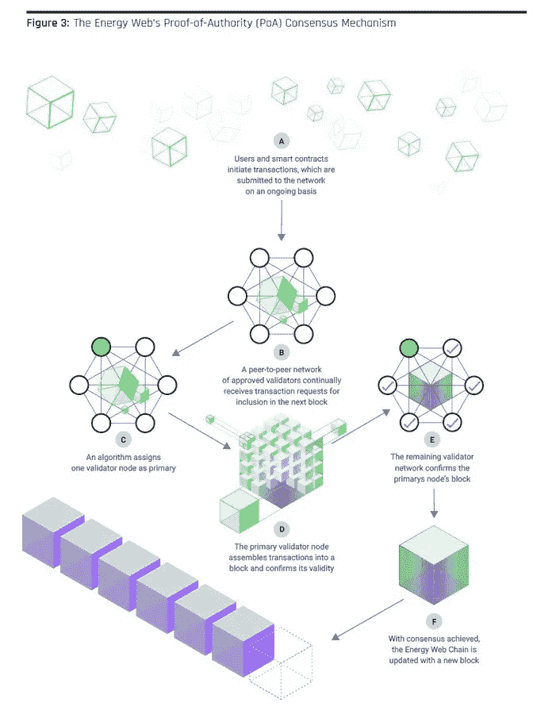
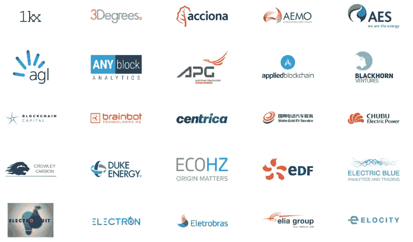

# 能源网络令牌:环保的绿色加密货币

> 原文：<https://medium.com/coinmonks/energy-web-token-green-cryptocurrencies-for-the-environment-895b24034554?source=collection_archive---------25----------------------->

在这篇关于绿色加密货币的文章中，我谈到了为能源网格构建操作系统的能源网络令牌(EWT)。Energy Web Token 旨在加速全球经济的去碳化，为拥有 100 多家能源市场参与者的全球社区部署数字操作系统。

Energy Web Token (EWT)

这些系统使清洁能源资产支持未来电网变得简单、安全和高效。EWT 的主要卖点之一是，它为企业提供了创建完全定制的 dApps 的机会。而区块链像以太坊也提供这种多样性，能源网链是有目的地为能源部门设计的。能源网络虚拟机在授权证明(PoA)共识下运行。这意味着区块链依赖可信验证器来创建新块。PoA 共识是另一种验证方法，它允许比工作证明(PoW)共识更快的处理时间。权威证明使电子战链的分布式网络保持同步。

Proof-of-Authority (PoA) Consensus Mechanism of EWT

虽然在结构上与 PoW 没有什么不同，但 PoA 机制只允许一定数量的节点验证交易并创建块，称为验证器节点，这些节点必须满足一定的资格标准，如合法注册的组织和能源网络基金会的正式成员。它还发布了一个名为能源网络分散操作系统(EW-DOS)的堆叠技术解决方案。它允许用户在线控制和管理他们的电气系统，并具有三个协同工作的层，以支持能源部门的分散式应用程序的开发和部署。EWT 涵盖的主要行业如下:电网运营商、集成商和原始设备制造商、能源供应商、电动汽车和加密气候协议。能源网络令牌最多可提供 100，000，000 个令牌。你可以在这里阅读白皮书[。能源网已经发展到 100 多个合作伙伴，包括行业巨头东电、西门子、壳牌和 Exelon。](https://www.energyweb.org/wp-content/uploads/2019/12/EnergyWeb-EWDOS-VisionPurpose-vFinal-20191211.pdf)

Some of the partnerships of EWT

能源网在瑞士楚格成立，由落基山研究所(RMI)和电网奇点(GSy)共同创建。落基山研究所(RMI)是一个独立的非营利组织，成立于 1982 年，致力于改变全球能源使用，以创造一个清洁、繁荣和安全的低碳未来。相反，Grid Singularity 是能源领域世界领先的区块链技术开发商。

Rocky Mountain Institute (RMI) and Grid Singularity (GSy)

Energy Web Token 在 [Coinmarketcap](https://coinmarketcap.com/currencies/energy-web-token/) 上的排名在最大写硬币的第 150 位和第 200 位之间波动。

请在下面留下评论，告诉我你对能源网络令牌的看法，加密货币在环境保护中的作用，可以改进的方面，以及你是否知道其他值得注意的绿色加密货币。把这个空间当成一个没有审查的谈话场所。

胜利者是永不放弃的梦想家。

***免责声明*** *:我不知道任何第三方对所用图片的权利。如有任何资料来源，我保证予以引用，如有要求，我将调整立场。*

***免责声明*** *:交易加密货币具有很高的风险，可能不适合所有投资者。在决定交易加密货币之前，你应该仔细考虑你的投资目标和你的经验水平。自己做研究。此处表达的所有观点归各自作者所有，不应被视为任何形式的财务建议。*

*关于作者*

[*CRYPTO _ ALBERT*](https://twitter.com/albertovischio?t=C3Xj9pTm9Q7EZqwjrGHQdA&s=09)

*主编* [*新币帖*](https://www.newcoinpost.com/) *。我帮助人们更好地理解加密货币领域及其目的。*

> 交易新手？尝试[加密交易机器人](/coinmonks/crypto-trading-bot-c2ffce8acb2a)或[复制交易](/coinmonks/top-10-crypto-copy-trading-platforms-for-beginners-d0c37c7d698c)