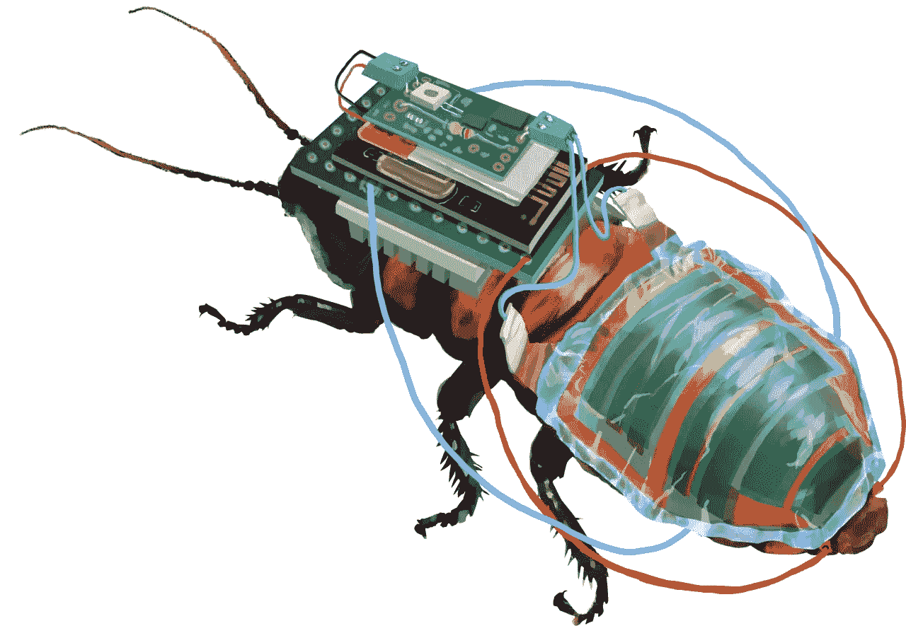
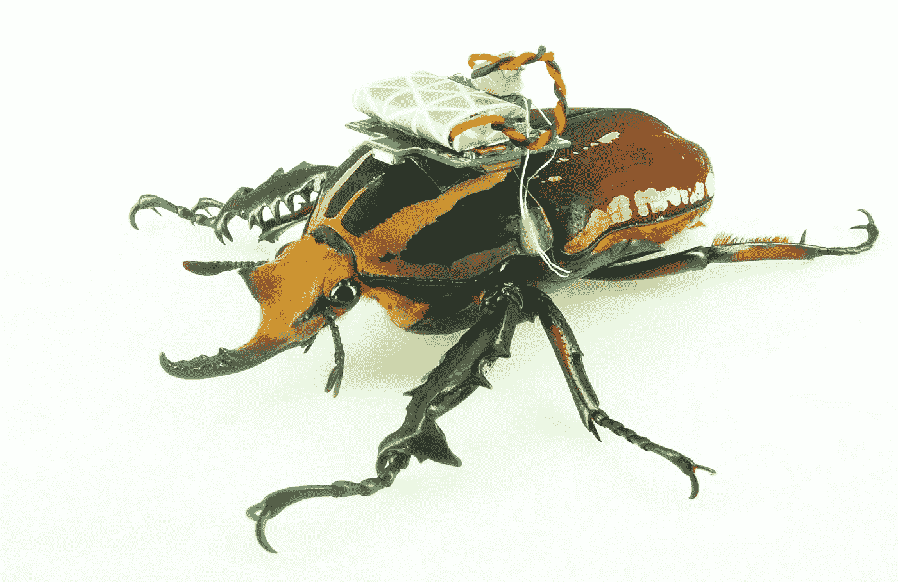
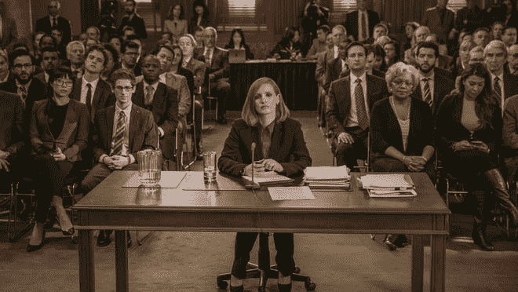

# 工程机器人蟑螂拯救生命。

> 原文：<https://medium.com/coinmonks/engineering-cyborg-cockroaches-to-save-lives-90fd7527ef9?source=collection_archive---------52----------------------->

Scientists are turning insects into cyborgs to save lives.

蟑螂！

当你读到这个的时候，你想到了什么？

恶心的小飞行威胁把你吓得屁滚尿流，然后拒绝死亡？

我也是。

我们大多数人都会对这些活跃的令人毛骨悚然的爬行动物产生空洞的恐惧。

但是如果我告诉你这些害虫可以拯救生命呢？

想象一下未来我们可以控制微小的昆虫，让它们去我们去不了的地方。

新加坡南洋理工大学(NTU)的研究人员想出了一种将机器人附着在昆虫身上的方法，实质上是创造一种电子昆虫。

The Goliath Beetle, one of the largest beetles in the world, can carry a heavy load and be useful for search and rescue missions.

“昆虫可以很容易地穿过碎石中微小而危险的缝隙。但是，尽管被称为“微型飞行器”(MAVs)的昆虫类无人机已经存在了几十年，但它们在飞行过程中消耗大量电力，只能携带微小的电池——这意味着操作时间通常被限制在几分钟*分钟*。”

他们选择了世界上最大的蟑螂之一来做这项工作。

马达加斯加发声蟑螂。

它们可以长到 3 英寸长，能够飞行，具有更大的有效载荷，并且仍然小到足以完成在裂缝和碎石中导航的工作。

不，不像它们的表亲，普通的美洲大蠊，非常恶心，马达加斯加大蠊实际上很温顺。

它非常温顺，不是害虫，容易处理和耐寒。

使它成为儿童中非常受欢迎的宠物。

“研究人员花了数年时间研究如何通过使用电极刺激不同的神经肌肉部位来遥控蟑螂的运动，包括那些激活飞行的部位。”

Insects can navigate into the crevices and cracks of rubbles and save lives amongst the disasters.

所以想象一下，把一个电池组和一个微型电脑放在一只蟑螂身上，并能够控制它的运动。

我们可以安全地执行搜索和救援任务，进入微小的裂缝中搜寻幸存者，如果碎石倒塌，至少没有人有生命危险。

好吧，我很确定用昆虫做这种东西存在某种形式的伦理问题，这仍然是一个非常新的话题。

想想这些可能性。

为半机械昆虫添加附件，比如迷你太阳能电池板和手电筒！

甚至可能是监控用的录像机。

If you watched Miss Sloane (the movie), a cyborg cockroach played a pivotal role in the storyline.

谁知道呢，也许我们甚至可以让水下昆虫来帮助海上救援，因为海上救援的通道非常狭窄。

我预测，如果我们掌握了正确的技术，我们将会看到一个全新的昆虫农场和半机械昆虫经济在我们的日常生活中帮助我们。

如此聪明的创新。

把害虫/宠物变成救星。

NTU 队的大道具，来自我自己的国家(新加坡)！

想想那些将要被拯救的生命。

尽管拥有电子人昆虫的科学是惊人的，我仍然不会接近任何种类的蟑螂，即使是死蟑螂。

哦，等我告诉你蟑螂奶的事。

这是世界上营养最丰富的超级食物之一，我们正在研究如何在不杀死蟑螂的情况下从蟑螂身上“挤奶”。

令人着迷的不安是吗？

但那是另一个故事了。

-

你喜欢蟑螂吗？

-

#初创公司#商业# startupx #成长#成功#社交媒体#文化#创业#战略#拯救#创新#机器人#电子人#蟑螂# madagascarhissingockroach # NTU #新加坡

> 交易新手？试试[加密交易机器人](/coinmonks/crypto-trading-bot-c2ffce8acb2a)或者[复制交易](/coinmonks/top-10-crypto-copy-trading-platforms-for-beginners-d0c37c7d698c)