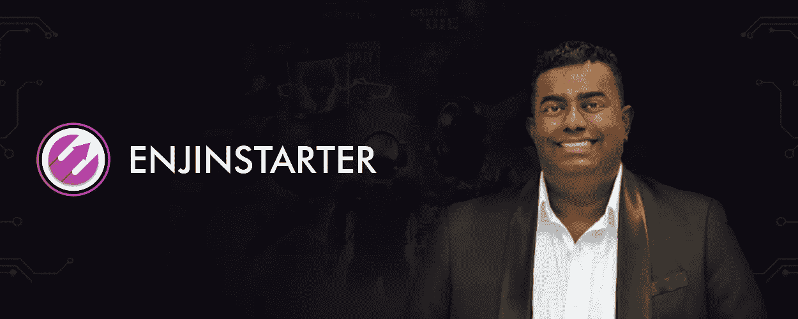
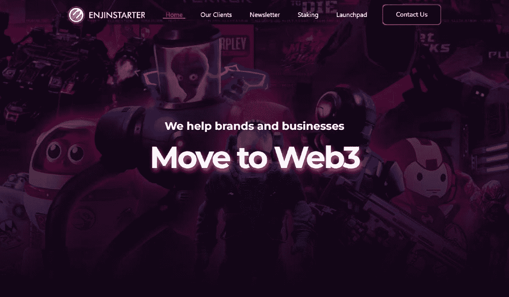

# Enjinstarter 创始人 Prakash Somosundram 深入研究 GameFi 的过去、现在和未来

> 原文：<https://medium.com/coinmonks/enjinstarter-founder-prakash-somosundram-delves-into-gamefis-past-present-and-future-83a058ff29a9?source=collection_archive---------48----------------------->

Enjinstarter 的首席执行官谈到了 GameFi 的迅速崛起，以及游戏如何在当前的低迷时期继续发展。

根据[enjin starter](https://medium.com/u/a7e22e6030c2?source=post_page-----83a058ff29a9--------------------------------)pra kash Somosundram 的首席执行官和创始人的说法，社区、社区和社区——这是在新加坡和其他地方建立成功的 GameFi 生态系统的关键。

GameFi 是“游戏”和“金融”两个术语的结合，随着 Axie Infinity 等区块链游戏的成功，GameFi 在不可替代令牌(NFT)成为 Web3 领域的新资产类别后迅速走红。它的游戏赚(P2E)模式被视为当前游戏经济模式(如付费游戏或免费增值)的下一步，它设想玩家以 NFTs 的形式拥有游戏内资产的所有权，同时通过为游戏经济贡献他们的技能和创造力来赚钱。

所有的游戏经济都需要游戏来发挥作用，Enjinstarter 率先推出了 Web3 游戏。该平台是一个区块链游戏发射台，旨在加速金恩区块链的游戏、元宇宙和 P2E 项目的发展，迄今为止，他们已经成功培育了 50 多个项目，还有更多项目正在进行中。

作为 Enjinstarter 的首席执行官，Prakash 对区块链博彩业并不陌生。他沉浸在新加坡不断增长的技术和 Web3 空间中，在建立了数字广告业务 Yolk PR 后，他一直为不同的加密项目和组织提供营销和战略咨询。

我们采访了 Prakash，以了解 Enjinstarter 如何在当地和地区生态系统中培育即将到来的游戏，以及 GameFi 的整体未来。

## 作为一名企业家，你在建立加密和非加密行业的新计划方面经验丰富。GameFi 空间是什么吸引了你？

这一切都是从我有机会投资 Efinity 开始的，这是 Enjin1 在 Polkadot 网络上建立的一个新区块链。他们是区块链游戏领域的早期先驱，编写了 ERC-1155 标准，许多 NFT 项目使用该标准来铸造不可替代的代币。有机会与金恩合作让我们很兴奋，作为区块链游戏领域的早期开拓者，我们觉得他们需要一个专用的发射台。

我在生态系统建设方面有很多经验，我们宣扬建立一个生态系统，不是专注于一个链，而是多链的方法。我们从牛市期间非常火爆的区块链游戏开始，但早在 2021 年 11 月，我们就开始进入娱乐领域。这主要是因为许多早期的 GameFi 和区块链游戏项目可以建立和筹集资金，但他们很难让人们加入进来。

这就是我们围绕 fandoms 建立投资理论的地方。我们一直在做的是寻找音乐和娱乐，因为无论市场状况如何，人们都会继续支持他们的偶像。我们相信，Web3 将会围绕娱乐来构建。虽然我们看到 Web2 正专注于成为我们生活不可或缺的一部分的电子商务，但我们认为娱乐将成为 Web3 的主要驱动力。

## Enjinstarter 正在与哪些 Web2 社区合作迁移到 Web3？

音乐就是一个很好的例子。我们正在与一些公司合作，这些公司有希望获得巨大突破的未来艺人。他们中的一些人可能需要筹集资金，一些人可能需要扩大他们的社区和粉丝群；这就是我们介入并为他们制定策略的地方。

我们还与向社区销售实体产品的品牌合作，我们正在创造新的收入机会。我们最近启动的一个有趣的项目是一个名为“燕子”的孵化器项目，他们将工具带入元宇宙，帮助纹身艺术家创造新的收入机会。他们把这个带到元宇宙，在那里你的头像可以有一个纹身；可以穿牌子当纹身；你可以通过展示你的纹身与一系列品牌互动。这是我们目前关注的重点项目之一。

我们从千禧一代那里获得了灵感，他们花钱买皮肤来展示自己的设计。越是合意，购买越贵。因此，我们看到了与纹身艺术家合作创造一系列皮肤的机会，这些皮肤也可以是限量版或一对一定制的。它可以是你在像元宇宙这样的数字环境中灵活运用的东西。

## 自一年前成立以来，Enjinstarter 已经成功推出了几个区块链游戏、元宇宙和市场。从那以后 GameFi 的生态系统发生了怎样的变化？

这是一次过山车般的旅程。我们在 4 月疫情期间创办了这家公司，我们非常幸运地通过象征性销售筹集了 550 万美元，另外还有 500 万美元来自私人投资者。所有的事情都是虚拟的，我们甚至无法在很多这样的会议中见到他们。我们建立了一个平台，在那里我们举办了 10 月份的公开销售，我们从社区中额外筹集了 50 万美元。

关于挑战，我们实际上在实际的 IDO2 的前一天被黑客攻击，我们的公司网站受到 DDOS3 攻击。黑客要我支付半个 ETH4，但我拒绝支付，因为这是我们的原则，我们不行贿。

我们继续前进，继续建立公司，进行销售，尽管没有一个公司网站。确实有一部分社区成员跟在我们后面，说我们在做地毯拉力赛，但我们向他们展示了我们能够兑现承诺，我们很快就壮大了公司。在 12 月份，我们在我们的平台上做了大约 20 个 ido，就在任何 launchpad 上发起的 ido 数量而言，这本身就是一个记录。

当前的熊市是我们要应对的最大挑战，因为代币价格已经下跌了很多。但这是我们必须向社区展示我们长期参与的地方，我们必须展示我们将在生态系统建设方面走在前列。

从 2022 年 3 月开始，我一直在广泛地旅行。我们从洛杉矶 NFT 开始，我一个人去那里了解机会是什么，以及这些活动是如何运作的，随后我们开始以集体的方式带来我们自己的项目。

我们在纽约举办了一个名为“NFT 纽约”的活动，展示了几个来自东南亚的集体项目。我们最近在巴厘岛也做了同样的事情，我们是 Coinfest 的冠名赞助商，我们带来了五个项目。最近，我们还推出了 Web3 Matters。

在过去，当遇到熊市时，许多项目会削减工作量和团队，同时进入冬眠以求生存。但我们认为熊市是一个建设的机会，现在容易多了，因为成本更低，更容易获得人们的关注。这就是为什么无论熊市持续多久，我们都将继续建设。但作为一个生态系统，我们需要将更多的合作伙伴聚集在一起，以实现共同的成功。

*在我们的网站* [*这里*](https://coinpasar.sg/enjinstarter-founder-prakash-somosundram-delves-into-gamefi-past-present-and-future/?utm_medium=organic&utm_source=Medium&utm_campaign=content) *阅读采访全文。*

> 交易新手？尝试[加密交易机器人](/coinmonks/crypto-trading-bot-c2ffce8acb2a)或[复制交易](/coinmonks/top-10-crypto-copy-trading-platforms-for-beginners-d0c37c7d698c)