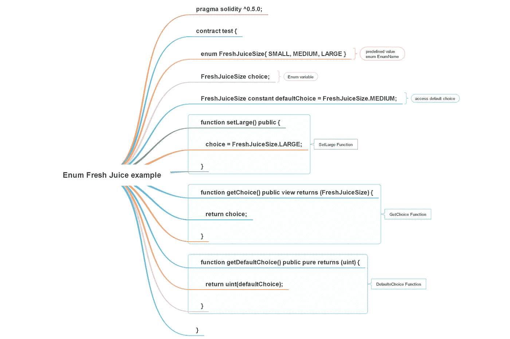
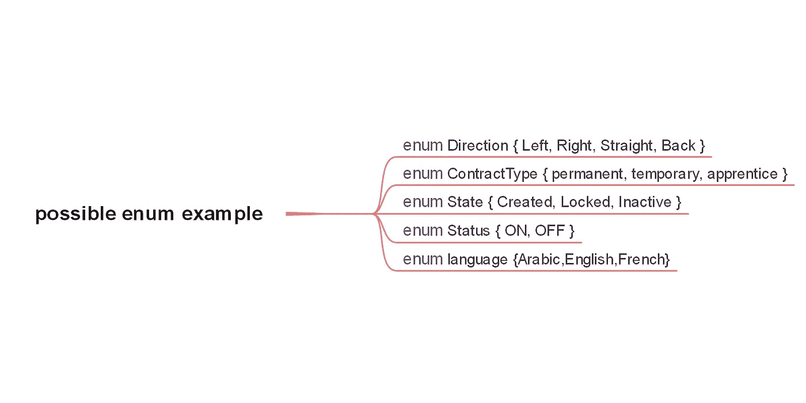
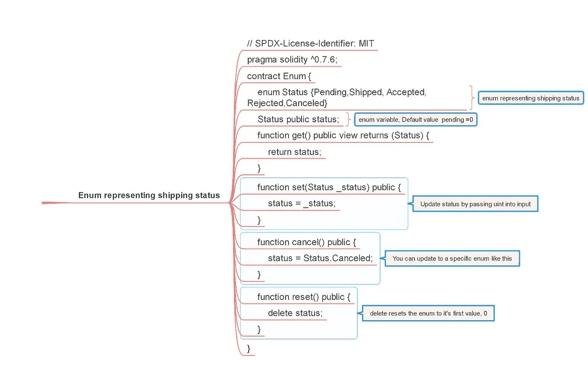

# 从零到英雄

> 原文：<https://medium.com/coinmonks/enum-in-solidity-from-zero-to-hero-f709796b1670?source=collection_archive---------14----------------------->



# 列举型别

*   枚举是在 solidity 中创建用户定义类型的一种方式
*   枚举是值类型，包括预定义的常数值列表
*   带有枚举的常量值可以显式转换为整数
*   每个常数值从零开始得到一个整数值
*   枚举需要至少一个数字
*   枚举不能超过 256 个成员
*   不能使用数字(正数或负数)或布尔值(小写的 true 或 false)作为枚举的成员。然而，真假(大写)都是可以接受的。
*   不需要用分号结束枚举声明。编译器使用分号；和花括号{}来确定代码的范围
*   使用类型(枚举的名称)。min 获得最小值
*   使用类型(枚举的名称)。max 获得最大值

# 枚举的示例

```
enum status {ON,OFF}
status lightOn=status.ON;
status lightOff=status.OFF
```



enum example in solidity

# 装运示例



```
// SPDX-License-Identifier: GPL-3.0
pragma solidity ^0.8.16;
contract enumTest{enum shipMent{notFound,approved,rejected}
shipMent status;
shipMent defaultStatus=shipMent.notFound;function setToApproved() public{
status=shipMent.approved;
}function setToRejected() public{
status=shipMent.rejected;
}function getChoise() public view returns(shipMent){
return status;
}function getDefaultStatus() public view returns(shipMent){
return defaultStatus;
}function getSmallestValue() public pure returns(shipMent){
return type(shipMent).min;
}function getLargestValue() public pure returns(shipMent){
return type(shipMent).max;
}
}
```

# 可靠性文档示例

```
// SPDX-License-Identifier: GPL-3.0
pragma solidity ^0.8.8;

contract test {
    **enum** ActionChoices { GoLeft, GoRight, GoStraight, SitStill }
    ActionChoices choice;
    ActionChoices constant defaultChoice = ActionChoices.GoStraight;

    function setGoStraight() public {
        choice = ActionChoices.GoStraight;
    }

    function getChoice() public view returns (ActionChoices) {
        return choice;
    }

    function getDefaultChoice() public pure returns (uint) {
        return uint(defaultChoice);
    }

    function getLargestValue() public pure returns (ActionChoices) {
        return type(ActionChoices).max;
    }

    function getSmallestValue() public pure returns (ActionChoices) {
        return type(ActionChoices).min;
    }
}
```

# 极客给极客的例子

```
// Solidity program to demonstrate
// how to use 'enumerator'
pragma solidity ^0.5.0;// Creating a contract
contract Types {// Creating an enumerator
 enum week_days
 {
 Monday,
 Tuesday,
 Wednesday,
 Thursday,
 Friday,
 Saturday,
 Sunday
 }// Declaring variables of
 // type enumerator
 week_days week;

 week_days choice;// Setting a default value
 week_days constant default_value
 = week_days.Sunday;

 // Defining a function to
 // set value of choice
 function set_value() public {
 choice = week_days.Thursday;
 }// Defining a function to
 // return value of choice
 function get_choice(
 ) public view returns (week_days) {
 return choice;
 }

 // Defining function to
 // return default value
 function getdefaultvalue(
 ) public pure returns(week_days) {
  return default_value;
 }
}
```

# 果汁大小示例

```
// SPDX-License-Identifier: GPL-3.0
pragma solidity ^0.8.0;contract test {// predefined value enum EnumName
enum FreshJuiceSize{ SMALL, MEDIUM, LARGE }//Enum variable
FreshJuiceSize choice;// access default choice
FreshJuiceSize constant defaultChoice = FreshJuiceSize.MEDIUM;function setLarge() public {
choice = FreshJuiceSize.LARGE;
}function getChoice() public view returns (FreshJuiceSize) {
return choice;
}function getDefaultChoice() public pure returns (uint) {
return uint(defaultChoice);
}}
```

# 已装运状态

```
// SPDX-License-Identifier: MIT
pragma solidity ^0.8.0;contract Enum {
//enum representing shipping status
enum Status {Pending,Shipped, Accepted, Rejected,Canceled}//enum variable, Default value  pending =0
Status public status;function getChoice() public view returns (Status) {
return status;
}// Update status by passing uint into input
function set(Status _status) public {
status = _status;
}//You can update to a specific enum like this
function cancel() public {
status = Status.Canceled;
}// delete resets the enum to it's first value, 0
function reset() public {
delete status;
}
}
```

# 在枚举元素之间移动

```
// SPDX-License-Identifier: MIT
pragma solidity ^0.8.0;
contract Enum {enum Status {Pending,Shipped, Accepted, Rejected,Canceled}
Status public status;function nextChoice() public  {
status=Status(uint(status)+1);
}
}
```

# 允许显式转换

```
// SPDX-License-Identifier: MIT
pragma solidity ^0.8.0;contract EnumTest {
enum Status {Pending,Shipped, Accepted, Rejected,Canceled}function explicitConvertion() public pure returns(uint){
return uint(Status.Accepted);
}
}
```

堆栈交换示例

```
// Lets see Enums which are often used for state machine like this
enum State { Created, Locked, Inactive };

// post this a variable can be Declared like this
State public state;

// Initializing the state can be done like this
state = State.Created;

// It is important to note that enums can be explicitly converted to ints like this
uint createdState = uint(State.Locked);
```

枚举和映射

```
// SPDX-License-Identifier: MIT
pragma solidity ^0.8.0;
contract Enum {
enum Status {Pending,Shipped, Accepted, Rejected,Canceled}
mapping(uint=> Status) enumMappnig;
}
```

枚举和结构

```
// SPDX-License-Identifier: MIT
pragma solidity ^0.8.0;
contract Enum {enum Status {Pending,Shipped, Accepted, Rejected,Canceled}struct enumStruct{
Status _status;
}
}
```

> 交易新手？试试[加密交易机器人](/coinmonks/crypto-trading-bot-c2ffce8acb2a)或者[复制交易](/coinmonks/top-10-crypto-copy-trading-platforms-for-beginners-d0c37c7d698c)