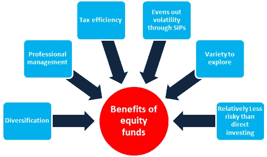
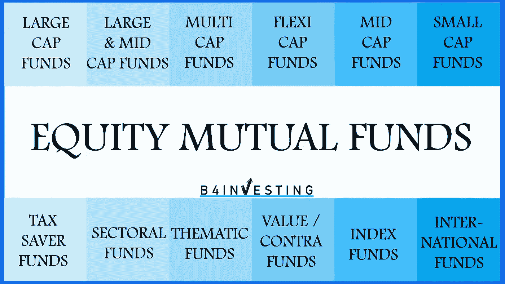

# 投资股票共同基金——快速简单指南

> 原文：<https://medium.com/coinmonks/equity-mutual-funds-quickstart-guide-d9c65ce0ee29?source=collection_archive---------8----------------------->

在我们之前关于债务共同基金**的 [**讨论中，我们考察了风险最小的投资形式。现在，我们将深入探讨股票共同基金，这是大多数投资新手或忙于工作的人的普遍选择。**](/@kalaiselvan_3467/list/debt-funds-872c23551d97)**

# **什么是股票共同基金？**

**股权共同基金是一种投资计划，包含多个组织的一篮子股票/股份。这些基金由经验丰富的基金经理管理。这些基金为投资者提供了分散投资组合的机会，并有可能获得更高的回报，因为与债券或现金等其他资产类别相比，股票历来具有更高的回报潜力。然而，值得注意的是，股票共同基金也伴随着更高的风险水平，因为基金中股票的价值会因市场条件或单个公司业绩的变化而波动。对于那些愿意承担一些风险以换取更高回报的投资者，以及那些没有时间或专业知识来管理自己的股票投资组合的投资者，股票共同基金可能是一个不错的选择。**

> **交易新手？在[最佳加密交易](/coinmonks/crypto-exchange-dd2f9d6f3769)上尝试[加密交易机器人](/coinmonks/crypto-trading-bot-c2ffce8acb2a)或[复制交易](/coinmonks/top-10-crypto-copy-trading-platforms-for-beginners-d0c37c7d698c)**

# **基金经理是谁，他是做什么的？**

**基金经理是负责管理特定共同基金投资的个人。此人通常由基金公司(资产管理公司)任命，在该领域拥有丰富的经验。基金经理负责分析、研究和管理基金中的股票，根据这些股票的表现做出买入或卖出的决定。值得注意的是，基金经理在共同基金的成功中起着至关重要的作用，因为他们的投资决策会极大地影响基金的回报。**

# **谁应该投资股票共同基金？**

**股票共同基金可能是一个很好的选择，为个人谁没有时间或专业知识来彻底研究个股，并作出明智的投资决定。这些基金提供了分散投资组合的机会，并有可能通过投资一系列股票获得更高的回报。值得注意的是，股票共同基金投资通常需要至少五年的更长时间，以便允许增长。此外，投资者愿意接受投资股市的内在风险也至关重要，因为总有亏损的可能。如果你正在考虑投资股票共同基金，在做决定之前仔细考虑你的投资目标、风险承受能力和时间范围是很重要的。**

# **我为什么要投资共同基金？**

1.  **分散投资:共同基金允许你投资多种多样的资产，如股票、债券和现金，这有助于分散风险，并可能减少任何单个投资对你整体投资组合的影响。**
2.  **专业管理:共同基金由专业基金经理管理，他们在选择证券和构建多元化投资组合方面拥有专业知识。这对于没有时间或知识来管理自己投资的个人投资者尤其有用。**
3.  **便利性:投资共同基金既简单又方便。你通常可以在网上开户，通过该基金的网站或应用程序进行投资，或者通过联系代表进行投资。**
4.  **低最低投资:许多共同基金的最低投资要求很低，这使得用较少的资金开始投资成为可能。**
5.  **更高回报的潜力:虽然投资时没有保证，但共同基金有潜力提供比其他类型投资更高的长期回报。**

****

**[https://fundguru.sbimf.com/tips-and-articles/investing-in-stock-versus-equity-mutual-funds](https://fundguru.sbimf.com/tips-and-articles/investing-in-stock-versus-equity-mutual-funds)**

# **股票共同基金的回报是什么？**

**股票共同基金通过持有一篮子股票而不是直接投资于单个股票，为投资者提供了分散投资组合的机会。因此，投资股票共同基金的风险通常低于投资个股。然而，值得注意的是，低风险通常也会导致低回报。平均而言，股票共同基金可能提供 13-20%的年回报率，尽管这是更长时期内的平均回报率。重要的是要知道，年回报率可能会大幅波动，在正常的市场条件下，回报率可能会下降 10-15%。如果出现像 2008 年和 2020 年那样的市场崩盘，回报率可能会下降多达 50%。对于投资者来说，了解投资股市的内在风险并确保他们对自己承担的风险水平感到满意是至关重要的，因为这是他们辛苦赚来的钱。**

# **好吧，现在有很多共同基金。我投资哪一个？**

****

**在决定投资哪只基金之前，参考此链接 [***不同类型的股票共同基金***](https://groww.in/p/equity-funds/large-cap-mutual-funds) 来熟悉不同类型的共同基金是个不错的主意。**

**现在我们知道了不同类型的基金，共同基金的潜在回报可能会根据基金的类型和与投资相关的风险水平而有所不同。大型共同基金通常风险较低，可能提供 11-13%的年回报率。另一方面，小型共同基金可能提供更高的潜在回报，但也承担更高的风险。如果你愿意在投资中承担更多风险，你可以考虑投资小盘股共同基金，这可能提供高达 16%的年回报率。如果你想投资一个特定的领域，你可以考虑一个专注于该领域公司的行业共同基金。**

# **一次总付与 SIP 投资**

****一次性投资**是一次性投入大量资金，而不是随着时间的推移定期投入少量资金。虽然一次性投资在某些情况下可能是一种有用的策略，但通常不建议投资于股票市场。这是因为股市可能会波动和不可预测，如果市场低迷，一次性投资大量资金会增加损失很大一部分投资的风险。**

**另一方面，**系统投资计划** (SIPs)涉及定期投入少量资金，如每周、每月或每季度。对于那些想投资股市，但又想降低一次性投入大量资金的风险的人来说，SIPs 可能是一个不错的选择。通过定期投入少量资金，你可以利用市场的涨跌，并有可能随着时间的推移获得更好的回报。只要你有稳定的收入来源，SIPs 也是培养持续投资习惯的好方法。**

**如果你确实有突然的收入或奖金流入，把钱分成小块，分阶段投资，而不是一次性全部投资，这可能是个好主意。这有助于分散风险，并有可能使你的回报最大化。**

**在投资股票共同基金之前，有几件重要的事情需要考虑，不管你是选择一次性投资还是系统投资计划。这些因素可能包括基金的费用、业绩历史、基金经理的经验和业绩记录，以及基金的投资策略和风险状况。在做出任何投资决定之前，仔细考虑自己的投资目标和风险承受能力也很重要。**

# **常规与直接共同基金**

****普通共同基金**是通过共同基金分销商销售的投资产品，这些分销商是认证顾问，根据您的投资目标提供购买基金的建议，并帮助您澄清对共同基金投资的任何疑问。当您购买定期共同基金时，您可能需要向共同基金公司(也称为资产管理公司或 AMC)和分销商支付费用。**

**另一方面，**直接共同基金**是直接从资产管理公司购买的，没有分销商的帮助。当你购买直接共同基金时，你有责任在没有顾问指导的情况下选择投资哪只基金，因此，你只需向 AMC 支付费用。然而，重要的是要注意，常规和直接共同基金都是由 AMC 的基金经理管理的。**

**确定共同基金收费多少的一个方法是看费用率，这是衡量基金运营费用占其资产百分比的指标。**

# **在哪里以及如何投资股票共同基金？**

**要投资股票共同基金，你可以在你的银行开一个 demat 账户，或者使用 Zerodha 或 Groww 等在线经纪商。demat 账户是一个电子账户，以非物质化(demat)的形式持有您的投资，而不是实物证书。这使得买卖证券和跟踪投资变得更加容易。**

**当您开立 demat 账户时，您需要提供一些个人和财务信息，并完成开户流程，其中可能包括填写申请表和提交任何所需的文件。一旦您的帐户被打开，您可以浏览可用的共同基金，并选择您想要投资的。你通常可以通过经纪人的网站或应用程序在线进行，或者联系代表寻求帮助。**

# **股票型共同基金没有风险吗？**

**重要的是要注意，股票共同基金，像所有的投资一样，带有一定程度的风险。虽然这些类型的共同基金可以提供长期更高回报的潜力，但也有可能失去部分或全部投资，特别是如果你持有基金的时间较短。但是，如果你持有基金的时间更长，比如五年以上，损失的风险几乎可以避免。这是因为股票市场往往在短期内波动，但在长期内总体呈上升趋势。因此，投资于股票共同基金更长的一段时间可能会减少因市场波动而遭受损失的风险。**

# **股票共同基金系列的近期话题**

**在以后的文章中，我们将探讨与共同基金投资相关的各种主题，包括:**

*   **分析和选择适合你需求的共同基金的技巧。**
*   **最小化共同基金投资组合风险的策略。**
*   **分散投资在共同基金投资中的重要性。**
*   **让你的共同基金投资回报最大化的建议。**
*   **用共同基金设定并实现你的投资目标。**
*   **通过共同基金投资节省税收的方法。**

**敬请关注这些关于共同基金投资的内容丰富且有益的文章！**

> **加入 Coinmonks [电报频道](https://t.me/coincodecap)和 [Youtube 频道](https://www.youtube.com/c/coinmonks/videos)了解加密交易和投资**

# **另外，阅读**

*   **[用于 Huobi 的加密交易信号](https://coincodecap.com/huobi-crypto-trading-signals) | [HitBTC 审核](/coinmonks/hitbtc-review-c5143c5d53c2)**
*   **[TraderWagon 回顾](https://coincodecap.com/traderwagon-review) | [北海巨妖 vs 双子星 vs BitYard](https://coincodecap.com/kraken-vs-gemini-vs-bityard)**
*   **[如何在 FTX 交易所交易期货](https://coincodecap.com/ftx-futures-trading)**
*   **[OKEx vs KuCoin](https://coincodecap.com/okex-kucoin) | [摄氏替代品](https://coincodecap.com/celsius-alternatives) | [如何购买 VeChain](https://coincodecap.com/buy-vechain)**