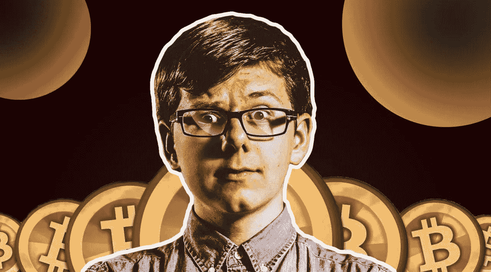

# 少年百万富翁埃里克·芬曼|比特币成功故事

> 原文：<https://medium.com/coinmonks/erik-finman-the-teenage-millionaire-bitcoin-success-stories-fe569fa5a477?source=collection_archive---------4----------------------->

**Erik Finman**

今天，我将分享一个令人惊叹的比特币成功故事，这是一个如何在 crypto 上赚钱并成为比特币百万富翁的完美例子，只要相信自己并继续为自己的目标努力。

在这篇文章中，你可以探索一个关于加密货币投资者的最惊心动魄的百万富翁故事；埃里克·芬曼。让我们开始吧:

# 埃里克·芬曼——比特币百万富翁少年

绰号“比特币少年百万富翁”的埃里克·费曼(Eric Feynman)在他 12 岁时与父母达成协议，让他辍学接受非传统教育，前提是他能从投资中赚钱。怎么会？

他不得不把祖母给他的 1000 美元兑换成 100 万美元。当每枚比特币的价格仅为 12 美元时，埃里克决定将全部金额投资于比特币和其他几种加密货币。两年后，当比特币价值 1200 美元时，这种选择开始产生回报。

埃里克在出售了一小部分加密货币股份后，进行了少量投资，建立了一家名为 Botangle 的在线教育初创公司。投资者很快对这个提供视频辅导服务的平台产生了兴趣，他们让这个 15 岁的孩子选择以 10 万美元或 300 BTC 的价格出售公司。你猜怎么着？他选择和 BTC 一起赚钱。芬曼实现了他的目标，年满 18 岁，而比特币的价值在 2017 年 6 月突破了 2700 美元。

埃里克·芬曼目前的净资产估计为 400 万美元。他在 2019 年推出了 Metal Pay，这是一个教人们如何投资比特币的网站。

芬曼说，没有经验的投资者最大的问题是他们的短期眼光。“他们可能犯的最大错误是，仅仅因为一次挫折就退出市场，卖掉他们的比特币，”他解释道。这意味着当比特币下跌时，你需要减少过度反应，并相信长期项目。

他说，如果你足够细心，并且对加密货币交易背景有很好的了解，你可以获得巨大的利润。“面积还是比较小的。市值刚刚超过 5000 亿美元，”他告诉美国消费者新闻与商业频道。他补充道:“我不想被误解:这当然是一个非常高的数额，但与其他资产类别相比，这是很小的。因此，我说，如果你在未来 10 年内没有成为百万富翁，那是你自己的错。”

如果你想投资比特币，我建议你去最值得信任的平台交易所，即**[**【www.binance.com】**](http://www.binance.com/)。在币安，你可以在注册并开始交易后获得奖励。记住，只投资你愿意失去的东西；)**

# **结论:**

**这都是关于少年百万富翁埃里克·芬曼(Erik Finman)的，他是比特币最成功的故事之一。如果你喜欢这篇文章，你可以在推特或脸书上分享它。谢谢！**

****

**[**Click Here To Access**](https://accounts.binance.com/en/register?ref=26723737)**

**你加入我的 [**私人脸书群**](https://web.facebook.com/groups/589559372560620) 了吗？在那里，你会找到合法的方式在网上赚到你的第一美元。**

**请 [**关注并订阅**](/@s.hanz) ，务必分享我的作品作为激励姿态。点击这里查看我所有的文章:[**https://medium.com/@s.hanz**](/@s.hanz)**

# **🌟[创建一个币安帐户，在 USDT 赢取 100 美元奖金](https://www.binance.com/en/activity/referral/offers/claim?ref=CPA_00M6XWFUN3)🌟**

****

**[**Click Her To Access**](https://accounts.binance.com/en/register?ref=26723737)**

**一旦您创建了一个帐户**[**www.Binance.com**](https://www.binance.com/en/activity/referral/offers/claim?ref=CPA_00M6XWFUN3)**存入 50 多 USDT，然后在到期前赎回您的 100 USDT 优惠券。(只需按照他们的简单指南激活奖金)******

# ******更多文章:******

******[**买 Shitcoin 有什么好处吗？**](/coinmonks/is-there-any-benefit-from-buying-shitcoin-412bf88006aa)******

****[**币安赚:利用低风险产品赚取利息**](/coinmonks/binance-earn-earn-interest-using-less-risk-products-408f6736cea)****

****[**熊市买比特币以外的 5 大加密货币**](/coinmonks/5-great-cryptocurrencies-other-than-bitcoin-to-buy-in-a-bear-market-be3e9945d621)****

****[**2022 年元宇宙最佳 5 个好项目——榜单 1**](/@s.hanz/best-5-metaverse-crypto-coins-with-good-projects-in-2022-list-1-687fedbe668e)****

****[***2022 年元宇宙最佳 5 个加密币好项目—榜单二***](/@s.hanz/best-5-metaverse-crypto-coins-with-good-projects-in-2022-list-2-15af2f8f01d9)****

****[**2022 年最值得投资的 7 种元宇宙加密币—榜单三**](/coinmonks/7-best-metaverse-crypto-coins-to-invest-in-2022-list-3-9e077f5c87ab)****

****[**最后的机会—2022 年投资的 6 个最佳元宇宙加密硬币—榜单 4**](/coinmonks/last-chance-6-best-metaverse-crypto-coins-to-invest-in-2022-list-4-2ce3d6c1c922)****

****[**需要钱的时候要做的事情快——新招**](/@s.hanz/things-to-do-when-i-need-money-fast-new-tricks-2b68ad24406b)****

****[**2022 年推广 NFT 项目的 7 种免费方式**](/coinmonks/7-free-ways-to-promote-nft-projects-in-2022-ccefc7f249e7)****

****[**2022 年 7 款最佳赌注币**](/@s.hanz/7-best-staking-coins-in-2022-70dbc31adcae)****

> ****交易新手？尝试[加密交易机器人](/coinmonks/crypto-trading-bot-c2ffce8acb2a)或[复制交易](/coinmonks/top-10-crypto-copy-trading-platforms-for-beginners-d0c37c7d698c)****