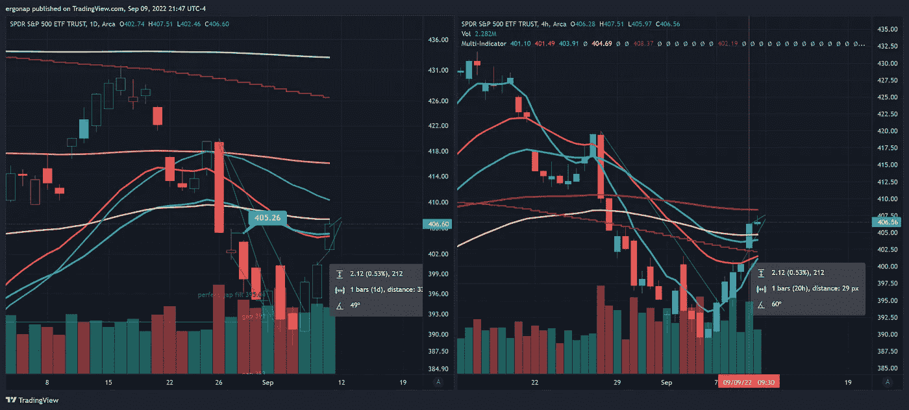
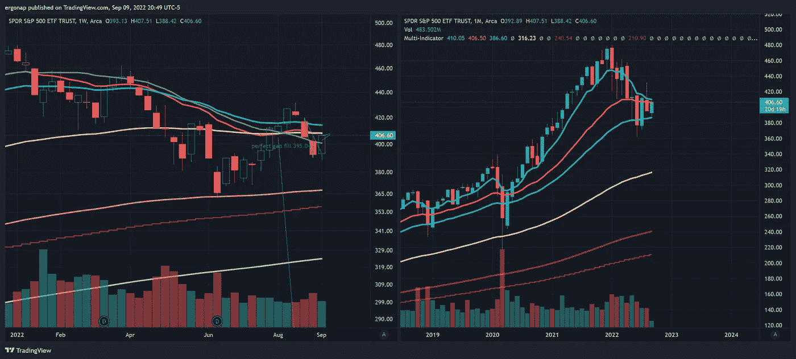
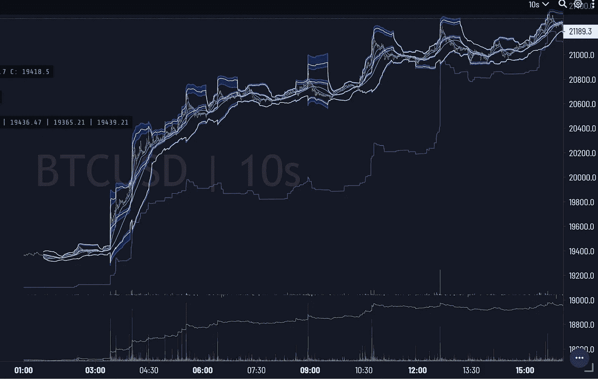
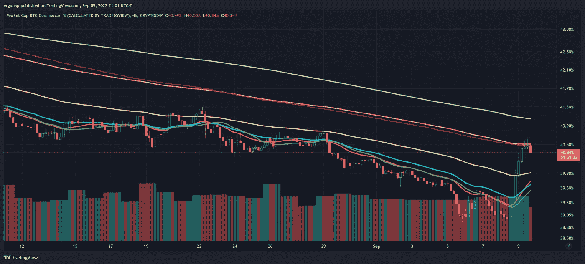
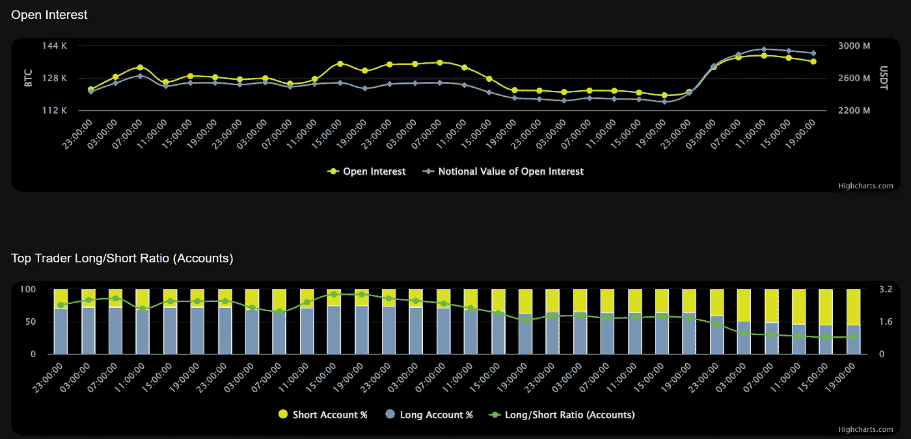
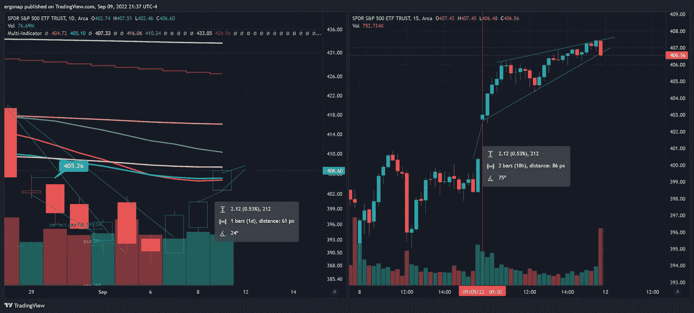

# 股票市场看起来不错，秘密的…

> 原文：<https://medium.com/coinmonks/es-short-squeeze-stock-market-lookin-good-crypto-eh-fe1dddcea2f2?source=collection_archive---------19----------------------->

## 加密货币市场/比特币市场分析 9/9

所以，有一个短暂的挤压。非常非常大的一个。发生了很多奇怪的事情，但是很多人都找错了地方。

为什么？因为这是$间谍，它的期货缺口，而不是一些神奇的$BTC 移动，因为 BTC 跟随间谍这些天。

Notice the $ES moving up here, hours before BTC follows. Why would anyone wait for this or even care? But I digress, that’s not what we’re here for. [https://www.tradingview.com/x/THGgHIdC/](https://www.tradingview.com/x/THGgHIdC/)

SPY，宏观:4h 现在有可能看涨，但与 200ma 的差距非常小，1d 甚至不接近。

[https://www.tradingview.com/x/scYpDVCN/](https://www.tradingview.com/x/scYpDVCN/)

一周零一个月表明我们可以在这里扭转局面。考虑到 BTC 处于疯狂的低点，人们出于对 BTC 市场的退出，这是非常说明问题的，因为股市目前可能还不错，如果不是很好的话。

ref:对于 Crypto 来说，这发生在一天之内。仅今天一天就有 1 . 86 亿美元艰难退出。所以是的，人们不买。即使短暂的挤压也无济于事。

> 密码量子警报，[2022 年 9 月 9 日凌晨 3 点 39 分]
> 🐳1，859.83 # BTC(＄38，494，457)
> 流入#币安
> CryptoQuant Alert，[9/9/2022 下午 2:04]
> 🐳1，300.37 # BTC(＄27，512，386)
> 合计流入# Huobi Global
> CryptoQuant Alert，[9/9/2022 下午 3:43]
> 🐳🐳🐳4000.04 # BTC(＄85214327)
> 流入#Bitfinex
> CryptoQuant Alert，[9/9/2022 下午 4:32]
> 🚨1，648.53 # BTC(＄35，041，198)
> 流入#比特币基地 Pro 的总额

[https://www.tradingview.com/x/2fLDeSpb/](https://www.tradingview.com/x/2fLDeSpb/)

然而，结果是，空头被清算，多头获利了结，以适应两个方向的变动。看看阿格尔。

[https://imgur.com/obbBRzs](https://imgur.com/obbBRzs)

#空头被清算了吗？是的，当然。但那是目标吗？考虑到持续不断的倾销，人们当然需要一个新的“答案”来追逐。我给你介绍: **M2** ( **货币供应量 vs 市场资本**)。这就是 crypto 出错的地方。

just don’t, please.

这是一些一厢情愿的废话连篇，需要一个星期才能被揭穿，人们会继续前进。BTC 不是通胀的对冲工具，从来都不是。也不是健全的货币。说真的，别闹了，伙计们。

stop, please! Photo by [tabitha turner](https://unsplash.com/es/@tabithabrooke?utm_source=medium&utm_medium=referral) on [Unsplash](https://unsplash.com?utm_source=medium&utm_medium=referral)

哦，猜猜还有什么玫瑰？最重要的危险: **BTC 独霸**。自 7 月 19 日以来，BTC 的优势终于第一次转向看涨 4 小时图，即使是短期的。因此，这可能是前方大规模倾倒的巨大危险。

[https://www.tradingview.com/x/JsAXGAcp/](https://www.tradingview.com/x/JsAXGAcp/)

还有:OI 吼涨，只剩空头。那么…我们下去吗？

[https://imgur.com/70fWCOv](https://imgur.com/70fWCOv)

如果有足够的散户来平仓这些空头，我们会上涨，这可能发生在周一。如果没有，我们就完蛋了。这是看涨吗？LOL 没有，整体没有。

这是一项投资，你可以从中赚钱，也可以从中赔钱。别再自欺欺人了。什么来了？嗯，这是周五股票最有可能的结果。提示:不是公牛旗。

Rising wedge. [https://www.tradingview.com/x/ZybghkIm/](https://www.tradingview.com/x/ZybghkIm/)

会不会有的股票涨，有的密码涨？是的，有一段时间。但是…是的。这不是一个好的开始。我想买些、和文之类的东西，但我能指望它长久吗？不是大部分。

另一则新闻，俄罗斯被乌克兰摧毁了—

因此，俄罗斯可能会开始这场让市场陷入困境的表演/试图威胁石油，因为这是他们所拥有的一切。

那么，当俄罗斯不再是一个世界强国，他们的石油出口因为被哈萨克斯坦取代而消失时，会发生什么呢？我们可能会找到答案。

 [## 独家报道:哈萨克斯坦将绕过俄罗斯通过阿塞拜疆管道开始石油销售

### 路透莫斯科/伦敦 8 月 12 日电---哈萨克斯坦预计将通过阿塞拜疆最大的石油公司出售部分原油

www.reuters.com](https://www.reuters.com/business/energy/exclusive-kazakhstan-start-oil-sales-via-azeri-pipeline-bypass-russia-2022-08-12/) 

猜猜我们将与谁合作，为什么美国的储备不太可能成为问题:

[https://www . Reuters . com/business/energy/雪佛龙-考虑-铁路-运输-哈萨克斯坦-石油-ceo-says-2022-09-07/](https://www.reuters.com/business/energy/chevron-considering-rail-transport-kazakhstan-oil-ceo-says-2022-09-07/)

这完全是人们在俄罗斯的路线。那么我们有什么能告诉我们接下来会发生什么？

关注加密法规(Gensler 称法规即将出台——点击此链接阅读全文:

还要关注石油状况和俄罗斯的状况。就目前而言，这些指标将比技术指标更能告诉我们方向。

> 交易新手？试试[密码交易机器人](/coinmonks/crypto-trading-bot-c2ffce8acb2a)或者[复制交易](/coinmonks/top-10-crypto-copy-trading-platforms-for-beginners-d0c37c7d698c)