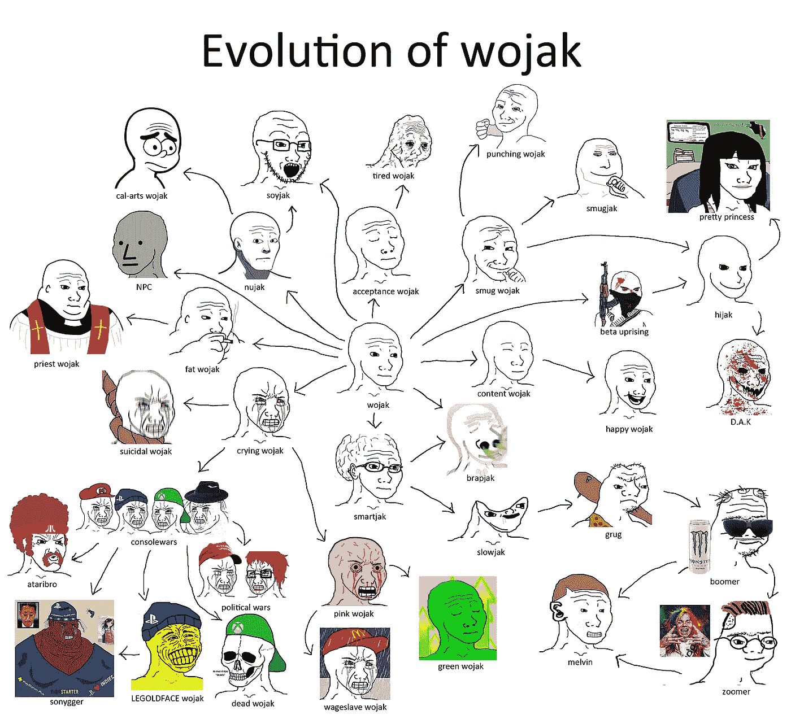
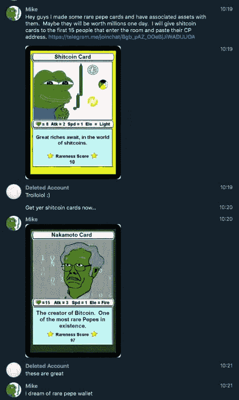
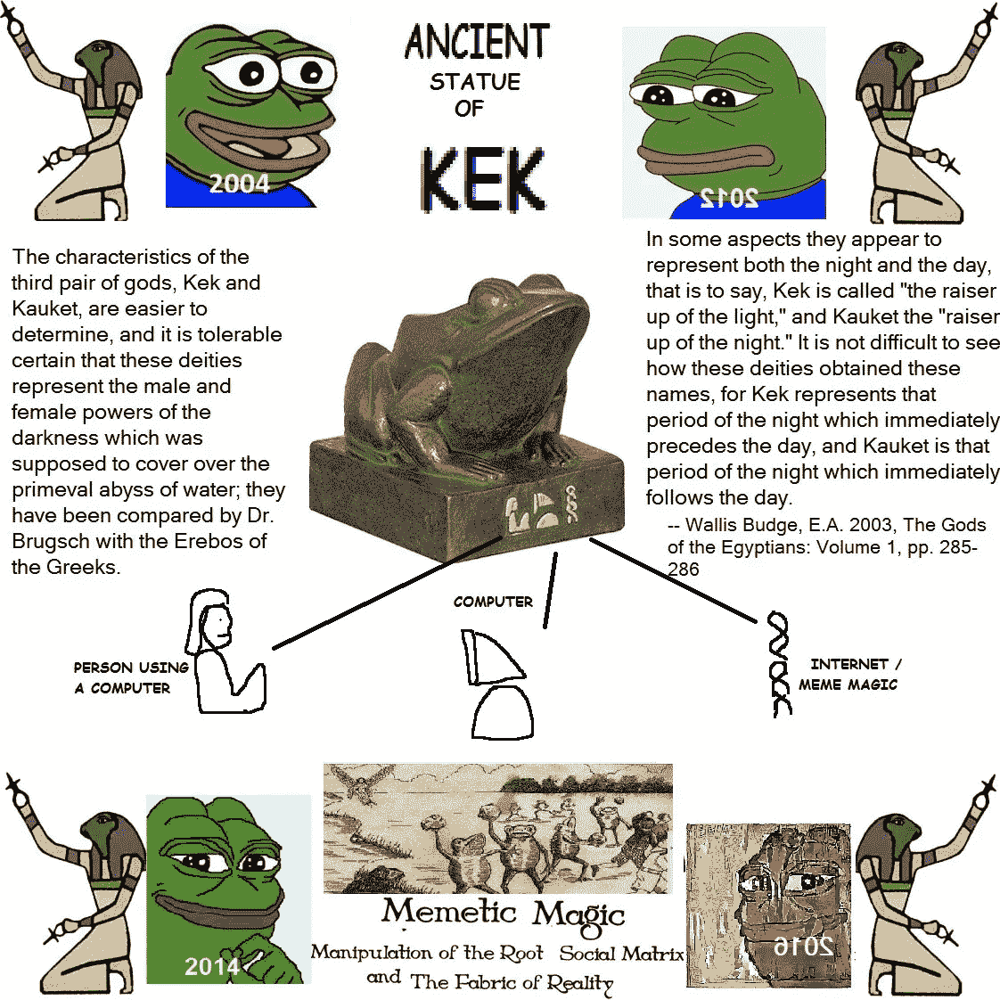
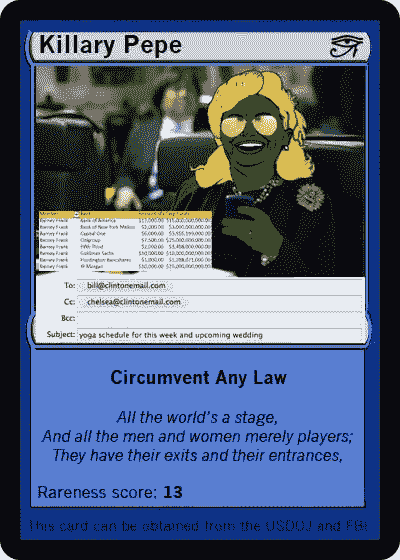
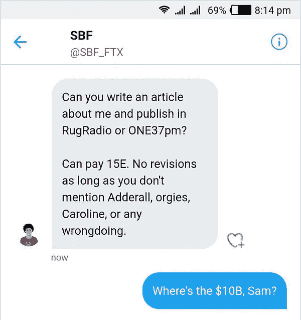
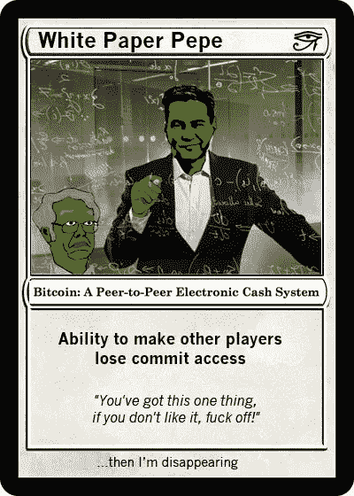
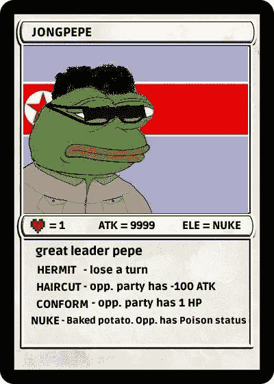
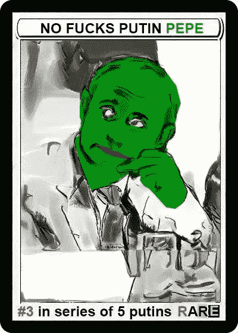
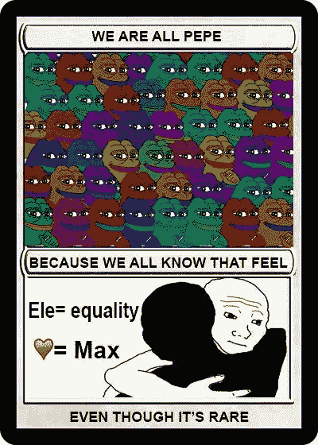

# 用迷因导航混乱、真相和共识。

> 原文：<https://medium.com/coinmonks/essay-navigating-chaos-truth-and-consensus-with-memes-ae8cca11843d?source=collection_archive---------60----------------------->

*(以下短文摘自我的子栈，* [*复调*](https://polyphony.substack.com/p/issue-1-da-capo?sd=fs&s=w) *)。以下任何观点均为作者个人观点，不应构成投资决策的依据)。*

在公元前 3102 年(大约 5124 年前)，人类进入了一个混乱时期，更好的说法是卡利宇迦时期。根据印度教神话，这是宇迦周期中四个年代中的第四个也是最糟糕的一个，预计将持续 432，000 年，之后将是下一个周期的重新开始，大约 427，878 年后的克里塔宇迦。

除了提及[另类右翼的深奥概念](https://knowyourmeme.com/memes/cultures/kali-yuga)、[传统主义](https://en.wikipedia.org/wiki/Traditionalist_School_(perennialism))和[雷内·古埃农](https://en.wikipedia.org/wiki/Ren%C3%A9_Gu%C3%A9non)之外，当考虑到西方社会内部竞争的意识形态和文化战争的不和谐时，很容易达成一致:卡莉·宇迦的决定性特征围绕着冲突和混乱。

另见: [**乔·罗根《我们在卡利宇迦》**](https://www.instagram.com/p/CWxaIYWFvfH/?utm_medium=twitter)

鉴于这种反复出现的扭曲现实感知的努力，就像传统媒体(legacy media)对山姆·班克曼·弗里德(SBF 饰)的吹捧文章一样，现在还不清楚还有哪些资源可以帮助我们找到真相，或者至少可以帮助我们克服认知偏见，得出关于事物真实情况的更具体结论，而不是主流权力结构是如何支配的。

> 交易新手？在[最佳加密交易](/coinmonks/crypto-exchange-dd2f9d6f3769)上尝试[加密交易机器人](/coinmonks/crypto-trading-bot-c2ffce8acb2a)或[复制交易](/coinmonks/top-10-crypto-copy-trading-platforms-for-beginners-d0c37c7d698c)

除了像马特·蒂亚比、T2·咖啡西拉和 T4 这样的独立人物，另一个潜在的媒介是迷因。迷因通过讽刺和荒诞的喜剧手法包含了我们这个世界令人不安的现实。有趣而且经常是真实的，它们的传播是分散的，令人放松的幽默可以帮助缩短认知失调反应，这种反应经常鼓励我们的大脑拒绝任何不是简单地确认我们已经“知道是真实的”的信息——因为，大多数时候，无论我们是否愿意承认，内容或主题都有一些真实的东西。

例如，人们只需查看大量使用像 Wojak 这样无意义角色的模因，就可以发现微妙的启示，这些启示反映了对某些人和社会事件的更有机(或诚实)的反应，而不是传统媒体和历史档案让我们相信的。

历史是人们一致认同的一系列谎言拿破仑·波拿巴

此外，虽然可能很难用客观数据来证实，但我的理论是，某些模因会像病毒一样传播，因为它们准确地捕捉到了我们的集体反应和情绪，并与之产生共鸣。评论或细微差别越准确，模因的传播性就越强。

我们可以从美国前总统唐纳德·特朗普和无数流行的模因中看到这个例子，其中许多不仅利用了他有争议和好斗的个性，还导致了公众对特朗普作为一个分裂和两极分化人物的看法，尽管他不断试图打造个人品牌。

迷因可能变得如此受欢迎，以至于个人或公司的声誉可能会被迷因掩盖，正如 2016 年[华尔街日报](https://www.wsj.com/articles/basketball-legend-surges-on-web-as-crying-jordan-1454531219)一篇详细描述迈克尔·乔丹和哭脸迷因之间的起源和联系的文章所揭示的那样。马歇尔大学(Marshall University)24 岁的大四学生罗伯特·格里尔(Robert Greer)对《华尔街日报》说，他从来没有看过乔丹打篮球，但经常转发这条微博。他最喜欢的是:在被费城老鹰队解雇后痛哭流涕的乔丹·奇普·凯利。“我认为最终人们会更多地认识到哭泣的乔丹的脸，而不是他真正的遗产，”他说。

另见:[https://www . new Yorker . com/sports/sporting-scene/how-air-Jordan-been-crying-Jordan](https://www.newyorker.com/sports/sporting-scene/how-air-jordan-became-crying-jordan)

虽然在乔丹的案例中，这可能是一种夸张，但有许多公众人物的声誉是由迷因塑造的。在某些情况下，这些模因有助于加强他们的形象和受欢迎程度，而在其他情况下，他们有助于发展更负面的声誉。

例如，演员山谬·里维已经成为众多模因的主题，其中许多都是利用他“酷”和悠闲的名声。这些模因有助于巩固他作为“酷哥”的声誉，并使他在年轻观众中更加知名和受欢迎。

当选择迷因符号来更真实地反映当前时代时，不缺乏潜在的竞争者——每个人都有不同程度的相关性和喜剧力量。我们可以从漫画家 KC Green 的例子中看出这一点，例如[感觉家伙又名 Wojak](https://knowyourmeme.com/memes/wojak) 或[迪克·巴特](https://knowyourmeme.com/memes/dick-butt)。

但是，考虑到它的起源是混沌、密码和互联网文化的固有代表，也许没有比青蛙佩佩更好的迷因符号来探索和揭示真相(考虑到我们的卡利宇迦时代)。更具体地说，稀有物种的不断扩张和潮湿的生态系统。

参见:**乔·罗根&乔丹·彼得森论真理、混乱和基斯坦**

# 简要背景

[青蛙佩佩](https://en.wikipedia.org/wiki/Pepe_the_Frog)可以追溯到 2006 年，它的创造者兼艺术家马特·弗瑞在他的标志性漫画《男孩俱乐部[中发表了它不久之后，这个角色作为一个独立的模因成长为一种文化现象，在包括 4Chan 在内的社交媒体网站上广受欢迎。](https://www.amazon.com/Boys-Club-1-Matt-Furie/dp/B001MJXDF2)

[交易对手](https://dbpedia.org/page/Counterparty_(platform))由罗伯特·德莫迪、亚当·克伦斯坦和埃文·瓦格纳于 2014 年创立。该协议包括一个内置的分散式交易所，旨在通过象征性地“写入”常规交易的边缘来扩展比特币的功能。通过这样做，它为创新和高级功能打开了大门，比如铸造新的基于比特币的资产，否则普通的比特币软件是不可能的。

到 2015 年，佩佩漫画的变体开始开花，上面覆盖着像[“稀有的 Pepe 不救](https://knowyourmeme.com/memes/rare-pepe)”这样的水印，用来说明每个设计背后的艺术家并没有打算将这些文化基因用于公共用途。那一年，1200 张佩佩的照片被放在了易贝网站上，[据报道，在被从网站上除名之前，出价达到了 99166 美元](https://www.reddit.com/r/4chan/comments/319btv/ebay_takes_down_collection_of_over_1200_rare/)。

2016 年，一个名为“ [Mike](https://pepe.wtf/artists/Mike) ”的 [Telegram](https://telegram.org/) 用户发布了一个链接，链接指向他注册的名为 [RAREPEPE](https://xchain.io/asset/RAREPEPE) 的[交易对手](https://counterparty.io/)资产。这个区块链资产的独特之处在于，就像《创世纪》中的 [**咒语**](https://spellsofgenesis.com/) 卡片(由 EverdreamSoft 于 2015 年 3 月发布)一样，迈克已经将一个图像连接到它上面。然而，与游戏中的 SoG 资产( [FDCARD](https://everdreamsoft.medium.com/introducing-the-fdcard-a56b19611000) )不同，通过将供应锁定在 300 个代币，Mike 无意中将 RAREPEPE 变成了第一件可验证的稀有数字艺术品——在没有团队、网站或路线图的情况下，他/他们引入了社区制作艺术品的概念，不仅以加密的方式保存了关于历史事件的想法和社会评论，还允许以点对点的方式买卖和交换迷因的经济和市场，就像基础的比特币货币和区块链一样。

在接下来的两年里共有[1774 张](http://rarepepedirectory.com/) 独特的稀有佩佩卡被批准进入草根稀有佩佩项目。这些卡片大量引用了流行文化和政治讽刺，如[希拉里](https://pepe.wtf/asset/KILLARYPEPE)、[唐纳德·川普](https://pepe.wtf/asset/TRUMPRARE)和[普京主题](https://pepe.wtf/asset/PUTINPEPE)卡片，一些更罕见的一对一卡片在 2021 年 10 月的苏富比拍卖会上售价高达[360 万美元。为了进一步证明这种不断增长的迷因经济的本质，稀有人物网站上的](https://metaverse.sothebys.com/natively-digital/lots/pepenopoulos)[当前交易量](https://pepe.wtf/market/activity)为 1350 万美元，仅上个月就售出了 23049 张卡片。

# Kek 象征主义

在过渡到罕见的数字艺术之前，青蛙佩佩的起源也可以追溯到古埃及的神 Kek，有时拼写为 Kuk 或库克。作为对原始黑暗和混沌的神化，凯克的形式各不相同，凯克被描绘成蛇头，凯克被描绘成青蛙或猫的头。在希腊罗马时期，凯克的男性形态是蛙头男，女性形态是蛇头女。

在 2016 年总统选举期间，4chan 社区和唐纳德·特朗普的支持者认为，他们利用了佩佩和 Kek 神的混乱和迷因魔法，通过他们的集体意图来帮助影响选举结果。从那以后，这个话题成了关于迷因和政治交叉性的更大范围的对话的一部分。

另见:[https://www . vice . com/en/article/pgkx7g/trumps-hypothetic-online-supporters-believe-Pepe-meme-magic-get-him-elected](https://www.vice.com/en/article/pgkx7g/trumps-occult-online-supporters-believe-pepe-meme-magic-got-him-elected)

# 真相和名誉的例子

当浏览和思考“真相”时，我们可以看到几个例子，其中罕见的佩佩迷因比传统媒体更诚实地反映了公众人物和他们的行为。一些例子包括:

# 希拉里·克林顿

尽管在社会上层有着抛光的外表和战略上的社会影响力，但许多罕见的佩佩卡片已经被创造出来，突出了希拉里性格和声誉的真实反映，如 Cryptonati 的 [Killary](https://pepe.wtf/asset/KILLARYPEPE) 。这个讽刺性的引用是人们如何看待她的一个例子(腐败机构的象征)，尽管她精心培育的声誉和辉煌的事业。

# SBF

另一个更近的、形成性的例子不是别人，正是 SBF。尽管他试图策划一个由《纽约时报》等传统媒体支持和强调的刻意塑造的角色，但鉴于媒体的力量，模因版本总是浮出水面，尽管他尽了最大努力，但可能会使他的角色的真实本质永垂不朽并保留下来——展示社区灵感的力量只会让任何可以用政治捐款买到的东西相形见绌。

# 克雷格·赖特

赖特不需要解释。作为自称的中本聪，尽管他有着没完没了的诽谤诉讼和自负的傲慢，他的角色总是成为许多迷因的主题。

# 罕见的佩佩市场

除了讽刺性的方面，稀有人物超越了普通的静态迷因，可以通过增加资产的财务和转售价值，以简单的 GIF 或 JPEG 格式保存或共享。

因此，人们可以说，鉴于稀有的佩佩生态系统的庞大规模(包括假的公共品、假的稀有品等)，艺术中包含的潜在真相或文化相关性越多，它在成千上万种变化中崛起的机会就越多，其金融价值也因此增加得越多。

但是为了更好地理解如何梳理生态系统，可以在 [pepe.wtf](https://pepe.wtf/howtobuy) 上找到购买指南。此外，稀有佩佩专家和爱好者 Matt Garcia 也在 Twitter 上发了一个帖子，帮助进行[粗略概述](https://twitter.com/MattGarciaEth/status/1432725838085165072?s=20)，详细介绍了一张可靠的稀有佩佩卡的各种特征。

# 缺陷和反驳

即使有了这些证据，围绕迷因价值的争论仍然有明显的漏洞。其中一个更普遍的观点是，模因可以被逆向工程，以引起公众的特定反应，而不是有机的社会反映。一个例子是成立于 2013 年年中的互联网研究机构。互联网研究机构也被称为 Glavset，在俄罗斯互联网俚语中被称为 Olgino 的 Trolls，是一家代表俄罗斯商业和政治利益从事在线宣传和影响业务的俄罗斯公司。

虽然有点跑题，但其他共同努力创造影响主流媒体的叙事的例子包括臭名昭著的 4chan“好吧”手势，也被称为“O-KKK 行动”。虽然它最初是 2017 年由 alt-right 创造的一场愚弄媒体的骗局，但 ADL(反诽谤联盟)已经将其视为官方的仇恨象征。

另见:[https://www . the guardian . com/world/2019/oct/03/ok-sign-gesture-e moji-right wing-alt-right](https://www.theguardian.com/world/2019/oct/03/ok-sign-gesture-emoji-rightwing-alt-right)

[https://www . ADL . org/resources/blog/how-ok-symbol-been-popular-trolling-gesture](https://www.adl.org/resources/blog/how-ok-symbol-became-popular-trolling-gesture)

虽然迷因不是一个完美的工具，但它是一种潜在的资源，也是一种更自下而上(而不是自上而下)的探索和分析公众舆论的工具，而不是迎合政治和意识形态偏见的传统媒体。

# 模糊不清的数据

此外，由于它们的分散性质，没有关于有多少人与特定的模因互动或分享的精确数据。不容易知道什么样的度量标准会将它的主题或陈述定义为大众的代表。更不用说，鉴于互联网研究机构等实体的先前例子，趋势迷因可能会通过社交媒体进行逆向工程。考虑到这一点，也许衡量一个模因影响力的唯一相对客观的标准就是它与时间的相关性。如果一个模因在几年后继续被分享和接受，它就有了一些持久的优雅和实质，可以说是人们(或至少是足够多的人)的更好的代表。

# 爱伦坡定律——不是每个人都能理解这个笑话

除非明确说明，模因中的符号或图像的含义也是可以解释的。因此，对于不熟悉网络文化细微差别的人来说，理解一个模因想要表达的东西很容易被混淆。这就是爱伦坡定律的基础，根据维基百科，这是一句互联网文化的格言，它说，如果没有作者意图的明确指示，任何对极端观点的模仿都可能被一些读者误认为是对被模仿观点的真诚表达。

参见:[https://en.wikipedia.org/wiki/Poe%27s_law](https://en.wikipedia.org/wiki/Poe%27s_law)

# 迷因说了你什么？

最终，由于人们很少拥有预知能力，一个更好的说法是，随着时间的推移，模因是一种更适合巩固和揭示真相的媒介*，特别是当人们创造的关于某人或某事的模因越多，就可以在整体上找到越一致的主题或模式。但是，考虑到迷因可以被用来加强或影响偏见，这只能出现在足够大的迷因生态系统中，以减轻集中共谋或影响鲸鱼——因此又一次出现了稀有物种的相关性。*

**

*作为一个建立在比特币(少数不倾向于安全的协议之一)基础上的生态系统，稀有 Pepes 对冲了政府和监管机构越来越大的压力和控制，这些政府和监管机构希望建立一个封闭、严密监管的货币系统。因此，如果你认为监管对 BTC 有利，这对基于监管的迷因和艺术意味着什么？很简单:罕见的人定义了只有区块链和分散应用程序才能提供的对审查越来越强的免疫力，因此随着时间的推移，它们作为真理的传播者和文化的载体将变得更有价值。*

> **加入 Coinmonks* [*电报频道*](https://t.me/coincodecap) *和* [*Youtube 频道*](https://www.youtube.com/c/coinmonks/videos) *了解加密交易和投资**

# *另外，阅读*

*   *[Bookmap 评论](https://coincodecap.com/bookmap-review-2021-best-trading-software) | [美国 5 大最佳加密交易所](https://coincodecap.com/crypto-exchange-usa)*
*   *[加密交易机器人](/coinmonks/crypto-trading-bot-c2ffce8acb2a) | [造币评论](https://coincodecap.com/coingate-review)*
*   *最佳加密[硬件钱包](/coinmonks/hardware-wallets-dfa1211730c6) | [Bitbns 评论](/coinmonks/bitbns-review-38256a07e161)*
*   *[新加坡十大最佳密码交易所](https://coincodecap.com/crypto-exchange-in-singapore) | [收购 AXS](https://coincodecap.com/buy-axs-token)*
*   *[红狗赌场评论](https://coincodecap.com/red-dog-casino-review) | [Swyftx 评论](https://coincodecap.com/swyftx-review)*