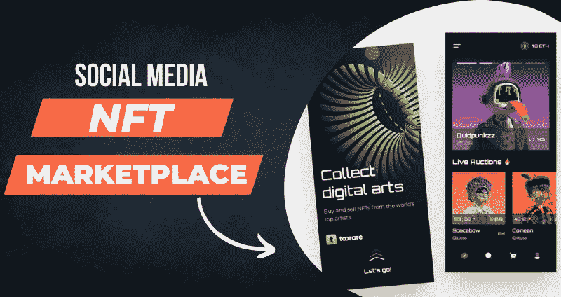

# 通过社交媒体 NFT 市场在 Web3 世界建立一个娱乐帝国！

> 原文：<https://medium.com/coinmonks/establish-an-entertainment-empire-in-the-web3-world-with-a-social-media-nft-marketplace-958052016f7c?source=collection_archive---------22----------------------->

众所周知，社交媒体早在 Web1 时代就开始了，当时拨号连接和数百万年的预期下载时间是标准。区块链技术在那段时间仅限于学术演示，直到 2000 年代末，第一个区块链像风暴一样席卷了世界。比特币区块链，传说中的加密货币所在的网络，是我们今天所经历的一切的开始。如果你已经从标题中猜出了这篇博客的关注点，你绝对是正确的，因为我们将会看到关于 [**社交媒体 NFT 市场**](https://bit.ly/3yqyeCT) 的详细内容。

> 交易新手？试试[密码交易机器人](/coinmonks/crypto-trading-bot-c2ffce8acb2a)或[复制交易](/coinmonks/top-10-crypto-copy-trading-platforms-for-beginners-d0c37c7d698c)

## 社交媒体 NFT 市场简介

社交媒体 NFT 市场是一个平台，内容创作者可以在展示才华的同时赚钱。传统的 NFT 市场不允许创作者和他们的粉丝在平台内一起参与，这使得创作者在 Web2 平台上维持群体，这违背了去中心化 Web 的目的。因此，为了使平台内创作者和追随者之间的互动和货币化成为可能，社交媒体 NFT 市场作为一站式解决方案，可能会塑造数字社交的未来。 [**不断增长的社交媒体 NFT 市场平台**](https://bit.ly/3yqyeCT) 包括**社交 NFT、Artemis 和 Artrade，**还有一些其他平台正在开发中。

## 社交媒体 NFT 市场的必备元素

✅ **个人资料** —用户可以在此门户中查看和修改他们的社交资料。他们还可以看到他们在平台上发布的所有帖子及其关注者。

✅ **内置钱包**——数字加密钱包将像密码一样有用，用户的 NFT 将包含在其中，以便于使用。

✅ **社会反馈**——在这里，用户可以查看帖子，并通过赞、评论和分享与他们互动。这些工作非常类似于 Web2 社交媒体源。

✅ **制作门户**——创作者可以在这个门户中为他们的图像和视频制作 NFT。他们需要提供细节，如内容片段，标题，标签，位置和定价，同时铸造 NFT。

✅ **拍卖门户**——在这里，追随者可以对他们最喜欢的 NFT 内容出价，并查看实时更新。在拍卖截止日期之后，NFT 将被转让给出价最高的投标人。

✅ **市场**——这是内容 NFT 的二次销售发生的地方。如果启用，原创者将从他们的 NFTs 的二次销售中获得一定比例的版税。

## 社交媒体 NFT 市场的优势

社交媒体 NFT 市场有利于内容创作者，因为它们往往会为他们带来巨大的收益，这在以前是不可能的。即使他们能够将其内容货币化，他们所赚的也只是内容(图片/博客/视频)实际利润的一小部分，其中大部分将被运营平台的公司拿走。利用不可替代的代币也有助于创作者赚取二次销售的版税，这是不可想象的。此外，在 Web2 的许多情况下，复制的内容已经变成了病毒趋势，而没有归功于原始创作者，这进一步需要社交媒体中的 NFTs。

## 社交媒体 NFT 市场的范围

到目前为止，由于 Web3 的 [**增长特性和基于 Web2 内容的社交平台中普遍存在的误解，社交媒体 NFT 市场在很大程度上还处于起步阶段。然而，随着内容创作者及其追随者意识的提高，这一领域有很多积极的空间。在这个追逐潮流的世界里，只需要一会儿，大量的人就会涌入 Web3 社交媒体平台，这一天不会太远。平台大门敞开的早期企业可以从即将到来的狂欢中受益，就像比特币、以太坊和 OpenSea 获得认可一样。**](https://bit.ly/3uTcE9x)

# 结束语

因此，我们可以说， [**社交媒体 NFT 市场**](https://bit.ly/3yqyeCT) 对于那些渴望长期留在拥有声誉和庞大社区的 Web3 领域的人来说，可能是完美的商业解决方案。开发这样的平台需要耐心和坚持，除了 Web3 开发技巧。只有少数公司的专业人员能够将两种截然不同的元素结合在一起，为 Web3 ventures 带来一个新颖的平台。如果你想经营这样一个平台，考虑毫不犹豫地联系这样一家公司，利用世界一流的社交媒体 NFT 市场开发服务！