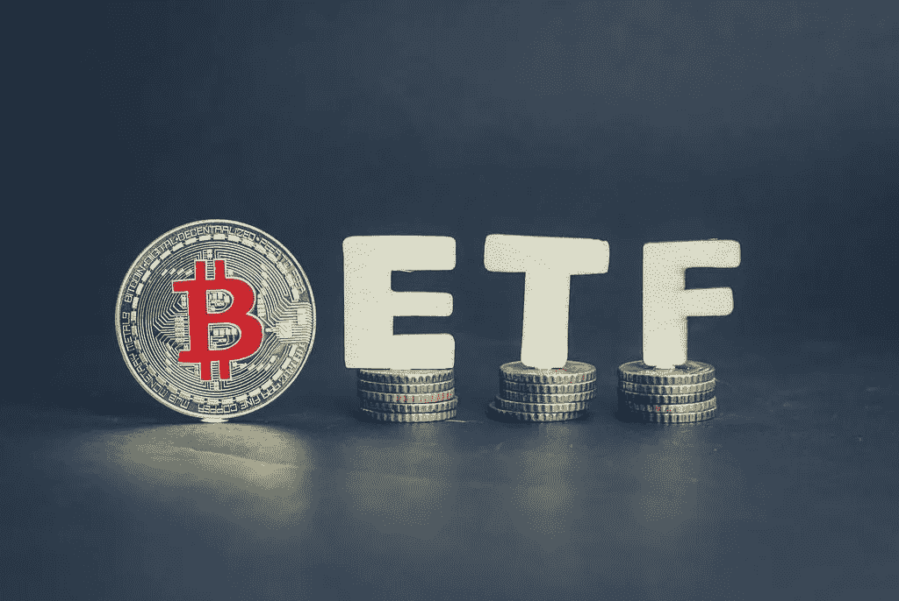
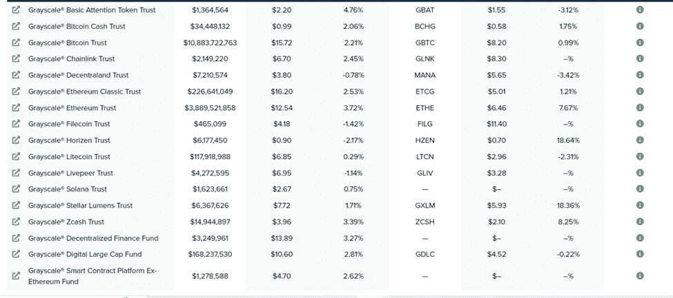

# ETF 加密货币

> 原文：<https://medium.com/coinmonks/etf-cryptocurrency-215ba86b00a4?source=collection_archive---------37----------------------->

ETF(交易所交易基金)是像股票一样的投资工具，随着其基础资产的价值而变动。ETF 允许潜在投资者尝试进入一个市场，而没有购买资产本身的风险。

ETF 的基础资产可以是

1.  商品
2.  分享
3.  结合
4.  其他资产

ETF 通常是被动投资工具。即使 ETF 在公开市场上交易活跃，管理或跟踪 ETF 也是免费的。例如，购买黄金 ETF 允许投资者在不实际持有实物资产的情况下投资黄金市场。

> 从顶级交易者那里复制交易机器人。免费试用。

最初，ETF 是由美国证券交易委员会(SEC)成立的，ETF 被归类为证券，可以跟踪大宗商品投资的动向，如投资者不需要直接购买的黄金或公司股票。ETF 对于降低风险非常有用，同时还能为高需求市场提供适当的敞口。

然后是专门为加密货币投资者制作的 ETF，因为加密货币是出了名的不稳定和不稳定，新投资者的进入限制可能非常高。因为他们必须在一个监管未知的交易所创建一个账户，并且可能会发生意想不到的事情，投资者必须付出额外的努力来创建一个 DEX / ledger 钱包以确保安全。

在 gray . io 网站上可以找到几种类型的 ETF

BTC 交易所交易基金是一种受监管的金融产品，在纳斯达克或纽约证券交易所等股票市场交易。比特币 ETF 也是期货合约(以预定价格购买或出售资产的合约)，通过比特币 ETF，你可以打赌特定合约到期时比特币的价格。这意味着你不会长期接触比特币

## 交易所交易基金对比特币价格的影响

ETF 可以增加对比特币的需求，因为 ETF 将吸引许多机构投资者进入加密货币，但仍有许多投资者尚未进入市场，因为比特币市场尚未有适当的法规和关于如何交易比特币的知识。

> 加入 Coinmonks [电报频道](https://t.me/coincodecap)和 [Youtube 频道](https://www.youtube.com/c/coinmonks/videos)了解加密交易和投资

# 另外，阅读

*   [OKEx vs KuCoin](https://coincodecap.com/okex-kucoin) | [摄氏替代度](https://coincodecap.com/celsius-alternatives) | [如何购买 VeChain](https://coincodecap.com/buy-vechain)
*   [币安期货交易](https://coincodecap.com/binance-futures-trading)|[3 commas vs Mudrex vs eToro](https://coincodecap.com/mudrex-3commas-etoro)
*   [如何购买 Monero](https://coincodecap.com/buy-monero) | [IDEX 评论](https://coincodecap.com/idex-review) | [BitKan 交易机器人](https://coincodecap.com/bitkan-trading-bot)
*   [CoinDCX 评论](/coinmonks/coindcx-review-8444db3621a2) | [加密保证金交易交易所](https://coincodecap.com/crypto-margin-trading-exchanges)
*   [红狗赌场评论](https://coincodecap.com/red-dog-casino-review) | [Swyftx 评论](https://coincodecap.com/swyftx-review) | [CoinGate 评论](https://coincodecap.com/coingate-review)