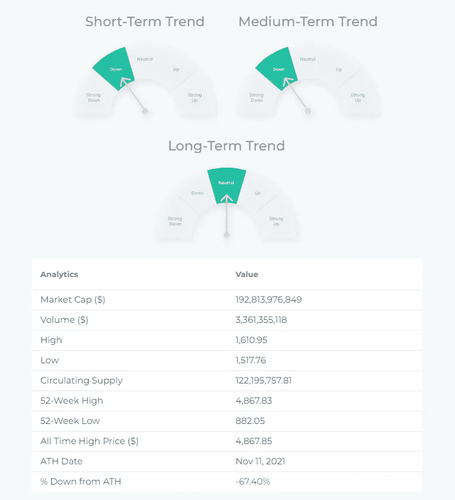

# ETH(以太坊)-价格分析，描述，技术指标，新闻…

> 原文：<https://medium.com/coinmonks/eth-ethereum-price-analysis-description-technical-indicators-news-4d5406b8df38?source=collection_archive---------30----------------------->

Source: [altFINS.com](https://platform.altfins.com/curatedCharts)

交易设置:价格在 2000 美元水平被拒绝。回调到 1500 美元附近可能会提供一个进场机会；1500 美元也是 50%的斐波那契回撤水平。潜在上行回到$2K。(设置价格[提醒](https://altfins.com/knowledge-base/create-alert-for-cryptocurrencies/))。势头再次转为看涨( [MACD 柱状图上升](https://youtu.be/9BeFcXNfbZI))。

趋势:中短期呈下降趋势，长期呈中性。

势头是看跌的，但有所收敛。MACD 线低于 MACD 信号线，RSI 低于 45，但是势头可能已经见底，因为 [MACD 柱](https://altfins.com/knowledge-base/macd-line-and-macd-signal-line/)正在上涨，这表明势头可能接近另一次上涨。

OBV(总成交量):正在下降，表明上涨日的成交量低于下跌日的成交量。因此，需求(买方)低于供应(卖方)。

支撑和阻力:最近的支撑区域是 1500 美元，然后是 1250 美元和 1000 美元。最近的阻力区是 1700 美元(前期支撑)，然后是 2000 美元。

Source: [altFINS.com](https://platform.altfins.com/screener)

Source: [altFINS.com](https://platform.altfins.com/screener)

Source: [altFINS.com](https://platform.altfins.com/screener)

Source: [altFINS.com](https://platform.altfins.com/screener)

# **描述**

以太坊是一个支持智能合约的分布式应用和分布式区块链计算平台。以太网(ETH)是该平台的本机令牌，主要用于支付交易费用，并作为分散金融(DeFi)行业中某些 ERC 20 令牌的贷款担保。

# 新闻和事件

在合并前的一年里，以太坊(ETH)的总市值增加了一倍多

在这里找到更多新闻！

> 交易新手？尝试[加密交易机器人](/coinmonks/crypto-trading-bot-c2ffce8acb2a)或[复制交易](/coinmonks/top-10-crypto-copy-trading-platforms-for-beginners-d0c37c7d698c)