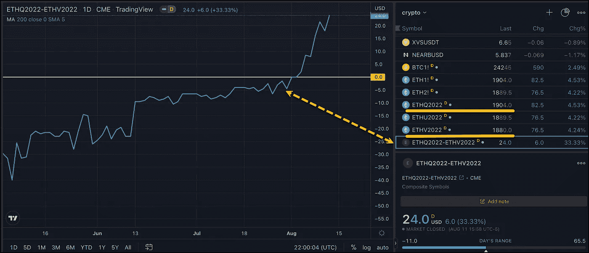

# ETH 期货正在讲述一个故事

> 原文：<https://medium.com/coinmonks/eth-futures-are-telling-a-story-2d683b91276d?source=collection_archive---------24----------------------->

小心弯道

期货曲线足以讲述你经常不需要看新闻的故事。看看以太期货曲线能告诉我们什么是很有趣的。

最新的估计是，神奇的#以太坊合并将在 9 月 19 日的那一周执行。这一期待已久的事件帮助#ETH 在过去的一个月里增长了 65%。令人印象深刻，但请记住，价格正在从一个可怕的低点反弹，在过去的一年里仍然下降了 42%。

这次合并带来了以太坊新的利益相关共识层，旨在提供更多的可扩展性、安全性和可持续性。这一合并也将大大减少以太坊的碳足迹，因为它将大幅降低以太坊的能源需求。

听起来不错。听起来很理想，不是吗？建筑者喜欢在以太坊上建筑，现在他们可能会带着更干净的良心这样做，因为他们的绿色倡议保持了更好的声誉。

如果我们看看市场在说什么，我们可能会遇到一些麻烦，因为芝加哥商品交易所集团的乙醚期货正在进行现货溢价交易。8 月 22 日期货价格比 10 月 22 日期货价格高 24 美元。

当远期合约的价格高于远期合约时，就会发生现货升水。理论上，这不应该发生。虽然持有成本在加密领域是不确定的，但你仍然有资金的时间价值和其他因素，这些因素应该会使后期数据合约的价格高于近期合约。利率、投机、供求关系和投机是导致期货曲线失调的一些因素

很明显在 cryptoville 有一些怀疑者。合并魔法的怀疑者。众所周知，Magic 出了问题，合并并不能回答 ETH 的所有问题。还有天然气问题和其他问题。

合并失败了又如何？很快就会变得很糟糕。💥💥但是如果合并顺利呢？延期合同中似乎有一些非常大的折扣。我们可以很容易地看到另一边的烟火。🚀🚀

我不知道这个巨大的变化会发生什么，我也不提倡交易……只是提出一些想法。做你自己的研究，分享市场对#合并的反应

#加密#加密货币#交易#市场#期货#华尔街

> 交易新手？试试[密码交易机器人](/coinmonks/crypto-trading-bot-c2ffce8acb2a)或者[复制交易](/coinmonks/top-10-crypto-copy-trading-platforms-for-beginners-d0c37c7d698c)