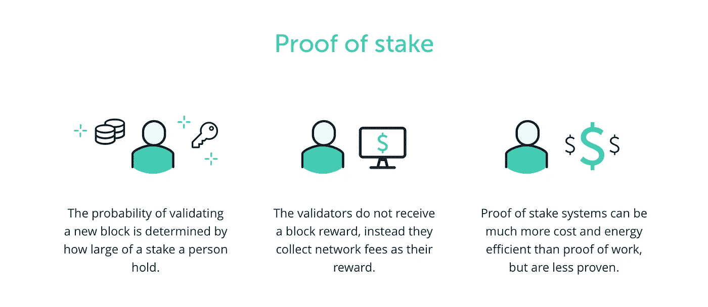

# ETH 合并成功，你需要知道的区块链术语

> 原文：<https://medium.com/coinmonks/eth-merge-successful-blockchain-terms-you-need-to-know-d68f9c24d466?source=collection_archive---------24----------------------->

密码社区最期待的时刻，**以太坊合并**成功上线。这将把以太坊从**工作证明**切换到**利益证明**，也使以太坊更加节能。

在这种情况下，我们将回顾加密和区块链技术的一些基本概念。

## **工作证明**

工作验证(POW)是一种机制，通过这种机制，您可以获取物理资源，并将其转化为网络的安全性。

如果你想让你的网络更安全，你需要更多的物理资源

## 利害关系证明

利益证明(POS)是一种机制，通过这种机制，用户将把他们的密码放入网络，并获得他们的位置来验证交易。

您的赌注越大，您就越有机会验证 Node 中的交易

## 为什么 POS 更好？

在赌注证明(POS)中，crypto one 的赌注决定了对网络的控制。

支持利益证明的人说，这使得攻击更加昂贵和弄巧成拙:攻击者可以削减或减少他们的利益，作为对试图破坏网络的惩罚。

## 51%的攻击

一群矿工控制着一个网络超过 50%的采矿硬件(专门用于采矿和处理交易的所有计算能力的总和)，对区块链的攻击被称为 51%攻击。

51%攻击，也称为多数攻击，发生在一个人或一群人获得超过 50%的区块链哈希能力的控制时。

成功的攻击者能够阻止新交易被确认，并更改新交易的顺序。

它还允许恶意代理从本质上重写区块链的部分内容，并撤销他们自己的交易

历史上有许多攻击改变功能的例子

例如:比特币现金，以太坊经典

## 能源优势

[以太坊合并](https://www.coindesk.com/tech/2022/09/15/the-ethereum-merge-is-done-did-it-work/)降低了全球 0.2%的能源消耗，即检修削减了[以太坊](https://www.coindesk.com/price/ethereum/)99.988%的能源使用和 99.992%的二氧化碳排放。

## 哈希速率

“散列率”是指在工作证明区块链上用于挖掘和处理事务的总组合计算能力。

“哈希”是一种固定长度的字母数字代码，用于表示任意长度的单词、消息和数据。

## **比特币目前的 hashrate 是多少？**

89 EH/s，代表每秒的 Exa 哈希数，1 Exa 哈希= 1 万亿次(10 ⁸)哈希。

这意味着矿工目前每秒钟计算 89 万亿次散列。

## 侧链

侧链是一个独立的[区块链网络](https://www.coindesk.com/learn/what-is-blockchain-technology/),它连接到另一个区块链——称为母区块链或主网。

这些二级区块链拥有自己的区块链网络协议，以提高网络的私密性和安全性，并最大限度地减少维护网络所需的额外信任。

侧链的主要用途是促进 mainnet 和二级区块链之间更顺畅的资产交换。

这意味着代币、硬币等数字资产可以在区块链之间安全转移，从而允许项目以分散的方式扩展其生态系统。

侧链可以通过几个组件有效工作，例如:

1.  双向挂钩
2.  智能合同

根据侧链白皮书，双向挂钩被定义为:“*双向挂钩*是指硬币在侧链之间以固定或确定的汇率转移回来的机制。

智能联系人是为执行特定任务而创建的一段代码，它可能是交易的验证，一个防篡改的身份文档。

## 续…

感谢阅读:)

> 交易新手？试试[密码交易机器人](/coinmonks/crypto-trading-bot-c2ffce8acb2a)或[复制交易](/coinmonks/top-10-crypto-copy-trading-platforms-for-beginners-d0c37c7d698c)