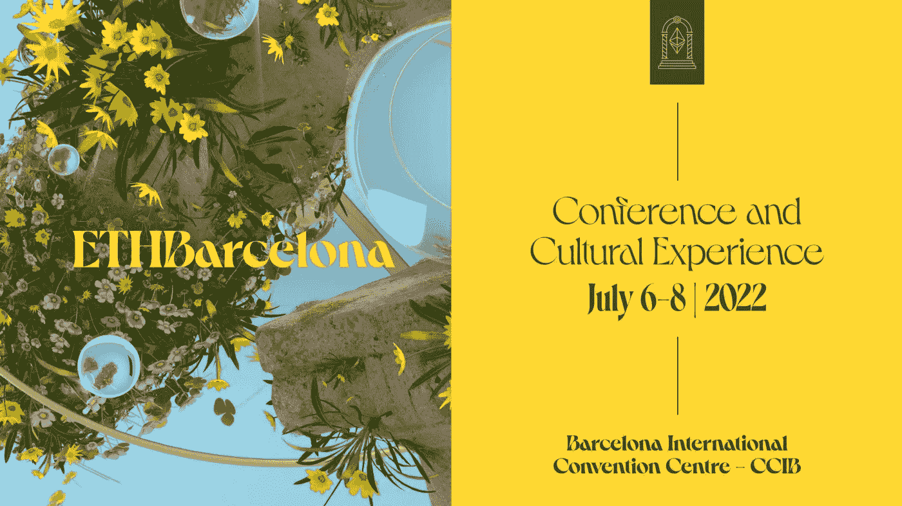
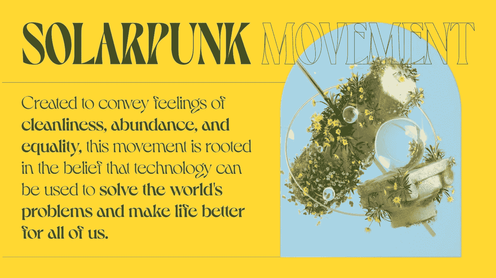
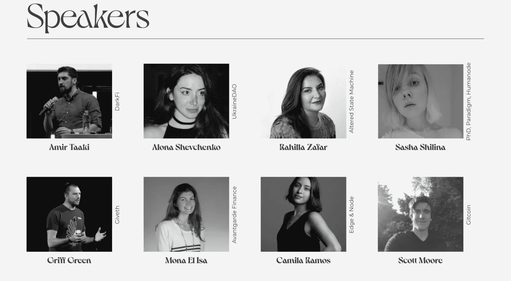
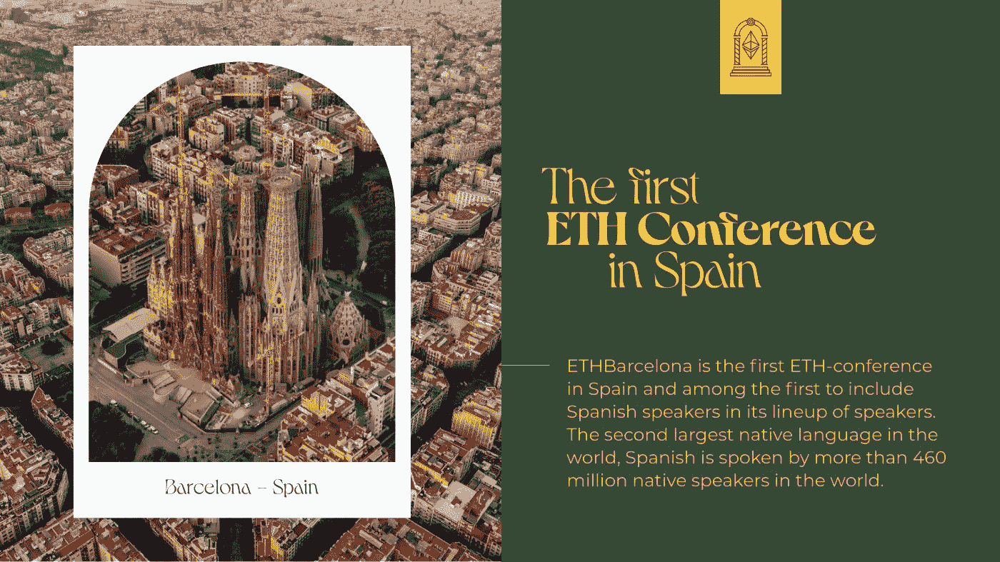

# ETHBarcelona——西班牙第一个以太坊节

> 原文：<https://medium.com/coinmonks/ethbarcelona-the-first-ethereum-festival-in-spain-7427acda50a3?source=collection_archive---------38----------------------->

## 那里见！我将为 YouTube 拍摄电影，并为这个平台创造内容。我们会很开心的！

Picture courtesy of ETHBarcelona.

我住在巴塞罗那。我爱巴塞罗那。夏天有许多各种各样的活动:音乐节、科技会议、街头食品市场、文化体验等等。我喜欢去所有的地方。但是有一个我想去，因为它把所有的人都集中在了一起。

我在 Twitter 上(偶然)发现了这个活动，叫做 ETHBarcelona。我对此非常感兴趣，所以我做了自己的研究，我将与你们分享我发现的所有信息，如果你们也感兴趣的话。

下面是我的发现！

ETHBarcelona 是一个连接聪明头脑、思想家、建设者、创造者和领导者的社区聚会。此次 ETH 活动包含了知识共享的非常重要的一面:来自该领域领导者的讲座、小组讨论和研讨会，以及对文化和影响的重要关注。

艺术可以塑造文化，这个团体想把它带到桌面上来。在这个历史时刻，很难不考虑他们通过他们参与的项目所产生的影响。

你是你周围的人，所以这是所有人重新想象一个可持续的、自由的未来的时刻，可以在一个地方见面并创造炼金术(包括物理和虚拟)。

ETHBarcelona 相信集体成长。该活动是根据太阳能电池板体验的概念设计的，这正是与会者所期待的。

Picture courtesy of ETHBarcelona.

# 协同增效的空间

主要目标之一是创造一个协同空间。这些社区聚会汇集了一些最聪明的头脑，通过这些突破性的技术致力于集体解决方案，使人类具有弹性。

这个活动旨在成为艺术、空间创新和社会影响的交汇点。可以期待的是一个炎热而阳光的巴塞罗纳，来自世界各地的演讲者和生态系统领导者的多样性，如来自 [Celo 基金会](https://celo.org/community)的 Anna Kryukova，来自[的 Alona Shevchenko】，来自](https://www.ukrainedao.love/)[Consensys【meta mask】的詹姆斯·贝克](https://consensys.net/blog/metamask/)，来自 [Giveth](https://giveth.io/) 的 Griff Green， [Women Rise NFT](https://womenrise.art/) ，来自 [Polygon](https://polygon.technology/) 的 Steph Orpilla，来自[的 Tracey Bowen](https://www.herdrop.com/)

Picture courtesy of ETHBarcelona.

[这里](https://ethbarcelona.com/speaker)可以查看完整名单。

但这还不是全部。将会有很多由不可思议的创作者集体(当地和国际)举办的展览、现场音乐表演、专用的休息和专注空间，以及准备好踏上旅程的好奇、有才华的学生。

> 交易新手？尝试[加密交易机器人](/coinmonks/crypto-trading-bot-c2ffce8acb2a)或[复制交易](/coinmonks/top-10-crypto-copy-trading-platforms-for-beginners-d0c37c7d698c)

ETHBarcelona 的另一个目标是分享如何创造体验的学习和过程，使其成为一个社区创造，并让所有与会者参与明年的建设。

> ETHBarcelona 是 web3 建设者、领导者、思想家、艺术家和创造者的一次体验，他们崇尚去中心化、公共产品和社会影响的价值观。2022 年 7 月 6 日至 8 日。

# 伙伴关系

ETHBarcelona 已经发展成为一个真正的集体努力，我们很高兴通过我们的合作伙伴关系来塑造这一点。很高兴能与来自学习经济基金会的科林·雷诺兹合作策展教育系列，与道学家合作策展道系列，与前瞻研究所的存在希望合作展示描述，以及其他许多项目。

在地方一级，像 Casa Batlló这样令人难以置信的机构也加入了支持。非常感谢所有现在和我们一起建造 ETHBarcelona 的支持者。

# ETHBarcelona 门票

NFTickets 是人们来到活动现场并证明他们是活动的一部分的门户。人们可以在网站 [**ETHBarcelona**](https://ethbarcelona.com/) 上找到它们的链接，加上一些有用的过程指南。门票 ID 的一些好处将在活动期间揭晓。

你也可以通过 Eventbrite 购买门票，这样每个人都可以使用。

NFT 是在第 2 层解决方案 Polygon 上创建的。除此之外，每一个 NFT 都会将价格的 5%捐赠给一项社会事业，这项社会事业将在 ETHBarcelona 的所有参与者中集体选出。

# 空投和折扣

在折扣方面有一些非常特别的东西。当有人决定购买前往 ETHBarcelona 的机票时，他们允许其他人免费参加会议。我们想做到有意识和易接近，所以学生可以通过这种形式申请获得免费门票。我们还向代表空间多样性的社区发放门票。

# 与 ETHBarcelona 的组织团队交谈

Picture courtesy of ETHBarcelona.

*你们好，伙计们！我是胡安·西恩富戈斯。*

*我有机会采访了 ETHBarcelona 的组织者之一，以便我们的* [*与 Cryptos 社区*](https://twitter.com/KeepingCryptos) *和 Coinmonks 出版物保持同步，可以获得关于该活动的独家信息，所以…给你，享受吧！*

胡安:你好，米凯拉！谢谢你的采访。我真的很高兴见到你。你能给我们介绍一下你自己吗？

米凯拉:我叫米凯拉，28 岁。我来自厄瓜多尔，从 2018 年开始一直生活在巴塞罗那。我称自己为人脉炼金术师，但那是另一回事了。

胡安:你有什么背景？你是怎么到这里的？

米凯拉:我的旅程带我去了很多地方，但我一直与艺术和文化联系在一起。我在巴塞罗那攻读硕士学位，这也是我来到这座城市的原因。从一开始，我就沉浸在文化场景和它的本质之一，音乐节。我曾为 Sónar Festival、Primavera Sound、Loom Collective 和 Oxymore Magazine 工作，这些都是推动多元化和多文化生态系统的大型独立项目。

后来，我在 2020 年的一个永久农业社区住了几个月，了解了恢复土地的奇迹。那是在 2021 年初，我接到一个朋友的电话，跳进了 web3。“我在一个新项目中，你应该是其中的一部分，”她告诉我，所以我立刻很好奇。从那以后，我一直在潜心学习，忘却了很多。

胡安:你对将要去那里的项目/公司有什么看法？

米凯拉:我对以影响为导向的项目特别感兴趣，这些项目专注于缩小多样性的差距，恢复我们的星球，以及入职和为他人提供便利。作为一个艺术爱好者，看到将在太空中展出的展览让我很兴奋。我也期待着所有再生大脑的对话。我们正在做出巨大努力，将播种可持续解决方案和培育社区的项目聚集在一起。

Source: YouTube

**胡安:这个项目的目标是什么？预期结果是什么？**

米凯拉:我们的主要目标之一是创造一个协同的空间。这些社区聚会聚集了一些最聪明的人，通过这些开创性的技术致力于集体解决方案，让人类具有韧性。这个活动旨在成为艺术、空间创新和社会影响的交汇点。可以期待的是一个炎热晴朗的巴塞罗那，来自世界各地和不同背景的生态系统中各种各样的演讲者和领导者，不可思议的创作者集体(本地和国际)的展览，现场音乐表演，专用于休息和正念的空间，以及好奇、有才华的学生，他们随时准备投身于这个旅程中。

另一个目标是分享如何创造体验的知识和过程，使其成为社区创造，并让所有参与者参与明年的建设。

Source: YouTube

我将从 7 月 6 日至 8 日在[关注 crypts(YouTube 频道)](https://www.youtube.com/channel/UCBldGfPEpvALxqNPz65JVmQ)报道整个事件，在[推特](https://twitter.com/KeepingCryptos)上发布独家内容，并在我的[个人资料](/@juanscienfuegos)上发表大量文章。确保遵循我们的主要平台，以免错过任何东西！

*下次见！*

*平安。*

## [加入 1K+其他企业家行列，在你的电子邮件中加入每周独家内容](https://www.getrevue.co/profile/JuanSC)📨☕喜欢通过媒体阅读？[购买会员资格](https://juanscienfuegos.medium.com/membership)以获得完全访问权限。