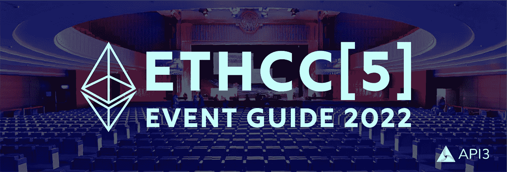
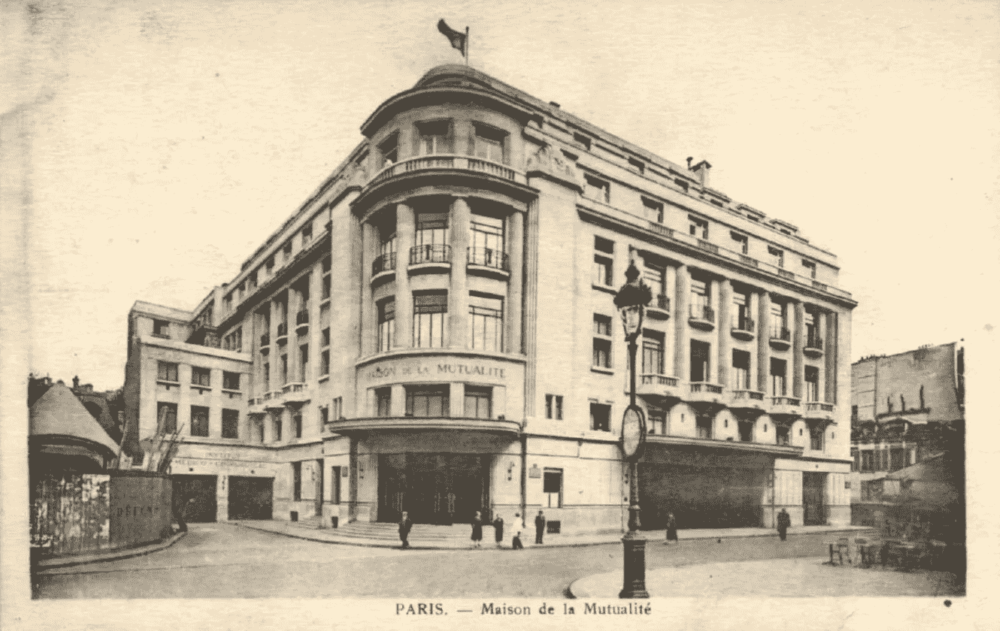
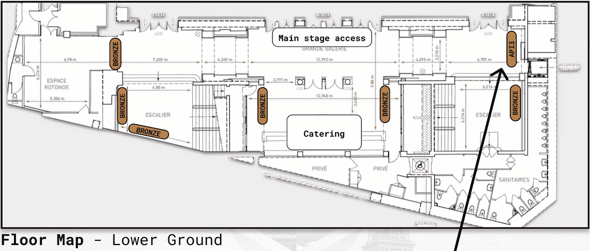
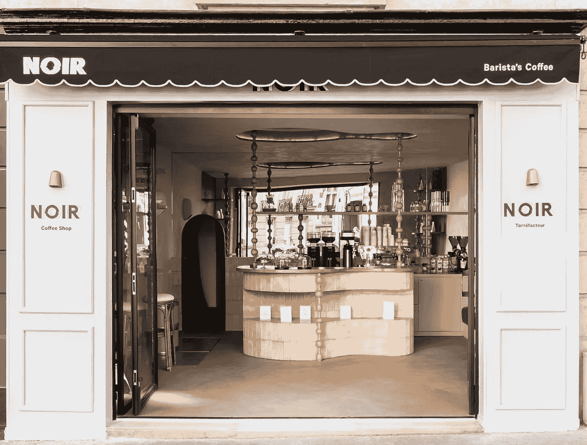

# ETHCC[5]完整指南:时间表、餐厅、咖啡馆、活动。

> 原文：<https://medium.com/coinmonks/ethcc-5-full-guide-schedules-restaurants-caf%C3%A9s-events-deb536ca5d40?source=collection_archive---------13----------------------->

# et HCC:2022 年重返巴黎

随着去年 ETHCC 的成功回归，ETHCC[5]有望变得更好。有 239 位演讲者在 3 天内做了超过 27 个小时的演讲，更不用说下班后的聚会和社交活动了。

这是整整 3 天的行动，需要很好的计划来充分利用它。

对于第一次与会者和常客，我们制定了指导性的每日时间表，包括步行范围内的餐厅和咖啡馆的午餐建议，甚至在活动结束后，以便您可以在 ETHCC 度过最美好的时光[5]。

## 快速导航链接

> [***我如何导航 ETHCC？***](#2003)
> 
> [***ETHCC【5】每日日程***](#e4d1)
> 
> [***ETHCC 周边最好的餐厅和咖啡馆***](#058b)
> 
> [***赞助商展位及活动***](#6b7e)

# 了解场地

ETHCC[5]在巴黎市中心第五区一个名为“可尔奇河”的街区举行。这是巴黎传统的标志性街区之一，距离以餐馆和夜生活闻名的拉丁区只有几分钟的路程。 [*点击此处查看我们的餐厅和咖啡馆列表*](#058b) *，点击* [*查看下班后活动*](#6b7e) *。*

ETHCC[5]占据了 Maison de la Mutualité的 4 层:地面(G)、G-1、G+3 和 G+5。

## **底层**

当您进入一楼时，您将可以进入认证区、赠品区，以及最重要的咖啡区。

## **G-1**

就在你的下方，在 G-1 层，是主舞台和 API3 展台，一直到舞台入口的右侧。

## **G+3**

在 G+3 你会发现会议室、书房和冷藏室，以及秘银市场和更多的赞助商摊位。

## **G+5**

在 G+5 的顶层，所有的研讨会和 EthVC 都将在这里举行。这在每日日程表上被记为 Bievre。这里有一个电视演播室和新闻发布室，还有一个可以享受巴黎夏日阳光的露台。

## **全部**

所有楼层都有食物，除了底层都有洗手间。

# 每日 ETHCC [5]每日计划

讲座和研讨会涵盖企业、区块链经济学、治理、区块链、安全性和隐私、NFT 和开发者工具；在 ETHCC[5]的众多选择中，你必须有敏锐的洞察力来选择你的道路。

我们已经为 ETHCC 的 3 天中的每一天制定了完整的时间表，包括靠近场地的午餐建议[5]。

## 快速导航链接

> [***et HCC【5】第一天:7 月 19 日***](#703b)
> 
> [***ETHCC【5】第二天:7 月 20 日***](#fd2f)
> 
> [***et HCC【5】第三天:7 月 21 日***](#JULY 21ST)

# 7 月 19 日

*第 1 天重点关注 Dao、治理、多链互操作性以及推动 Web3 生态系统发展的考虑因素。12 点或 2 点有 1 小时的免费午餐时间。*

## 10:50–11:15 |自我监管:不给政府机会

*@索邦*

来自 Kleros 的 Aleix Cerdà Cucó将讲述社区组织的信托注册的好处。通过保护网络 3 的新来者，我们消除了立法干预该领域的动机，促进了增长，并保持了创新的最大自由。

## 11:20–11:45 | Web3 的发展以及为什么选择 web 3

*@ Bievre*

以太坊推送通知服务(EPNS)将打破网络的历史。搭建好舞台后，他们会讨论你为什么提前参加 Web3 派对，以及你如何利用这个机会。

## 11:40–12:05 |月光:结合以太坊兼容性和波尔卡多特跨生态系统的互操作性

*@蒙日*

Moonbeam 的 Derek Yoo 将他们的快速崛起归功于以太坊熟悉且易于使用的工具和 Polkadot 可互操作、可扩展的架构的结合。了解像 Moonbeam 的 XC-20 这样的多链用例；一个新的可互操作的令牌，它是波尔卡多特本地的，可以在月光和月光上作为 ERC-20 使用。

# 12:05–1:10 |午餐 1

点击这里查看 ETHCC 的当地餐馆和咖啡馆指南。 **或者……吃一顿 45 分钟的午餐，享受:**

> ***12:10–12:25 |加密采用、社交媒体和影响者***
> 
> @ Monge
> 
> 【The TIE 的 Sacha Ghebali 谈到了如何通过社交媒体活动来衡量加密项目的采用情况。从影响者的影响到 DeFi 流动性和社会存在之间的相关性——项目如何提高其影响和增加采用率。

## 1:10–1:35 | ^ 20 亿美元清算:稳健的预言对于下一批机构投资者的重要性

*@蒙赫*

来自 Kaiko 的 Alexander Coenegrachts 考虑了两种清算事件:一种是自然的，是 DeFi 中的一种健康力量，另一种是由 oracle 漏洞造成的，这对解决生态系统的增长至关重要。Alexander 将介绍一个案例，研究 oracle 漏洞利用的影响，可以做些什么来减轻这些影响，以及为什么大型机构参与者可能会将目光投向其他地方。

## 1:40–2:05 |成为主流—数据主权仍然是 web3 的一部分吗？

*@蓬图瓦兹*

Privy 的 Henri Stern 剖析了 Web3 开发者在考虑隐私和 UX 时面临的设计决策。开发者将如何平衡这两个因素？Henri 讨论了允许开发人员在不暴露用户数据的情况下构建更丰富的体验的技术。

# 2:05–3:00 |午餐 2

[*点击这里查看 ETHCC*](#058b) *的当地餐馆和咖啡馆指南——或者如果你已经吃过了，留下来……*

## 2:00–2:30 |提炼红杉资本 50 年来之不易的经验，包括如何在市场周期中生存

*@ EthVC 房间*

红杉资本的肖恩·马奎尔和帕特·格雷迪在竞争激烈的金融管理行业拥有 50 年的经验。了解市场周期以及如何在最糟糕的熊市中生存。

## 2:40–3:05 |下一代互联网的硬件

*@ Bievre*

Aligned 的首席执行官兼创始人 Sam Cassatt 谈到了为 DeFi 生态系统定制硬件的重要性。他将讨论专用硬件如何解决 Web3 不断发展的基础设施需求，更好地实现链上流动性供应，并帮助协议和组织最大限度地提高投资回报率和性能。

## 3:00–3:15 |分散协作中的挑战

*@索邦*

来自阿拉贡的 Ivan Fartunov 关注为什么这个团队认为协作是 Web3 的制胜策略。一项涵盖阿拉贡一年经验的案例研究将使听众在分散协作中扎根，并揭示陷阱。

## 3:20–3:35 |为生态系统治理设计 Dao

*@圣日耳曼*

Near Protocol 的 Illia Polosukhin 正在谈论 Near Digital cooperation DAO(NDC)如何引领生态系统治理和资金的分散化。了解该结构是如何发展的，并使团队能够建立社区，推动投资回到各自的地区或垂直行业。

## *3:40–3:55 |治理理论与实践*

*@索邦*

StableNode 的 Doo Wan Nam 以他从各种协议中获得的经验来谈论治理在理论和实践中的对比。我们如何满足 NFTs、DeFi 和其他 Web3 项目的不同需求？这个讲座探索了答案，并揭示了弥合项目之间差距的方法。

## 4:00–4:15 |道设计的首要原则

*@索邦*

Deep Work 的 Andrej Berlin 讨论了分散自治组织(Dao)是如何解决很多我们讨厌工作的问题的。他在 Web3 中的组织心智模型使得考虑如何将 DAO 结构成功地应用到您自己的项目中变得很容易。他用具体的例子讲述了薪酬、工作中的主人翁感，以及如何在没有无休止会议的情况下做出决策。

# 25 分钟休息时间

*顺道看看*[*API 3 @ et HCC【5】*](#6b7e)*！我们的摊位在主舞台入口的右边。*

## *下午 4:40—5:05 |筑道框架*

*@圣日耳曼*

StableNode & 1inch 的 Gustav Arentoft 介绍了将治理与您的 DAO 及其社区的成熟度相匹配的重要性。了解如何实施程序和实践，以确保您的令牌持有者能够以有意义的方式参与。通过简单的构建治理框架的注意事项，您可以确保您的治理根据您的项目和社区的需求适当地发展。

> 交易新手？尝试[加密交易机器人](/coinmonks/crypto-trading-bot-c2ffce8acb2a)或[复制交易](/coinmonks/top-10-crypto-copy-trading-platforms-for-beginners-d0c37c7d698c)

## 5:05–5:20 |未来是多链的

*@主舞台*

SKALE Labs 的 Jack O'Holleran 主持了一场关于多链以太坊第二层生态系统的未来优势和要求的讨论。进入一系列可能的未来，并在 SKALE 网络上了解通过生态系统基金进行建设的机会。

## 5:25–5:50 | Foundry，一个用于以太坊应用程序开发的便携式、快速和模块化的工具包，用 Rust 编写

*@主舞台*

Paradigm 的圣乔治·孔斯坦托普洛斯解释了 Foundry，一个在以太坊中开发应用程序的新框架。不需要第三方库，Foundry 是一个即插即用的解决方案，为比以往更广泛的开发人员打开了 Web3 的大门。

## 5:55–6:20 |灵知链:延伸以太坊

*@主舞台*

来自 Gnosis 和 Epicenter 的 Friederike Ernst 讲述了该链如何促进那些因以太坊主链开发而定价过高的小型 dApps。他将讲述区块链三难困境的技术挑战、架构选择以及 Web3 的发展方向。

## 6:20–6:45 |您的数字身份在 Web3 中与您同行

*@蓬图瓦兹*

Unstoppable Domains 的 Sandy Carter 强调了随着 Web3 在范围和功能上的持续增长，数字身份管理的影响。了解钱包未来的潜在使用案例，以及它们的所有权如何成为我们这一代人的人权问题之一。

## 6:50–7:15 |形式的(法律)法则

*@圣日耳曼*

法律顾问 Fatemeh Fannizadeh 着眼于 cryptoverse 当前的法律趋势，并提醒我们，当我们无法提出明智的问题时，我们会根据明智的信息做出决定。了解哪些基本风险问题可以为您的项目节省时间和资金，并从更广阔的角度来看待风险缓解策略。

# 7 月 20 日

*第 2 天重点关注项目领导和 DeFi 开发。开始一天有两种选择:一种是实践研讨会，另一种是讲座。今天带些零食，因为 20 号是一个接一个的活动，如果你还没有间歇的加快速度，下午 2:00 的午餐可能会觉得晚了。*

## 上午 9:30—10:25 |以太坊上的安全 DeFi 智能合约开发(研讨会)

*@ Bievre*

ChainSecurity 的审计专家 Anton Permenev & io annis Sachinoglou 将指导开发人员应对挑战，熟悉以太坊上 DeFi 应用程序中发现的 8 个最常见的漏洞。

## 9:50–10:15 |重塑 DeFi 的美好形象

*@蓬图瓦兹*

Celo 基金会的索绮特·卡扎多指出，DeFi 的全部潜力还远未实现，即使总价值锁定在最近几年已经蓬勃发展。对超额抵押的需求对那些从获得信贷中获益最大的人来说是一个障碍。通过关注公共产品和正外部性，我们可以实现财富和技术的民主化。

## 10:30–11:25 |在不欺骗用户的情况下控制您的应用程序:ZK 认证(研讨会)

*@ Bievre*

Sismo 的 Leo Sayous 教你如何使用该平台的开源工具为任何数据生成 ZK 证明。NFT 所有权证明将被涵盖。

## 11:30–11:45 |使用 NFTs 作为 DeFi 抵押品

*@圣日耳曼*

Arcade.xyz 的 Robert Masiello 讨论了 NFTs 与 DeFi 的集成——技术现状、当前问题和未来发展。

## 11:50–12:05 |定义熊市的 Gwei Forward

*@主舞台*

第四次革命资本的 DeFi Dad 提供了一个协议，战略，用户和创新的精彩卷轴，定位于引导我们通过熊市，进入下一轮大规模采用。

## 12:10–12:25 |影响力驱动的社交令牌

*@ Pontoise*

来自 Socialstack 的 Kristina Tauchmannova 向我们展示了 Web3 令牌可以用来推动重大变革。了解如何在您的 DAO 或社区中实施“影响赚取”象征性激励措施，以推动全球范围内的草根行动。

## 12:30–12:45 |区块链开发；非洲自我持续发展之路

*@ Pontoise*

Web3bridge 的 Ayodeji Awosika 讲述了非洲的 Web3 开发人员如何实现自我可持续性，以及 Web3bridge 在让更多非洲人进入区块链发展职业领域方面的作用。

## 12:50–1:15 |区块链带来的好处

*@ Pontoise*

印度区块链联盟的拉兹·卡普尔将讲述联合国如何利用区块链技术来帮助其全球人道主义努力，以及其他项目如何使用 Web3 创造真实的社会影响。

## 1:40–2:05 |隐朋克精神和自由的未来

*@主阶段*

Orchid 的 Steven Waterhouse 博士阐述了朋克心态在互联网发展中的作用，以及它如何在 Web3 中复活，以对抗大型、中央集权和强大的公司。下一代互联网利用去中心化和加密来提供隐私、透明和自由，这是早期版本的网络最初承诺的。数字货币是未来，风险极高。想象一下，在一个世界里，政府发行的数字货币限制了你可以购买的东西或购买的数量？这就是我们将会得到的未来，除非我们现在做点什么——朋克们正在迎接挑战。

# 2:05–3:00 |午餐

[*点击此处查看 ETHCC 的当地餐厅和咖啡馆指南。*](#058b)

## 3:00–3:25 |跨链互操作性 DeFi 和 NFTs 的下一波浪潮

*@蓬图瓦兹*

acku range 的 Alex Smirnov 强调，一个断开的多链生态系统分裂了 Web3 社区，创造了一个流动性和功能有限的更弱的竞争环境。跨链互操作性协议将实现真正的可组合性和用户自由——支持大量新的用例及特性。最终，通过连接每个链上的每个合同，我们释放了我们 Web3 社区的真正潜力。

## 3:30–4:25 |构建安全的合同:如何像专家一样使用 fuzzing

*@ Bievre*

来自《比特之路》的 Josselin Feist 和 Natalie Chin 将带您了解鼹鼠，这是一款开源智能合同模糊器，可以帮助您确保智能合同的安全性。您将了解代码不变量的效用，如何编写它们，以及如何使用鼹鼠作为系统的有效检查。在课程结束时，您将了解如何正确测试您的工作，确保您的智能合约从第一天起就能更安全地运行。

## 4:35–5:00 |加密经济

*@主舞台*

PWN 的 Josef Je 生动地描绘了 Web3 哲学和社区的力量。虽然加密货币的世界正在走向主流接受，但监管机构有可能创造只有 TradFi 玩家才能遵守的法律壁垒。幸运的是，Web3 已经创造了一个自给自足的全球经济。约瑟夫将提出他的论点，即为什么 Web3 创造价值的方式将会盛行，即使它创造了一代被抛弃的人。

## 5:00–5:55 |精疲力尽是最容易利用的漏洞

*@ Bievre*

Gitcoin 的克里斯·德库特(Kris Decoodt)主持了这次圆桌会议，讨论如何战胜最大的弱点:我们自己。人是利用协议最容易的入口，小组成员将就如何在 web3 组织中保持敏锐和防止倦怠交换意见。

## 6:05–6:30 | EVM 的未来

*@索邦*

以太坊基金会的 pawebylica 介绍了以太坊虚拟机的新特性，这些特性将使协议更上一层楼。

## 6:40–6:55 |通过大规模合作网络将反乌托邦降至最低

*@ Bievre*

《来自黑色天空的恒星磁铁》设想了一个未来，智能合同使不同的人能够汇集他们的资源并实现大胆的目标，共同努力实现反工业化、支持可持续技术和经济的民主社会。Black Sky 希望探索当 DAOs 成员每年数亿甚至小额的个人捐款将意味着数十亿美元的可激活资本时会有什么可能。本次演讲将涵盖从治理到设计和制造的大创意。

# 7 月 21 日

*第三天将展示大图，将 DeFi 视为世界上一股向善的力量，以及如何最好地实现大目标。12 点 15 分花一个小时吃午饭。*

## 9:35–9:50 | CBD cs 的状态

*@主舞台*

国际清算银行的 Mike Alonso 将向我们介绍不同类型的 CBDCs 的最新发展状况，涉及它们的设计和相关指标。他将讨论为什么可能需要 CBDCs，并强调为什么隐私需要在国内采用。

## 9:55–10:20 |合并——将以太坊带入利益攸关的领域

*@主舞台*

来自 Consensys 和 OnlyDust 的 Sajida Zouarhi 向我们讲述了以太坊在 2022 年向利益证明(PoS)的转变。该演讲强调了开发者、节点运行者和 dApp 用户应该期待什么，以及他们如何为以太坊历史上的这一独特时刻做好准备或做出贡献。

## 10:25–10:40 |为什么 DeFi 对每个人都很重要

*@主舞台*

Aplo 的 Oliver Yates 分享了他对 DeFi 将如何不可避免地演变为全球金融共享操作系统的看法。在这次演讲中，他将探讨 DeFi 的效率将如何彻底改变 CeFi 的运营，以及这将在系统中释放的价值。DeFi 将使更多的人获得更具竞争力的金融服务，这种变化是不可阻挡的。我们必须了解当前 CeFi 的运作和心态，以便在这个新的更好的生态系统中建立有效的桥梁。

## 10:50–11:15 | Crypto—法庭怎么说？

*@圣日耳曼*

ArbTech 的米哈埃拉·Apostol 着眼于加密所有者和托管其资金的平台之间关系的法律问题。谁有权利？纠纷中会发生什么？随着 Web3 的发展，理解风险和责任对双方都很重要。

## 11:20–11:45 |如何使用您的 TGE 为您的产品充电

*@圣日耳曼*

来自 Spartan Group 的 Sanat Kapur 着眼于令牌发射如何实际上使他们的协议更强大。Sanat 将涵盖最近的例子，这些例子使用有趣的锁定机制、流动性提供激励和协议间分发来增加 TVL、建立联盟和增加游戏内参与。通过观察这些成功，其他项目可以有更好的流动性、价格发现、公平性和参与性。

## 11:50–12:15 |密码经济系统中的投票概述

*@圣日耳曼*

克莱罗斯的威廉·乔治将打破区块链系统中投票的无数方式。有时是显式的，如在 DAO 决策中，有时是隐式的，如在选择遵循哪个分叉链时；我们将了解在这些环境中使用的投票系统的要求。接下来将讨论谢林基于点的模式对 Web3 生态系统中二次、承诺和其他投票系统的影响。

# 12:15–1:20 |午餐

[*点击这里查看 ETHCC 的当地餐厅和咖啡馆指南。*](#058b)

## 1:20–1:35 |令牌组学的发展:从获取价值到为用户创造持久价值

*@圣日耳曼*

Decentology 的 Kaylee Bushell 讲述了区块链项目如何使用令牌。从初始资金，到投资回报率和用户参与的功能激励，我们将了解令牌组学的历史和未来及其在 TradFi、DeFi 等领域的应用。

## 1:45–2:00 | NoFi 到 DeFi:通过数字接入推动金融普惠

*@ Pontoise*

Fonbnk Inc .的 Christian Duffus 强调了每个人都有智能手机，但只有 1%的人使用加密服务的世界的市场潜力。他的目标是阐述 UX 在新兴市场经济体中创建通向 Web3 的真实桥梁的最佳实践。您将看到项目如何象征无线经济和提高全球生活水平的例子。

## 2:05–2:20 |为加密应用和多样性的未来而设计

*@ Pontoise*

来自 Thesis.co 的 Michael Gluzman 利用他在可口可乐公司担任首席设计师的经验，制作了世界级的 Web3 UX/UI。基于 Web1 和 Web2 的经验，Gluzman 向我们展示了设计如何不仅影响大众采用，还影响多样性和包容性。Web3 的目标是金融包容性，所以让我们学习如何使用设计来实现它。

## 2:30–2:55 |区块链:数据科学家的梦想

*@圣日耳曼*

来自南森的 Elizabeth Yeung & Daniel Khoo 向我们展示了区块链的透明度是如何从根本上改变市场，使其有利于零售。了解如何使用链上分析来访问令人难以置信的大量数据，并从噪音中分离信号。

## *2:55–3:35 |*Vitalik buter in-以太坊基金会

*@主舞台*

虽然这个演讲没有描述，但 Vitalik 对以太坊的独特视角提供了其他演讲无法比拟的洞察力。

## *3:45–4:00 |*UX 是采用的基础:从教育到 web3 UI

*@圣日耳曼*

Oasis.app 的 Maria Magenes 认为，坏 UX 是 Web3 发展的拦路虎。她带我们踏上了 Oasis.app 的旅程，因为他们改进了平台，以满足用户反馈并增加平台的参与度。

## *4:05–4:20 |*作为公共产品的科学

*@索邦*

Philipp Koellinger 和 DeSci 基金会认为 Web3 可以彻底改变人类有史以来创造的最有价值的公共利益:科学知识。使用基于博弈论的协调，我们可以消除科学出版物的财政偏见，并且通过连锁活动的持久性，我们可以使用区块链来创建地球上任何地方都可以访问的坚不可摧的图书馆。Web3 是下一次科学启蒙的催化剂，我们有责任建立一个互联网本土基金会来保护这一重要的公共利益。

## *4:35–5:00 |*为什么建筑商蜂拥至链间 DeFi，用户如何从中获益

*@主舞台*

渗透的 Sunny Aggarwal 认为互操作性是即将到来的 DeFi 寒武纪的催化剂。他将报道促进互操作未来的发展热潮，以及一旦流动性可以在生态系统中流动，等待用户解锁的可能性。

## *5:05–5:30 |*如果消费者认为 Web3 是一个毁灭地球的骗局，它就不会成为互联网的金钱层:改变叙述的四种方式

*@主舞台*

詹姆斯·贝克和 T21 分享了这次会议最重要的话题。尽管公众的意识很明确，资金正在进入我们的行业，但一项 Morning Consult 调查显示，虽然 83%的消费者知道 crypto，但只有 26%的人持正面看法。Beck 将分享四个故事，这些故事对 15 个国家的受访者很重要，当我们向媒体和广大公众宣传 crypto 和 Web3 的好处时，我们都应该考虑这些故事。

## 5:30–6:00 |闭幕式

*@主舞台*

# ETHCC 餐厅和咖啡馆指南

## 步行即可到达 ETHCC 的餐厅

巴黎是一个令人难以置信的富裕城市，有着令人惊叹的景点和美味的食物。繁忙和熙熙攘攘，我们很幸运，ETHCC 是在巴黎的中心。我们在今年会议的 300 米范围内为您找到了 10 种不同的美食。 [*咖啡馆点击此处*](#c27b)

## 哈姆勒堡

*   类型:美国
*   距离:95 米
*   饮食:素食
*   成本:美元

## [巴夏](https://goo.gl/maps/gYXzkr7s9QVWGPwdA)

*   类型:土耳其
*   距离:180 米
*   饮食:清真
*   成本:美元
*   预订:是

## [阿纳瓦卡利](http://www.anahuacalli.fr/)

*   类型:墨西哥
*   距离:180 米
*   饮食:素食
*   成本:美元
*   保留:必须

## [2 之二](https://2biscafe.eatbu.com/?lang=en)

*   类型:西班牙语
*   距离:200 米
*   饮食:
*   成本:美元

## [南方咖啡馆](https://cafe-elsur.com/)

*   类型:阿根廷人
*   距离:230 米
*   饮食:素食
*   成本:美元
*   预订:是

## [蔗糖](https://arras.sucrepice.fr/menu)

*   类型:四川
*   距离:250 米
*   饮食:素食
*   成本:美元
*   预订:是

## [OTIAMO](http://otiamo.com/)

*   类型:意大利
*   距离:250 米
*   饮食:素食
*   成本:美元
*   预订:是

## [西藏 Pema Thang 餐厅](https://www.facebook.com/PemaThangParis/)

*   类型:藏族
*   距离:250 米
*   饮食:素食
*   成本:美元
*   预订:是

## [乐通行](https://www.google.com/maps/reserve/v/dine/c/Io_RUgLxnUg?source=pa&hl=en-US&gei=nInQYpLtFNu6qtsPqZWsqAs&sourceurl=https://www.google.com/maps/preview/place?authuser%3D0%26hl%3Den%26gl%3Dus%26pb%3D!1m17!1s0x47e671e5118e16ef:0x7dac3e7dcde6b8e5!3m12!1m3!1d1052.7619512820452!2d2.3510931380901887!3d48.84816448017947!2m3!1f0!2f0!3f0!3m2!1i1792!2i1040!4f13.1!4m2!3d48.84756544209301!4d2.3529997095465673!6sRestaurants!12m4!2m3!1i360!2i120!4i8!13m57!2m2!1i203!2i100!3m2!2i4!5b1!6m6!1m2!1i86!2i86!1m2!1i408!2i240!7m42!1m3!1e1!2b0!3e3!1m3!1e2!2b1!3e2!1m3!1e2!2b0!3e3!1m3!1e8!2b0!3e3!1m3!1e10!2b0!3e3!1m3!1e10!2b1!3e2!1m3!1e9!2b1!3e2!1m3!1e10!2b0!3e3!1m3!1e10!2b1!3e2!1m3!1e10!2b0!3e4!2b1!4b1!9b0!14m5!1sSYnQYvmJMa-7qtsP7r-PsAo!4m1!2i5357!7e81!12e3!15m71!1m23!4e2!13m8!2b1!3b1!4b1!6i1!8b1!9b1!14b1!20b1!18m12!3b1!4b1!5b1!6b1!9b1!12b1!13b1!14b1!15b1!17b1!20b1!21b1!2b1!5m5!2b1!3b1!5b1!6b1!7b1!10m1!8e3!14m1!3b1!17b1!20m2!1e3!1e6!24b1!25b1!26b1!29b1!30m1!2b1!36b1!39m3!2m2!2i1!3i1!43b1!52b1!54m1!1b1!55b1!56m2!1b1!3b1!65m5!3m4!1m3!1m2!1i224!2i298!71b1!72m4!1m2!3b1!5b1!4b1!89b1!21m28!1m6!1m2!1i0!2i0!2m2!1i886!2i1040!1m6!1m2!1i1742!2i0!2m2!1i1792!2i1040!1m6!1m2!1i0!2i0!2m2!1i1792!2i20!1m6!1m2!1i0!2i1020!2m2!1i1792!2i1040!22m1!1e81!29m0!30m1!3b1!34m2!7b1!10b1!37i610!38sCgtSZXN0YXVyYW50c1oNIgtyZXN0YXVyYW50c5IBEWZyZW5jaF9yZXN0YXVyYW50%26q%3DLe%2BPassage)

*   类型:法语
*   距离:280 米
*   饮食:
*   成本:美元
*   预订:是

## 【Kootchi 餐厅

*   类型:阿富汗
*   距离:300 米
*   饮食:
*   成本:美元
*   保留:否

# ETHCC 周围的咖啡馆

不去美丽的咖啡馆，巴黎之旅就不完整。我们选择了三个离 ETHCC 只有几步之遥的地方，那里的风景值得我们大书特书。

## [拉克鲁瓦馅饼店](https://www.alacroixparis.com/)

*   备注:这家咖啡馆和面包店俯瞰塞纳河和巴黎圣母院的重建。
*   距离:400 米
*   成本:美元

## [莎士比亚公司](https://shakespeareandcompany.com/)

*   备注:在这个可爱的咖啡馆里浏览书籍精选之前，先走过美丽的广场 René Viviani。
*   距离:550 米
*   成本:美元

## [黑色](https://noircoffeeshop.com/)

*   注释:这可能是最长的一段路，但你的路会带你穿过塞纳河，经过圣母院，到达小岛圣路易斯。Noir 在店里烘焙来自非洲、中南美洲的咖啡豆。
*   距离:700 米
*   成本:美元

# API3 @ ETHCC[5]

在主舞台入口的最右侧，我们将铸造和赠送由新的 API3 量子随机数发生器制成的独特的 NFT，所以请过来领取您自己的量子随机数！每个人收到一个到他们的钱包，还会得到现场打印的小家伙定制贴纸。

我们还将分发数量有限的 7 月 20 日举行的 [API3 x Kleros party](https://www.eventbrite.com/e/kleros-x-api3-bear-beers-beats-tickets-381800895757) 门票！如果你不能去展位，请在 twitter 上给我们发这篇文章的链接，我们会让你进入 Eventbrite 页面。

随着自由流动的啤酒、葡萄酒、食物和音乐引领着 Web3 Petanque 世界锦标赛，这将是一个有趣的夜晚！如果你想参加活动，但不知道如何玩 Pétanque，请查看这里的[简单规则](#56c2)。

Bear Beers & Beats party 庆祝在全新的 [API3 Marketplace](https://market.api3.org/dapis) 上将受保护的数据馈送推向市场。

我们的风险保证数据馈送在有限的时间内可在 Polygon、BNB 链、雪崩和 RSK 上免费使用。

我们很乐意在我们的展位或聚会上与您讨论这些产品。

# 佩坦克的规则

那么，你怎么玩佩坦克？

Petanque 是一种准确性游戏，很像地滚球，玩家投掷或滚动球，试图比对手更接近目标。目标是一个叫做“杰克”的小球，运动员投掷的较大的钢珠叫做“球”。

球队可以由一名、两名或三名球员组成。有一个和三个队员，每个球员得到 3 个球。当每队有两名球员时，每人可以得到两个球。

与地滚球相比，petanque 有一个更小的场地和一个供球员投掷的圆圈。掷硬币赢的队先走，然后是对方队。哪一队的球离千斤顶更近，杰克就坐在后面观察，而另一队则试图靠近。两队交换投掷者，直到一方没有剩下的球，然后另一队完成剩余球的投掷

每轮比赛中，球离千斤顶最近的队有资格得分，每一个球比另一个队最近的球得分。

第一个得 13 分的队获胜！

_____________________

*有关 API3 第一方数据馈送和独特服务覆盖范围的更多信息，请访问 www.api3.org。*