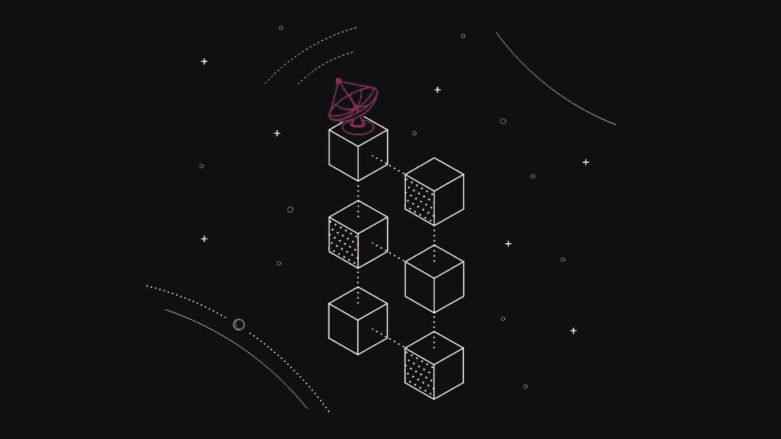

# 以太坊 2.0:下一次经济转变

> 原文：<https://medium.com/coinmonks/ethereum-2-0-the-next-economic-shift-8c8454c0001b?source=collection_archive---------29----------------------->

你一直在等待它。等待了非常非常长的时间。这可能比在六月等待圣诞节更糟糕。然而，时间终于临近了——以太坊 2.0 即将到来——臭名昭著的合并计划在 2022 年 9 月 19 日的那一周进行。这次系统升级旨在带来可伸缩性(以太坊已经为此奋斗了相当长一段时间)和通过一系列改变增加安全性，最主要的改变是切换到利益证明而不是工作证明。在这个概述中， [**Swapzone**](https://swapzone.io/) 团队将描述等待以太坊的变化，为什么我们需要 2.0，以及接下来会发生什么。

## 以太坊 2.0 是什么？

首先，以太坊 2.0，也被称为宁静，是以太坊区块链的重大升级。Serenity 的出现是为了解决现有链的速度、效率和可伸缩性(你好，行话)问题，因此更多的交易可以通过以太坊进行，而不必面临延迟和昂贵的费用。升级分几个阶段启动，整个过程必须在 2022 年 9 月中旬达到高潮。

## 会有什么变化？

以太坊正转向股权证明。这个转变是社区讨论了很长时间的事情。目前，以太坊通常运行在与大多数已知网络相同的算法上——工作证明。这意味着矿工们正在使用他们的计算机来计算和解决数学难题，并验证通过网络进行的交易。矿工得到加密货币的奖励——在这种情况下，是 ETH 硬币。这个过程是可行的，但是它需要大量的计算能力来维持。

另一方面，股权证明的不同之处在于，它不需要矿工——验证者用加密货币来处理新的交易。验证者是从持有加密货币的人中挑选出来的，这取决于他们的持股量和持股时间。股权证明比传统采矿更节能。被占领的区块链的安全也不依赖于计算机的能力。

## 为什么伸缩对以太坊很重要？

目前，区块链以太坊每秒可以支持大约 30 笔交易。随着以太坊程序的丰富和网络的普及，这个限制造成了拥塞。以太坊 2.0 旨在解决这个问题，并提供每秒 100，000 次交易的能力，当然，这听起来更先进。这个巨大的飞跃应该随着碎片链的实现而发生。

## 以太坊 2.0 是怎么开始的？

从 2020 年底开始，更新的推出有三个主要阶段。

这个过程中的第一个阶段 0 为我们带来了信标链的建立。信标链的存在是为了存储和管理验证器的注册以及部署利害关系的证明。“旧的”以太坊将仍然在旁边运行，以确保数据流没有中断。

这一阶段将于 12 月 1 日启动。然而，只有当网络中有 16.384 个验证器(截止到 11 月 24 日)，每个验证器都有 32 个 ETH 时，这一推出才会发生——对于大多数用户来说，这是一笔相当大的投资。然而，一切都在按计划进行。

ETH2 存款合同也已经发布，启动了所有以太坊 2.0 引擎。

## 什么是存款合同，为什么它很重要？

存款合同是发布阶段 0 的主要步骤。为了使向 ETH2 的过渡成为可能，用户将需要开始下注，为此，需要将资金从旧网络迁移到新网络。这正是需要存款合同的地方。一旦条件具备，以太坊 2.0 就呼之欲出了。顺便说一下，你可以通过这个 Twitter [账户](https://twitter.com/DepositEth?ref_src=twsrc%5Etfw%7Ctwcamp%5Etweetembed%7Ctwterm%5E1329771474878607361%7Ctwgr%5E&ref_url=https%3A%2F%2Fdecrypt.co%2Fresources%2Fwhat-is-ethereum-2-0)查看资金累积的进度。

## 以太坊的未来会是怎样的？

以太坊 2.0 对于基金会、ETH 用户、服务等等都是非常大的一步。以太坊的开发者声称在接下来的几年里将会有更多的研究，更多的评估，更多的进展。

当然，许多人猜测 ETH2 将如何影响以太坊的价格。以太坊 2.0 承诺的可扩展性绝对意味着更多的使用。费用将降低，交易将更快，网络将为用户提供无缝体验。

随着专家们对以太坊的未来持乐观态度，人们可能正在寻找支持以太坊交换的服务，并成为以太坊生态系统的一部分。从这一点来看，我们很高兴推出一系列由 [**Swapzone**](https://swapzone.io/) 支持的非托管交易所，它们都有 ETH。您可以在我们网站的主 [**页面**](https://swapzone.io/) 查看全部，选择以太坊掉期的最佳费率，轻松即时兑换，当然，等待 ETH2 的推出。

> 交易新手？尝试[加密交易机器人](/coinmonks/crypto-trading-bot-c2ffce8acb2a)或[复制交易](/coinmonks/top-10-crypto-copy-trading-platforms-for-beginners-d0c37c7d698c)