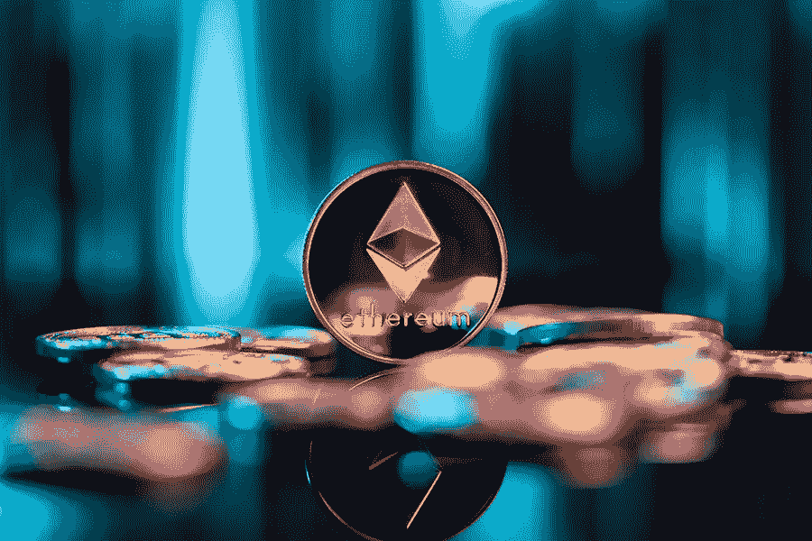

# 合并后的以太坊——改变了什么？

> 原文：<https://medium.com/coinmonks/ethereum-after-merge-what-have-changed-4bcee95c8b4b?source=collection_archive---------58----------------------->

以太坊升级——区块链工业最令人印象深刻的成就之一，终于完成了。

“而且我们敲定了这件事！…快乐合并所有！这是以太坊生态系统的一个重要时刻，”以太坊联合创始人 Vitalik Buterin 在一条推文中说。

那么，自从以太坊转向股权证明以来，除了 ETH 成本在过去 7 天下降了 20%之外，还有什么变化呢？

由于以太坊社区合并的准备工作已经进行了数年，目前事件本身不太可能对 Web-3 的整体发展造成重大变化。

NFT 部分的积极趋势是有先决条件的——由于高能耗对环境的影响，许多艺术家和用户对区块链技术有反感。通过转向股权证明，以太坊变得更加环保。事实上，在合并完成后不到一个小时，一个用户花了 36 ETH——大约 6 万美元——在 proof-of-stage 网络上铸造了第一个 NFT。这是一个名为“过渡”的熊猫脸图像。

与此同时，生态方面对矿工产生了毁灭性的影响，他们似乎是合并中受害最深的一方。一些矿工可能会选择在另一条链上采矿，而不是出售装备。

当然，对过去合并以太坊最大的担忧和批评是它正在走向中心化。利害关系的证明取决于用户购买、持有和押注大量网络加密货币。

虽然以太坊网络的控制权将不再集中在少数公开交易的矿业集团手中，但批评者坚持认为，以前的强大参与者将被新的参与者取代。Lido 是一个验证者社区，控制着以太坊股权证明链上超过 30%的股权。比特币基地、北海巨妖和币安——三家最大的加密交易所——拥有该网络另外 30%的股份。

“自从成功完成合并以来，大多数街区——大约 40%或更多——都是由属于丽都和比特币基地的两个地址建造的。crypto research 分析师 Ryan Rasmussen 解释说:“看到超过 40%的区块由两家提供商解决是不理想的，尤其是一家集中式服务提供商(比特币基地)”。

由于去中心化是 Web 3 概念的主要组成部分，为了以太坊的成功发展和在未来保持领先于竞争对手，应该解决这个问题。

所以合并不能认为是以太坊的最终转型。挑战在于不断升级网络，使其适应分散化概念，并提高安全性和速度。

正如布特林承认的那样，合并只是一个开始。“对我来说，合并只是象征着早期以太坊和我们一直想成为的以太坊之间的区别，”他说。“所以让我们去构建这个生态系统的所有其他部分，把以太坊变成我们想要的样子。

无论传统金融部门如何抵制加密货币的推进，它们在未来必然会占据主导地位。毫无疑问，不断发展的以太坊是这个行业的主要支柱之一。

> 交易新手？试试[加密交易机器人](/coinmonks/crypto-trading-bot-c2ffce8acb2a)或者[复制交易](/coinmonks/top-10-crypto-copy-trading-platforms-for-beginners-d0c37c7d698c)