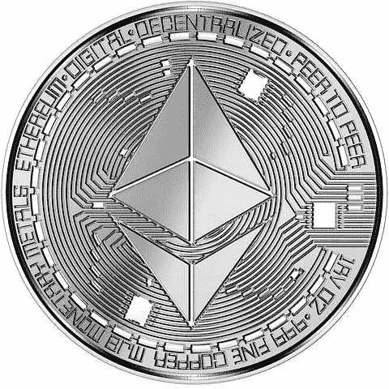

# 以太坊及其上海升级版:为什么重要

> 原文：<https://medium.com/coinmonks/ethereum-and-its-shanghai-upgrade-why-it-matters-ecfa6e29a6c2?source=collection_archive---------32----------------------->

Pixabay

自从从工作证明(PoW)转向利益证明(PoS)以来，以太坊一直在为自己的长期加密定位。

2023 年 1 月，上海升级计划推出 EOF(文件结束)实施，这是以太坊虚拟机(EVM)中的一项重大代码更改。EVM 是以太坊处理所有交易的核心组件。