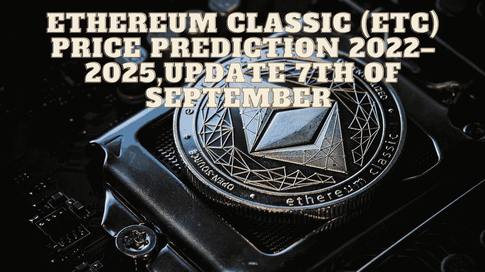

# 以太坊经典(ETC)2022–2025 年价格预测，9 月 7 日更新

> 原文：<https://medium.com/coinmonks/ethereum-classic-etc-price-prediction-2022-2025-update-7th-of-september-c07b8e7181be?source=collection_archive---------20----------------------->

Source photo Unsplash.com

# 以太坊经典(等)是什么？

以太坊经典最初于 2015 年推出，是基于以太坊智能合约平台打造的原创币。它的目的是让开发人员更容易管理软件，同时增加其安全性。以太坊最早发布于 2016 年 7 月，是作为…