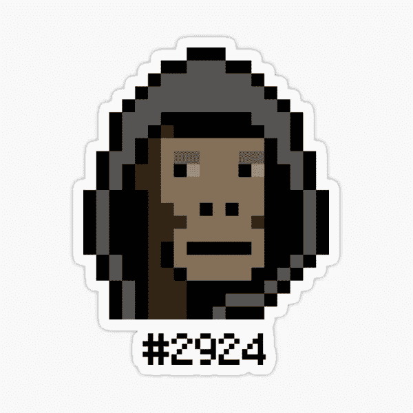

# 以太坊密码朋克 NFT 卖了 450 万美元，这是它的样子

> 原文：<https://medium.com/coinmonks/ethereum-cryptopunk-nft-sold-for-4-5-million-this-is-what-it-looks-like-dce7eb647acc?source=collection_archive---------35----------------------->

今天早些时候的《NFT 新闻》提到，不可替代令牌(NFT)市场的交易量大幅下降。然而，这并不意味着异常值不会出现。事实上，昨天 2924 号密码朋克以 3300 英镑的天价售出。想知道这个隐朋克长什么样吗？接着读下去！

Ethereum CryptoPunk NFT sold for $4.5 million, this is what it looks like