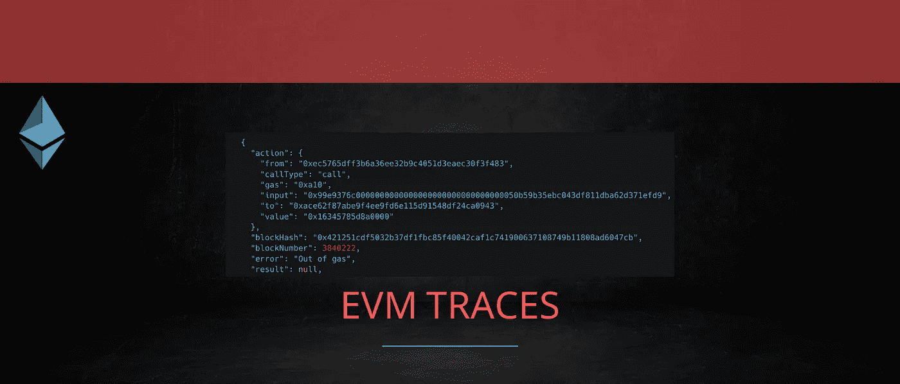
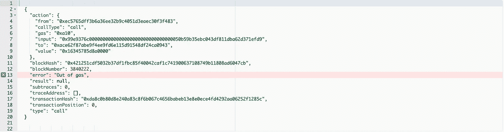
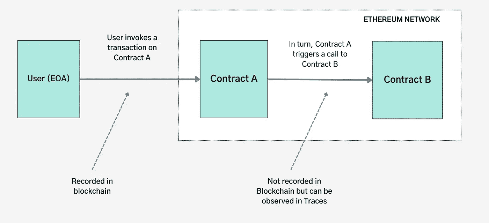
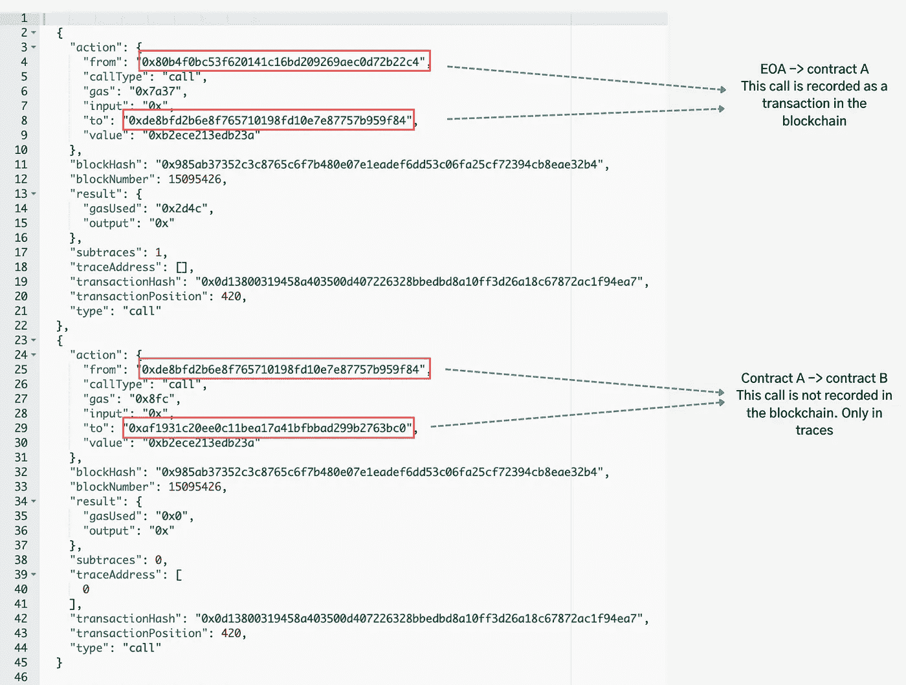
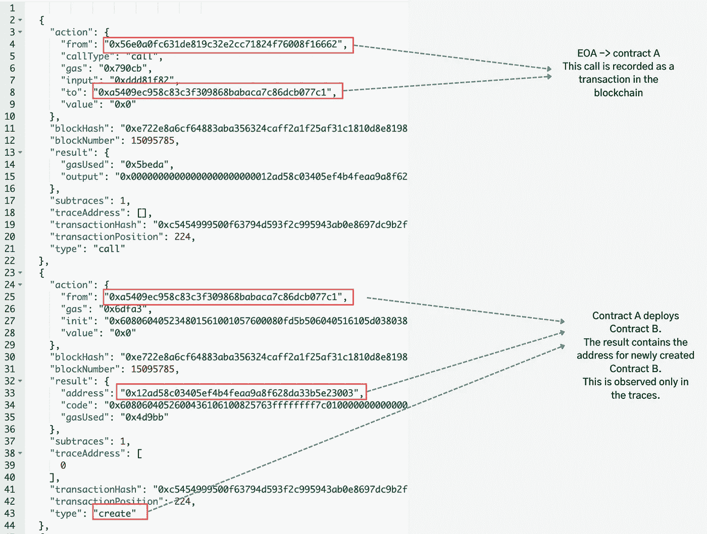

# 以太坊数据—简化的 EVM 轨迹

> 原文：<https://medium.com/coinmonks/ethereum-data-evm-traces-simplified-5e297e4f40a4?source=collection_archive---------1----------------------->



以太坊虚拟机(EVM)跟踪为事务的每个步骤提供详细的运行时数据，包括诸如使用的气体、结果、错误值等信息。与状态和事务不同，EVM 跟踪不是区块链的一部分，不需要保存在节点上。

```
💁‍♂️ Etherscan runs an instrumented EVM, allowing us to view traces from various clients ([parity](https://etherscan.io/vmtrace?txhash=0xda8c0b80d8e240a83c8f6b067c4656babeb13e8e0ece4fd4292aa06252f1285c&type=parity#raw), [geth](https://etherscan.io/vmtrace?txhash=0xda8c0b80d8e240a83c8f6b067c4656babeb13e8e0ece4fd4292aa06252f1285c&type=gethtrace2))
```

# 痕迹有什么帮助？

## 调试错误

当交易在 EVM 恢复时，状态被记录在交易收据中。但是，没有描述失败原因的其他信息。唯一的选择是检查痕迹以确定原因。



Parity VM trace — out of gas — [Etherscan](https://etherscan.io/vmtrace?txhash=0xda8c0b80d8e240a83c8f6b067c4656babeb13e8e0ece4fd4292aa06252f1285c&type=parity#raw)

## 内部通话/转接

任何智能合约的执行都始于外部账户发起的交易。反过来，智能合约可以与其他合约交互或进行转移。这些活动在区块链没有记录。例如，智能合同可以向一组用户空投令牌(即发送免费令牌)，但这一活动在区块链中不会被记录为交易。对于这样的活动，契约可以选择发出事件，然后可以在日志中查看这些事件。否则，观察它们的唯一方法就是监控痕迹。

> 交易新手？试试[加密交易机器人](/coinmonks/crypto-trading-bot-c2ffce8acb2a)或者[复制交易](/coinmonks/top-10-crypto-copy-trading-platforms-for-beginners-d0c37c7d698c)

需要监控的一些常见操作有:

**调用**跟踪类型指示智能合约何时将以太网转移到另一个帐户或调用另一个合约的方法。



CALL — contract calling another contract



Parity VM trace — CALL — [Etherscan](https://etherscan.io/vmtrace?txhash=0x0d13800319458a403500d407226328bbedbd8a10ff3d26a18c67872ac1f94ea7&type=parity#raw)

**创建**跟踪类型指示智能合约何时部署到以太网。智能合同可以由 EOA 帐户或其他智能合同部署。



Parity VM Trace — CREATE — Smart contract deploys another contract — [Etherscan](https://etherscan.io/vmtrace?txhash=0xc5454999500f63794d593f2c995943ab0e8697dc9b2f61062ead1d875fdd0921&type=parity#raw)

其他可能令人感兴趣的痕迹类型是自毁(合同从区块链删除)和奖励(对矿工的奖励)。通过检查跟踪数据，可以更好地理解事务中发生的事情。

## 为什么轨迹不存储在大多数节点中？

跟踪是一个耗时且耗费资源的过程。该节点必须能够存储和检索大量的跟踪数据。它还会降低节点同步整个区块链历史的能力。因为块验证或挖掘不需要存储跟踪，所以大多数节点在没有启用跟踪的情况下运行。

## 如何找回 EVM 的痕迹？

有几种方法可以检索事务的 EVM 跟踪。

**a)在一个完整/归档节点中重放事务:**以太坊客户端公开一些方法，这些方法试图以与先前执行事务相同的方式重新运行事务，并收集跟踪信息。虽然检索结果需要时间，但是只要有足够的信息来运行事务，节点就不需要存储跟踪。

**b)运行启用跟踪的归档节点:**以太坊客户端支持运行启用跟踪的节点。这将允许节点存储跟踪，以便可以快速检索它们，而不必重新执行事务。然而，这是以较高的成本和较慢的节点性能为代价的。

**c)使用 API:**诸如 Infura 或 Alchemy 之类的第三方服务管理启用跟踪的节点，并提供 API 端点来收集事务跟踪。虽然这是最简单的，但缺点是你必须依赖一个中央实体。

*我希望这篇文章已经让你对 EVM 痕迹有了更好的了解。如果您有任何问题或意见，请随时联系我们。*[*Twitter*](https://twitter.com/kirubakumaresh)*|*[*LinkedIn*](https://www.linkedin.com/in/kirubakumaresh/)